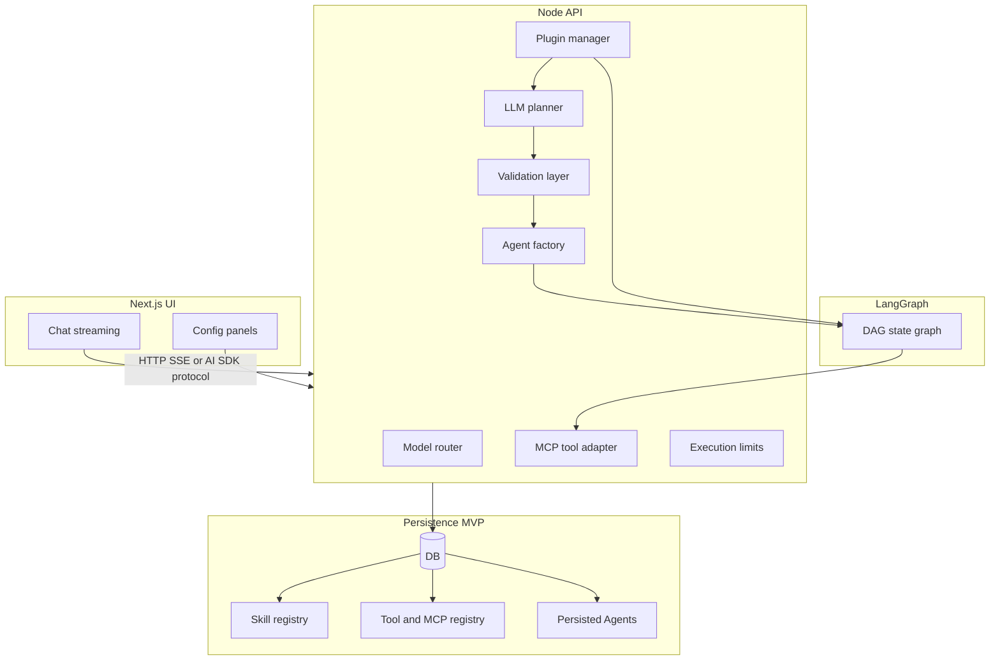

# Agent Platform MVP — implementation plan

## Scope anchored to your ADR (reconciled with product model)

- **Runtime**: Node.js + TypeScript, orchestration via **[@langchain/langgraph](https://github.com/langchain-ai/langgraphjs)** (JS/TS).
- **Tools**: **MCP** as the external contract; internal `Tool` type is an adapter view over registered MCP tools (plus any first-party tools you add later).
- **Governance**: **Persisted Agents** (default + user-created specialists) hold **allowlists** into global registries (skills, tools/MCP servers) plus **ExecutionLimits** and optional model override. **Runtime execution** is **ephemeral** (see next section)—not “agents disappear from the database.”
- **Registries**: **Global** catalogs for Skills, Tools/MCP servers, and Plugins; **specialist Agents** (and the **default Agent**) reference **subsets** so each agent exposes only what the user assigned.
- **Plugins**: **Globally available** for core extensibility (memory, observability, context injection). Users can **override defaults** (for example, swap the default memory plugin for their own), similar in spirit to extensible client/plugin ecosystems.
- **Extensibility**: custom **Plugin** SDK with hooks; plugins cannot bypass validation.
- **Frontend**: **Next.js** + **Vercel AI SDK** (`useChat`) + **assistant-ui** *or* **AI Elements**; **presentation and forms only**—backend owns persistence and enforcement.

### Persisted specialist agents vs ephemeral execution (clarification)

- **What is persisted**: The **specialist Agent** (and default Agent) as a **configuration record** in the database—name, allowlists, limits, etc. It is **not** thrown away after one chat. Users return to it, edit it, or select it again from the UI until they delete it.
- **What is ephemeral**: Each **run** (request/session turn) builds a **fresh in-memory execution**: LangGraph state, planner scratch work, tool call machinery, MCP handles for that run, and any transient runtime objects. When the run finishes (or times out), that **runtime** is torn down. Nothing in that layer is assumed to survive as a process.
- **What “recreate” means**: On each chat message, the harness **loads** the persisted Agent by id and **constructs** a new runtime graph. That is **re-instantiation from config**, not “the user must recreate the specialist from scratch.”

So: **specialist agents are durable settings**; **execution is disposable per run**.

### Plugin policy — recommendation and forward compatibility

**MVP (simplest, still safe)**:

- Maintain a **plugin catalog** (what can be installed/enabled).
- Apply **user-level overrides** for implementation choice where it matters (for example, which memory backend plugin is active), with sane **defaults**.

**When to add per-agent plugin allowlists**:

- Add when you need **governance** (for example, a “customer support” specialist must never load a plugin that can exfiltrate data) or **product tiers** (certain plugins only on certain agents).

**How to keep it adaptable**:

- Model **effective plugin resolution** as an ordered merge: `global defaults → user overrides → optional per-agent allowlist/denylist (future)`.
- In **contracts**, reserve optional fields such as `pluginAllowlist` / `pluginDenylist` on `Agent` (nullable = “no extra restriction beyond user/global policy”). If unused in MVP, they stay null and cost nothing in the UI.

This gives you a clear MVP without painting yourself into a corner.



## Recommended repo layout (single monorepo)

| Package / app | Role |
|----------------|------|
| `packages/contracts` | Zod schemas + TS types: `Skill`, persisted `Agent`, tool/MCP refs, `Plugin` bindings/overrides, `Plan`, `Task`, stream `Output` union |
| `packages/plugin-sdk` | `Plugin`, `PluginHooks` surface + safe context types |
| `packages/harness` | Planner, validation (against resolved Agent allowlists), agent factory, model router, limits, LangGraph wiring |
| `packages/mcp-adapter` | MCP client/session management; maps to internal `Tool` |
| `apps/api` | HTTP API: chat stream (`agentId`, session), CRUD for skills, tools/MCP registrations, agents, plugin policy/overrides, user settings, sessions |
| `apps/web` | Next.js: chat + configuration UI (pure view; calls API only) |

This keeps **one source of truth** for types shared by API and web (import `contracts` in both).

## API contracts (first concrete deliverable)

Define versioned JSON shapes for:

1. **Chat**: request (**`agentId`** — default or specialist, **skill id** or skill selection policy, optional **session id**) + **streaming events** mapping to your `Output` union (`text`, `code`, `tool_result`, `error`, `thinking`).
2. **Config CRUD**:
   - **Skills**: global registry; create/update markdown + parsed structured form.
   - **Tools / MCP**: global registry (MCP server records, discovered tool metadata, connection test endpoint).
   - **Agents**: list/create/update **persisted Agents**; assign **allowlisted** skill ids, tool ids, MCP server ids; set execution limits and optional model override; mark/configure **default Agent**.
   - **Plugins**: catalog entries; **user-level** overrides for implementation choice; optional **per-agent plugin allow/deny lists** reserved in schema for later governance (nullable in MVP).
   - **Secrets**: encrypted-at-rest API keys (see security note below).
3. **Operational**: health, model list/providers (from router config).

Backend remains authoritative: the UI never constructs plans or invokes tools directly.

## Persistence (MVP default)

Store: **global** skills, **global** tool/MCP registrations, **persisted Agents** (including **default** + **specialist** with allowlists), plugin catalog + **user plugin overrides**, user settings, chat sessions.

- **Default recommendation**: **SQLite** (single file) via Prisma or Drizzle for speed of MVP; document a migration path to **Postgres** when you need multi-instance or stricter ops.
- **Secrets**: per-user API keys in DB with encryption (envelope or libsodium) + key rotation story; never log key material.

## Backend harness — workstreams (parallelizable after contracts exist)

1. **Types + validation**: Zod for all boundary objects; fail closed before any graph execution.
2. **Skill pipeline**: markdown parse → normalized `Skill` (store raw + parsed, or parse on save).
3. **Agent resolution**: load persisted **Agent** by id; merge **allowlists** with global registries to produce the effective skill set and tool set; apply `ExecutionLimits` + optional model override.
4. **Planner**: LLM emits **structured JSON plan**; validate against **resolved Agent** (skill allowed, tools/MCP allowed, limits).
5. **Agent factory**: `resolved Agent + active Skill + resolved Tools →` LangGraph graph/nodes (implementation detail lives here).
6. **MCP adapter**: connect only to **MCP servers allowed for that Agent**; tool calls go only through harness after validation.
7. **Plugin manager**: resolve **effective plugin stack** (global defaults + user overrides + optional per-agent policy); run hooks in fixed order; explicit typed contexts; **hard guardrails** so hooks cannot skip validation.
8. **Execution limits**: max steps, parallelism, timeouts, token/cost budgets—enforce at graph boundaries and between planner iterations.
9. **Model router**: multi-provider dispatch; per-user keys; Agent-level model override passes through router.

## LangGraph execution

- Implement **checkpointing + retries** where LangGraph supports it in TS; keep state machine explicit.
- **Parallelism** only within declared limits from the persisted Agent’s `ExecutionLimits`.
- Emit **structured trace events** for the UI (skills used, tools used, path)—feeds both streaming and observability plugin.

## Frontend (Next.js)

1. **Chat**: `useChat` wired to your streaming API; render `Output` variants (code blocks, tool panels, errors, gated thinking).
2. **Config**:
   - Skill Factory + browse global skill registry,
   - **Agent** editor: create specialist agents; manage **allowlists** for skills, tools, and MCP servers; set limits and optional model override; view/configure **default Agent**,
   - Global MCP / tool registry (server URLs, auth fields, test connection, discovered tools),
   - Plugin catalog and **override** UI (for example, memory plugin choice),
   - Model/API key management (masked display).
3. **Library choice**: spike **assistant-ui** vs **AI Elements** early (half-day): pick based on composability with your `Output` renderer and design system fit (both shadcn-adjacent).

## Observability and memory (MVP)

- **Observability**: first-party plugin that logs structured execution records (minimum fields from ADR §17).
- **Memory**: session plugin only—scoped to `sessionId`, cleared on policy you define (TTL or explicit reset).

## Security and governance (non-negotiables to bake in early)

- The persisted **Agent** (including the default Agent) is the **authorization** boundary for skills, tools, and MCP servers for that chat/configuration context.
- Validate **every** plan and **every** tool invocation against **resolved Agent allowlists** + limits.
- Audit log of Agent changes, registry changes, and plugin policy changes (lightweight table or append-only log).

## Suggested milestone order

1. **Contracts package** + OpenAPI or typed route handlers (even if internal-only).
2. **Persistence** for global registries + **default Agent** seed + specialist Agents + seed data.
3. **MCP adapter** + “echo” tool to prove end-to-end tool path.
4. **LangGraph minimal graph** + limits + validation on a **fixed persisted Agent**.
5. **Planner** integrated behind validation.
6. **Plugins** (observability first; then memory + override plumbing).
7. **Next.js chat** streaming all `Output` types (select **agent** + **skill**).
8. **Config UI** panels in order: global skills → global tools/MCP → agents/allowlists → plugin overrides → models.

## Next stage: task breakdown, dependencies, and concurrency

**What happens now (before writing production code):** this document is the architecture and milestone list; the **next stage** is to treat it as a **work breakdown structure**—phases, subtasks, **must-run-in-order** edges, and **safe parallel** lanes—so you can schedule work or hand it to an agent without ambiguity. That is exactly what the rest of this section is for.

### Critical path (minimum sequence for “real” chat)

Nothing below can be skipped if the goal is end-to-end **persisted Agent → harness → stream → UI**:

1. **Monorepo + `packages/contracts`** (Zod types for API + stream events).
2. **Persistence** (schema + migrations + seed **default Agent** + empty registries).
3. **`apps/api`**: CRUD for registries + **Agents** (so configuration is real, not mocked).
4. **`packages/mcp-adapter`** + at least one **tool** path (real MCP or internal stub).
5. **`packages/harness`**: **Agent resolution** + **validation** (allowlists + limits).
6. **`packages/harness`**: **LangGraph** minimal graph (single skill, no planner or a trivial plan) to prove execution.
7. **Chat streaming route** (wire harness to SSE / AI SDK protocol).
8. **`apps/web`**: **Chat UI** + `useChat` against that route.

**Planner**, **full plugin stack**, and **config UI** are layered on top of that spine; they can start in parallel once contracts and API are stable.

### Dependency graph (high level)

```mermaid
flowchart TB
  subgraph phase0 [Phase0_Foundation]
    repo[Monorepo scaffold]
    contracts[contracts Zod types]
  end
  subgraph phase1 [Phase1_Data]
    db[DB schema migrations seed]
    apiCRUD[API CRUD registries and agents]
  end
  subgraph phase2 [Phase2_Backend_core]
    skillParse[Skill markdown parser]
    mcp[MCP adapter]
    harnessVal[Harness validation and limits]
    pluginsdk[Plugin SDK skeleton]
    graph[LangGraph minimal graph]
    planner[LLM planner]
    factory[Agent factory full wiring]
    stream[Chat streaming endpoint]
  end
  subgraph phase3 [Phase3_Plugins_and_polish]
    obsPlugin[Observability plugin]
    memPlugin[Memory plugin and overrides]
  end
  subgraph phase4 [Phase4_Frontend]
    uiSpike[assistant-ui vs AI Elements spike]
    webChat[Web chat UI]
    webCfg[Web config UI]
  end
  repo --> contracts
  contracts --> db
  contracts --> apiCRUD
  db --> apiCRUD
  contracts --> skillParse
  contracts --> mcp
  db --> mcp
  mcp --> harnessVal
  skillParse --> harnessVal
  harnessVal --> graph
  graph --> factory
  harnessVal --> planner
  planner --> factory
  contracts --> pluginsdk
  pluginsdk --> obsPlugin
  pluginsdk --> memPlugin
  factory --> stream
  apiCRUD --> stream
  apiCRUD --> webCfg
  stream --> webChat
  contracts --> uiSpike
  uiSpike --> webChat
  uiSpike --> webCfg
  obsPlugin --> factory
  memPlugin --> factory
```

Edges mean **“depends on”** (finish or stabilize the upstream before relying on it). In practice, **planner** and **LangGraph minimal graph** can be developed in tight iteration; the graph must exist before the planner is meaningful.

### What can run in parallel (safe lanes)

After **`contracts`** and **DB schema** are in place (even before all CRUD is polished):

| Lane | Work | Notes |
|------|------|--------|
| **Backend — data** | Skill parser, seed scripts, DB constraints | Uses `Skill` / `Agent` types from contracts. |
| **Backend — tools** | MCP adapter, connection test handler, tool registry | Needs DB + contracts; can mock harness at first. |
| **Backend — harness** | Validation, limits, model router, resolver | Depends on contracts + how tools are represented. |
| **Backend — graph** | LangGraph state machine, checkpoints, retries | Can use a **stub** planner (fixed plan) until LLM planner lands. |
| **Backend — planner** | Structured JSON plan + Zod validation + repair policy | **Can** start once contracts for `Plan`/`Task` exist; integrates after graph skeleton. |
| **Plugins** | `plugin-sdk` + observability plugin | Parallel once hook interfaces are stable. |
| **Frontend** | UI library spike, Next.js shell, layout, auth stub | Parallel to backend if you use **mock API** or **OpenAPI** fixtures; real config UI waits on CRUD. |
| **Frontend — chat** | `Output` renderers, streaming client | Needs **final** stream event shape from contracts; can prototype against stub server early. |

**Highest concurrency:** once **contracts** are frozen enough for v0, **MCP**, **skill parser**, **plugin-sdk**, and **web shell/UI spike** can proceed in parallel; **chat streaming** and **full config UI** converge on the **API + harness** integration point.

### Subtasks (actionable checklist)

**Phase 0 — Foundation**

- Scaffold monorepo (pnpm workspaces, TS, shared `tsconfig`, lint/format).
- `packages/contracts`: Zod schemas + exported types for `Agent`, registries, `Output` stream, `Plan`/`Task`, `ExecutionLimits`, nullable plugin policy fields.
- CI: typecheck + test on PR (even if minimal).

**Phase 1 — Persistence + API shell**

- ORM/schema: skills, tools/MCP servers, agents + allowlist join tables or JSON columns, plugin catalog, user/plugin overrides, sessions, chat metadata, user settings.
- Migrations + seed: **default Agent**, empty specialist list, optional demo skill.
- `apps/api`: CRUD routes + validation via Zod; **health**; **error shape** consistent with UI.
- Optional: generate OpenAPI from routes or maintain hand-written OpenAPI for the web team.

**Phase 2 — Harness + execution**

- Skill markdown → `Skill` parse + persist **parsed** + validation on save.
- MCP: connect, list tools, map to internal ids; timeouts; structured errors.
- Resolver: given `agentId`, produce **effective** skill/tool/MCP sets.
- **Harness validation**: plan steps and tool calls checked against allowlists + limits.
- LangGraph: minimal runnable graph (single path); emit trace events.
- Planner: LLM → JSON plan → validate; integrate with graph.
- Agent factory: full wiring **planner + graph + MCP + limits**.
- Chat: **streaming** endpoint; map internal events → `Output` union.

**Phase 3 — Plugins**

- Implement plugin resolution order: `global defaults → user overrides → (future per-agent)`.
- Observability plugin (structured logs); memory plugin (session scope); wire overrides.

**Phase 4 — Frontend**

- Spike **assistant-ui** vs **AI Elements**; pick one.
- Chat: `useChat`, renderers for `Output` types, agent + skill selector.
- Config: global skills → MCP → agents/allowlists → plugin overrides → models.
- E2E: **register skill + MCP → specialist agent → chat** + default agent smoke.

### Ordering rule of thumb

- **Contracts first** (everything else imports them).
- **Persistence before** “real” CRUD UI and before **agent resolution** that reads DB.
- **Validation before** any LLM planner in production paths (stub planner is fine for graph bring-up).
- **Streaming contract stable** before polishing the chat UI (reduces churn).

### When to start implementation

The **next step** after this plan is: **create the project repo** (or open the target workspace), **move the agent into that root** for Cursor, then execute **Phase 0** and **Phase 1** in order. Until that point, everything here is **planning** (task breakdown, not code).

**Canonical project path (agreed):** `/Users/letuscode/projects/agent-platform` — scaffold the monorepo here when implementation begins; initialize git in this directory (or use Cursor’s create-project flow targeting this path).

## Open decisions (fine to defer if documented)

- **Auth**: local-only MVP vs OAuth; drives multi-tenancy in DB.
- **Deployment**: single VM vs serverless; affects SQLite vs Postgres choice timeline.
- **Thinking stream**: model capability gating + user setting + server-side redaction policy.
- **Per-agent plugin allowlists**: not required for MVP if user overrides + global catalog suffice; add when governance or product segmentation demands it (schema can stay ready—see Plugin policy section).
