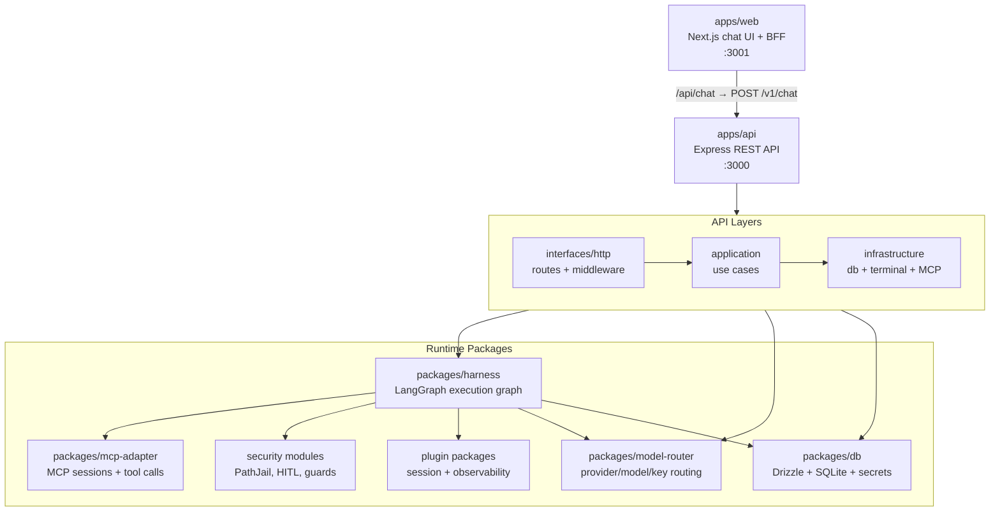
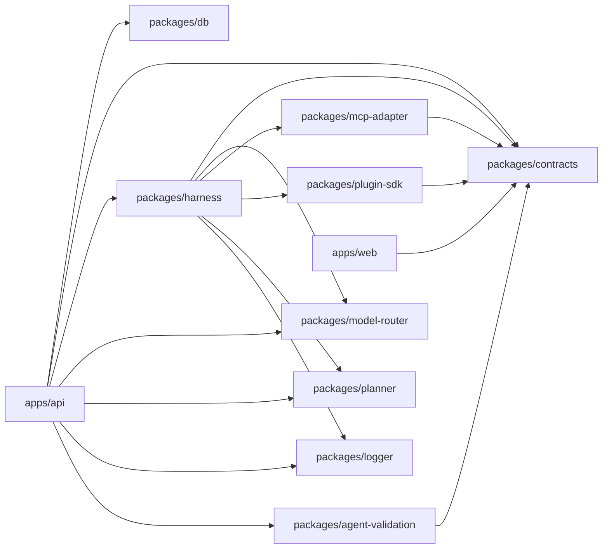
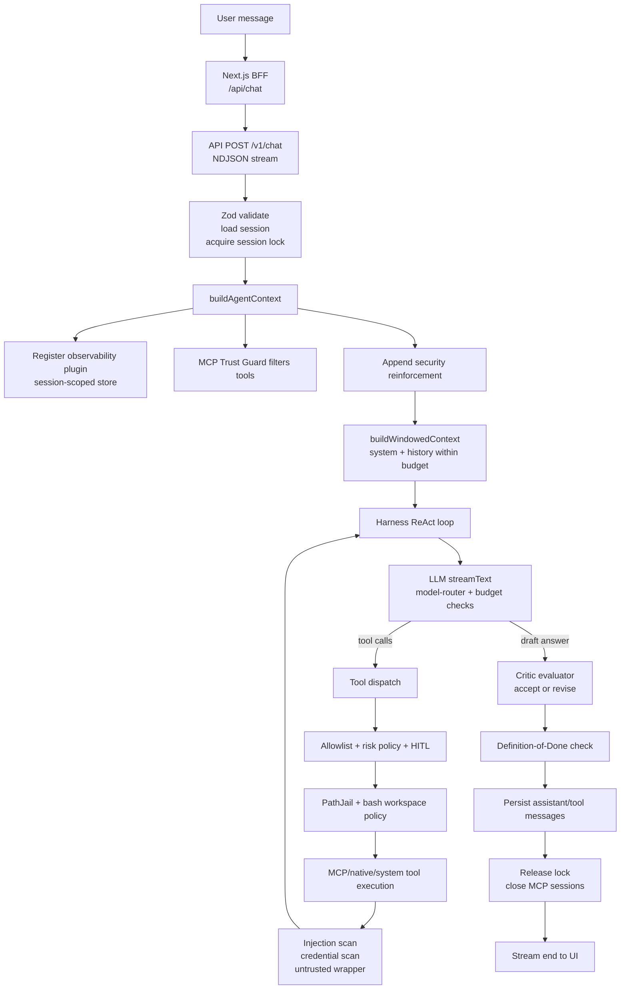

# Architecture

## Overview

Agent Platform is a composable agent harness built with Node.js, TypeScript, and LangGraph. It treats the LLM as an untrusted, non-deterministic dependency inside a controlled execution system.

The platform follows clean architecture principles: dependencies point inward, control flows outward.

For the complete message lifecycle (request → security checks → LLM → tool dispatch → response), see **[Message Flow](architecture/message-flow.md)**.

## System Diagram



## Package Dependency Graph



## Shared Packages

| Package                | Role                                                                                                 |
| ---------------------- | ---------------------------------------------------------------------------------------------------- |
| `contracts`            | Zod schemas shared between all layers (agents, skills, tools, sessions, plans)                       |
| `db`                   | Drizzle ORM + better-sqlite3; migrations; AES-256-GCM secret storage                                 |
| `harness`              | LangGraph-based agent execution graph; security guards (injection, credential, MCP trust, path jail) |
| `model-router`         | OpenAI provider routing via Vercel AI SDK; provider+model+key configurable                           |
| `mcp-adapter`          | MCP client lifecycle; transforms MCP tools to contract tools                                         |
| `plugin-sdk`           | Plugin interface + hook dispatcher (7 lifecycle hooks, including DoD override)                       |
| `planner`              | LLM-driven planning layer producing structured JSON output                                           |
| `logger`               | Structured logging with context propagation                                                          |
| `agent-validation`     | Agent schema validation                                                                              |
| `plugin-session`       | Session plugin implementation                                                                        |
| `plugin-observability` | Logging/tracing plugin plus an in-memory, session-scoped observability store                         |

## Data Flow



> For the full lifecycle with all security checkpoints and error handling, see **[Message Flow](architecture/message-flow.md)**.

## Observability

The API owns a process-local observability store keyed by `sessionId` and `runId`. A global `plugin-observability` instance records lifecycle events into that store during each chat run, and the zero-risk built-in observability tools read from the same store through a session-bound executor context.

This keeps observability queryable by the agent at runtime without allowing cross-session reads. Tool access is jailed by closure-bound `sessionId`/`runId`, not by model-supplied parameters.

## Feedback Sensors

Feedback sensors run inside the harness after meaningful code checkpoints and before completion or push handoff. Computational sensors cover deterministic checks such as typecheck, test, lint, and imported findings from IDE plugins, terminal output, SonarQube, CodeQL, GitHub check runs, review comments, and MCP-backed providers. Inferential sensors review task satisfaction, architecture fit, test quality, open findings, and readiness to hand off.

Sensor results are emitted as structured observability events, not chat transcript messages. `GET /v1/sessions/:id/sensors` exposes the bounded session dashboard used by the UI: active agent profile, selected sensor profile, deterministic and inferential definitions, provider availability, MCP capabilities selected for reflection, normalized findings, runtime limitations, repeated-failure patterns, and review-gated improvement candidates. The chat UI renders a compact expandable sensor panel so users can see pass/fail, repaired, auth-required, unavailable, Docker/sandbox-limited, and escalation states without flooding the conversation.

Coding sensors are selected for coding-profile agents and repository task contexts. Personal-assistant profile sessions show coding gates as disabled or manual-only unless a repository task explicitly needs them. Provider connection remains explicit: unavailable or auth-required providers surface repair actions such as GitHub CLI authentication, SonarQube MCP or IDE plugin setup, CodeQL configuration, and retry discovery.

## Browser Automation Contracts

Browser automation is modeled as a platform-owned tool pack rather than a direct dependency on an MCP browser server. Shared contracts in `packages/contracts` define browser sessions, page state, action requests/results, policy decisions, and bounded evidence artifacts. Playwright is the intended first internal runtime, while MCP/browser providers can be added later as adapters.

The policy model classifies snapshot and screenshot actions as read-only, session start/navigation/close as medium risk, and click/type/press as high risk when they can mutate state or submit data. URL policy covers localhost development URLs, external-domain approval, deny lists, protocol restrictions, redirects, and artifact redaction/bounding. UI/UX grading is intentionally separate and belongs to the UI quality sensor epic; browser tools provide evidence and policy enforcement.

The first runtime implementation lives in the harness system-tool surface as
`sys_browser_start`, `sys_browser_navigate`, `sys_browser_snapshot`,
`sys_browser_screenshot`, `sys_browser_click`, `sys_browser_type`,
`sys_browser_press`, and `sys_browser_close`. The session manager keeps
Playwright contexts in-process for the lifetime of the native tool executor,
expires inactive sessions, and writes bounded evidence under the active
workspace at `.agent-platform/browser/<session-id>/`. Docker deployments should
provide a Chromium binary through the image or
`PLAYWRIGHT_CHROMIUM_EXECUTABLE_PATH`; when the browser cannot launch, the tool
returns an explicit runtime-unavailable result instead of failing opaquely.

Navigation checks URL policy before the action and again after redirects.
Interaction tools resolve locators through user-facing attributes first
(role/name, label, text, placeholder, alt text, title, and test id) before
falling back to explicit selectors. Submit-like, destructive, and sensitive
input actions are classified as approval-required and return structured policy
decisions when approval has not been granted.

Browser evidence is exposed without chat spam through metadata sidecars and API
routes under `/v1/browser/artifacts`. Each screenshot, DOM summary, and ARIA
snapshot writes a bounded artifact plus a JSON sidecar containing the contract
metadata needed by the UI and later UI-quality sensors. The chat UI detects
browser tool results and renders a compact activity preview with current page
state, policy status, and artifact links instead of dumping the raw tool result
JSON into the transcript.

## API Clean Architecture

The API app (`apps/api`) follows a layered architecture:

| Directory              | Layer          | Responsibility                               |
| ---------------------- | -------------- | -------------------------------------------- |
| `src/interfaces/http/` | Interface      | Express routes, controllers, middleware      |
| `src/application/`     | Application    | Use cases, orchestration                     |
| `src/infrastructure/`  | Infrastructure | Database access, MCP clients, external calls |

**Rules:**

- Routes are thin — delegate to application layer
- Application layer orchestrates but doesn't know about HTTP
- Infrastructure implements interfaces defined by inner layers

## Layer Responsibility Model

| Layer                         | Question                  |
| ----------------------------- | ------------------------- |
| Harness (Control Plane)       | Are you allowed?          |
| Runtime (Execution Engine)    | What happens next?        |
| Tooling (Capability Boundary) | What action can be taken? |
| Services (Domain Authority)   | What is correct?          |
| Data (Source of Truth)        | What is true?             |

## Security

The harness treats the LLM and external tool outputs as **untrusted**. Security guards execute at multiple phases:

| Phase         | Guards                                                                                    |
| ------------- | ----------------------------------------------------------------------------------------- |
| Agent boot    | MCP Trust Guard (shadowing, injection, schemas), security prompt suffix                   |
| Per-turn      | Wall-time deadline check, token/cost budget limits, abort signal                          |
| Pre-dispatch  | Agent allowlist, PathJail (mount enforcement), cumulative tool limit, per-tool rate limit |
| Post-dispatch | Injection scan, credential leak scan, untrusted content wrapping                          |
| Graph level   | Loop detection (3 identical calls), max steps, deadline routing guard                     |

See the full guard map in **[Message Flow § Security Checkpoints](architecture/message-flow.md#3-security-checkpoints)**.

## Lazy Skill Loading

Skills are **not** injected in full into the system prompt. Instead, the harness emits lightweight **stubs** (name, description, hint) and provides a `sys_get_skill_detail` system tool. The model calls this tool on demand to fetch full instructions before using a skill.

| Aspect         | Detail                                                            |
| -------------- | ----------------------------------------------------------------- |
| Stub format    | `- **id** (name): description` + optional hint                    |
| Full fetch     | `sys_get_skill_detail({ skill_id })` → goal + constraints + tools |
| State tracking | `loadedSkillIds` (append-only) in graph state                     |
| Governor       | Warn at 3 loads of same skill; hard error at 5 (loop detection)   |
| Token savings  | ~70% reduction for multi-skill agents                             |

Schema fields: `description` (one-liner for stub) and `hint` (when-to-use) are optional on the Skill contract. When absent, `goal` is truncated to ~100 chars for the stub.

For the full implementation guide (architecture decisions, data flow, governor logic, error cases), see **[Lazy Skill Loading](architecture/lazy-skill-loading.md)**.

## Streaming Protocol

The chat response uses **NDJSON** (`application/x-ndjson`). Each line is a JSON event:

| Event               | When                                     |
| ------------------- | ---------------------------------------- |
| `text`              | LLM text delta                           |
| `thinking`          | LLM reasoning delta                      |
| `tool_result`       | Tool execution complete                  |
| `approval_required` | Tool execution paused for human approval |
| `error`             | Fatal or budget limit hit                |
| `stream_aborted`    | Client disconnect or timeout             |

## Session Locking

In-process mutex per `sessionId`. Returns `409 SESSION_BUSY` if a second request arrives for the same session while one is in progress. The lock is always released in the `finally` block.

## Capability Map

This JSON map is intentionally compact and agent-readable. Update it when new first-class runtime capabilities are added.

```json
{
  "runtime": {
    "execution": ["react_loop", "plan_mode_stub", "critic_loop", "definition_of_done_gate"],
    "streaming": ["ndjson_text", "thinking", "tool_result", "approval_required", "error"],
    "state": ["sqlite_sessions", "session_lock", "windowed_context", "workspace_storage"]
  },
  "tooling": {
    "zero_risk": [
      "generate_uuid",
      "get_current_time",
      "json_parse",
      "json_stringify",
      "regex_match",
      "regex_replace",
      "count_tokens",
      "base64_encode",
      "base64_decode",
      "hash_string",
      "template_render"
    ],
    "filesystem": [
      "read_file",
      "write_file",
      "list_files",
      "file_exists",
      "file_info",
      "find_files",
      "append_file",
      "copy_file",
      "create_directory",
      "download_file"
    ],
    "runtime": ["bash"],
    "network": ["http_request"],
    "observability": ["query_logs", "query_recent_errors", "inspect_trace"],
    "extension": ["mcp_tools", "registry_tools", "lazy_skill_loading"]
  },
  "safety": {
    "pre_execution": ["agent_allowlist", "risk_tier_policy", "human_in_the_loop"],
    "filesystem": ["PathJail", "bash_workspace_policy", "workspace_relative_paths"],
    "network": ["url_guard", "outbound_body_secret_scan"],
    "post_execution": ["prompt_injection_scan", "credential_scan", "untrusted_output_wrap"],
    "graph": ["max_steps", "max_tokens", "max_cost", "tool_rate_limit", "loop_detection"]
  },
  "known_missing": [
    "native_patch_tool",
    "background_process_manager",
    "browser_automation_tool",
    "scheduled_task_runner",
    "persistent_semantic_memory",
    "multi_agent_orchestration",
    "git_pr_ci_feedback_loop"
  ]
}
```

For the full architecture philosophy, see `docs/planning/architecture.md`.
