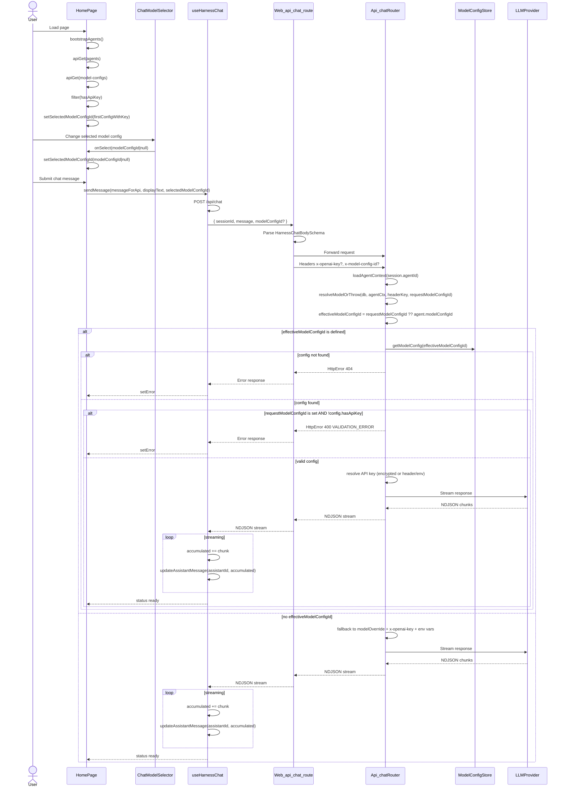
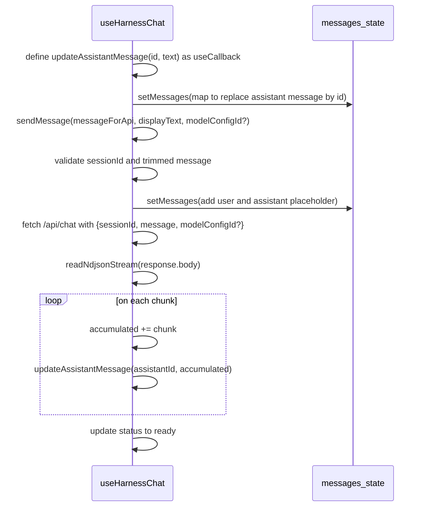
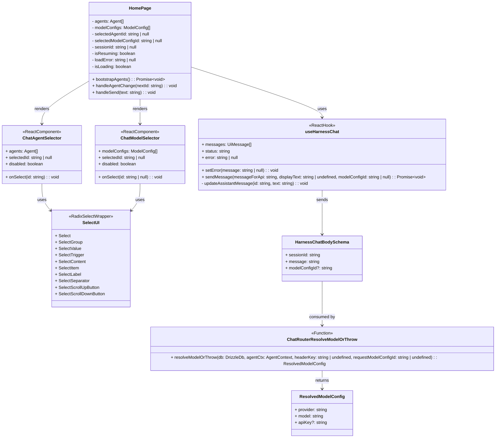

<!-- Generated by sourcery-ai[bot]: start review_guide -->

## Reviewer's Guide

Implements a per-message chat model picker across the API, BFF, and frontend, while resolving several SonarQube issues and introducing a shared shadcn/Radix Select UI component for both agent and model selection.

#### Sequence diagram for per-message chat model override

#### Sequence diagram for SonarQube-driven changes in useHarnessChat

#### Class diagram for chat model picker frontend components and hooks

### File-Level Changes

| Change                                                                                | Details                                                                                                                                                                                                                                                                                                                                                                                                                                                                                                                                                                                                                                                                                                                                                                                                                                              | Files                                                                                                                                                                                                                                                                                                                        |
| ------------------------------------------------------------------------------------- | ---------------------------------------------------------------------------------------------------------------------------------------------------------------------------------------------------------------------------------------------------------------------------------------------------------------------------------------------------------------------------------------------------------------------------------------------------------------------------------------------------------------------------------------------------------------------------------------------------------------------------------------------------------------------------------------------------------------------------------------------------------------------------------------------------------------------------------------------------- | ---------------------------------------------------------------------------------------------------------------------------------------------------------------------------------------------------------------------------------------------------------------------------------------------------------------------------- |
| Add per-request model config override support to the chat API and BFF.                | <ul><li>Extended chat body schema to accept optional modelConfigId and forward it as x-model-config-id header.</li><li>Updated chatRouter model resolution to accept an optional requestModelConfigId, compute an effectiveModelConfigId, and prioritize it over the agent’s stored config.</li><li>Added validation that overridden configs exist, have API keys, and improved error handling semantics.</li><li>Documented x-model-config-id and x-openai-key precedence in the API reference.</li></ul>                                                                                                                                                                                                                                                                                                                                           | `apps/api/src/infrastructure/http/v1/chatRouter.ts` `apps/web/app/api/chat/route.ts` `docs/api-reference.md`                                                                                                                                                                                                         |
| Introduce a chat model picker UI and integrate it into the chat page.                 | <ul><li>Created ChatModelSelector component that lists model configs with API keys and exposes a nullable selection.</li><li>Loaded model configs in the home page alongside agents, filtered to hasApiKey, and managed selectedModelConfigId state with sensible defaults and resilience to list changes.</li><li>Threaded the selectedModelConfigId through useHarnessChat.sendMessage and into the /api/chat request payload and handler dependencies.</li><li>Rendered the ChatModelSelector next to the agent selector in the chat header and wired selection to state.</li></ul>                                                                                                                                                                                                                                                               | `apps/web/app/page.tsx` `apps/web/hooks/use-harness-chat.ts` `apps/web/components/chat/chat-model-selector.tsx`                                                                                                                                                                                                      |
| Replace native select-based agent picker with a shared shadcn/Radix Select component. | <ul><li>Added a new ui/select.tsx wrapper around @radix-ui/react-select with project-consistent styling and subcomponents.</li><li>Refactored ChatAgentSelector to use the shared Select primitives instead of a native <select> and Chevron icon.</li><li>Added @radix-ui/react-select dependency and updated pnpm-lock.yaml accordingly.</li></ul>                                                                                                                                                                                                                                                                                                                                                                                                                                                                                                 | `apps/web/components/ui/select.tsx` `apps/web/components/chat/chat-agent-selector.tsx` `apps/web/package.json` `pnpm-lock.yaml`                                                                                                                                                                                  |
| Tighten model config editing UX and server-side update behavior.                      | <ul><li>Replaced nested ternary model placeholder logic with a simple provider→placeholder lookup map in the model config editor.</li><li>Adjusted modelConfigsRouter update to only compute a master key when a non-empty apiKey is provided, avoiding unnecessary secret handling.</li></ul>                                                                                                                                                                                                                                                                                                                                                                                                                                                                                                                                                       | `apps/web/components/config/model-configs-dashboard.tsx` `apps/api/src/infrastructure/http/v1/modelConfigsRouter.ts`                                                                                                                                                                                                     |
| Apply SonarQube-driven cleanup and minor behavioral improvements across web and API.  | <ul><li>Switched deriveSessionTitle whitespace normalization to use String.replaceAll for regex-based collapsing.</li><li>Simplified file reading for context attachments by using File.text() instead of FileReader.</li><li>Updated session list loading to use toSorted for non-mutating sorting, and replaced void refresh() with explicit error-handled refresh().</li><li>Removed an unnecessary provider cast and unused type import in testModelConnection.</li><li>Improved chat input semantics by replacing a div region with a labelled section for the main input/drop zone container.</li><li>Raised the web app TS lib target from ES2022 to ES2023 to support toSorted.</li><li>Documented a strict SonarQube/Problems completion gate in Copilot instructions and refreshed session.md with details of this work session.</li></ul> | `apps/api/src/infrastructure/http/v1/chatRouter.ts` `apps/web/hooks/use-context-attachments.ts` `apps/web/hooks/use-sessions.ts` `packages/model-router/src/testConnection.ts` `apps/web/components/chat/chat-input.tsx` `apps/web/tsconfig.json` `.github/copilot-instructions.md` `session.md` |

---

Tips and commands

#### Interacting with Sourcery

- **Trigger a new review:** Comment `@sourcery-ai review` on the pull request.
- **Continue discussions:** Reply directly to Sourcery's review comments.
- **Generate a GitHub issue from a review comment:** Ask Sourcery to create an
  issue from a review comment by replying to it. You can also reply to a
  review comment with `@sourcery-ai issue` to create an issue from it.
- **Generate a pull request title:** Write `@sourcery-ai` anywhere in the pull
  request title to generate a title at any time. You can also comment
  `@sourcery-ai title` on the pull request to (re-)generate the title at any time.
- **Generate a pull request summary:** Write `@sourcery-ai summary` anywhere in
  the pull request body to generate a PR summary at any time exactly where you
  want it. You can also comment `@sourcery-ai summary` on the pull request to
  (re-)generate the summary at any time.
- **Generate reviewer's guide:** Comment `@sourcery-ai guide` on the pull
  request to (re-)generate the reviewer's guide at any time.
- **Resolve all Sourcery comments:** Comment `@sourcery-ai resolve` on the
  pull request to resolve all Sourcery comments. Useful if you've already
  addressed all the comments and don't want to see them anymore.
- **Dismiss all Sourcery reviews:** Comment `@sourcery-ai dismiss` on the pull
  request to dismiss all existing Sourcery reviews. Especially useful if you
  want to start fresh with a new review - don't forget to comment
  `@sourcery-ai review` to trigger a new review!

#### Customizing Your Experience

Access your [dashboard](https://app.sourcery.ai) to:

- Enable or disable review features such as the Sourcery-generated pull request
  summary, the reviewer's guide, and others.
- Change the review language.
- Add, remove or edit custom review instructions.
- Adjust other review settings.

#### Getting Help

- [Contact our support team](mailto:support@sourcery.ai) for questions or feedback.
- Visit our [documentation](https://docs.sourcery.ai) for detailed guides and information.
- Keep in touch with the Sourcery team by following us on [X/Twitter](https://x.com/SourceryAI), [LinkedIn](https://www.linkedin.com/company/sourcery-ai/) or [GitHub](https://github.com/sourcery-ai).

<!-- Generated by sourcery-ai[bot]: end review_guide -->
