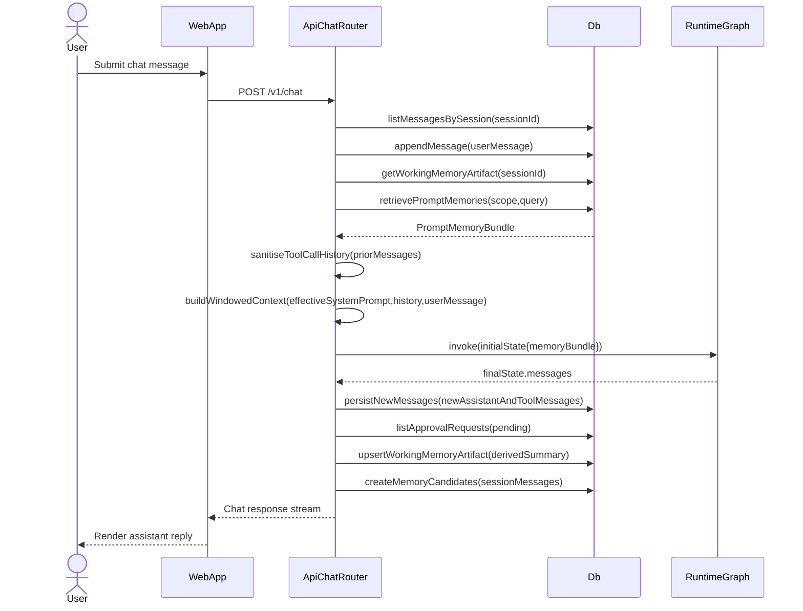
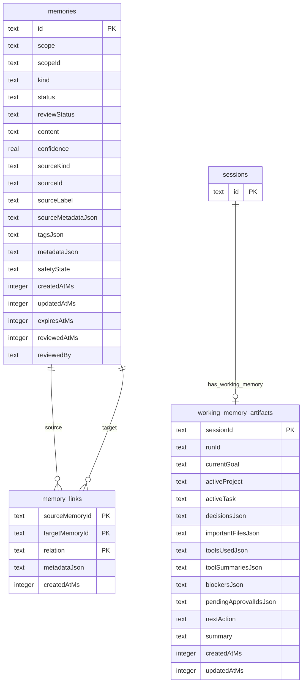

<!-- Generated by sourcery-ai[bot]: start review_guide -->

## Reviewer's Guide

Implements the core of the memory epic: adds durable long‑term memory records and links, short‑term session working memory artifacts, conservative prompt retrieval and self‑learning evaluation, plus API routes, system tools, UI, and tests to manage and safely expose memory; also refactors some shell/workspace parsing utilities for reliability and wires memory into the chat/runtime graph traces.

### Sequence diagram for chat request with memory retrieval and working memory refresh

### ER diagram for new memory-related database tables

### Class diagram for memory contracts and repositories

```mermaid
classDiagram
  class MemoryScopeSchema
  class MemoryKindSchema
  class MemoryStatusSchema
  class MemoryReviewStatusSchema
  class MemorySafetyStateSchema
  class MemorySourceKindSchema
  class MemoryLinkRelationSchema

  class MemorySource {
    +MemorySourceKind kind
    +string id
    +string label
    +JsonObject metadata
  }

  class MemoryRecord {
    +string id
    +MemoryScope scope
    +string scopeId
    +MemoryKind kind
    +MemoryStatus status
    +MemoryReviewStatus reviewStatus
    +string content
    +number confidence
    +MemorySource source
    +string[] tags
    +JsonObject metadata
    +MemorySafetyState safetyState
    +number createdAtMs
    +number updatedAtMs
    +number expiresAtMs
    +number reviewedAtMs
    +string reviewedBy
  }

  class MemoryCreateBody {
    +MemoryScope scope
    +string scopeId
    +MemoryKind kind
    +string content
    +number confidence
    +MemorySource source
    +string[] tags
    +JsonObject metadata
    +MemoryStatus status
    +MemoryReviewStatus reviewStatus
    +MemorySafetyState safetyState
    +number expiresAtMs
    +number reviewedAtMs
    +string reviewedBy
  }

  class MemoryUpdateBody {
    +MemoryKind kind
    +MemoryStatus status
    +MemoryReviewStatus reviewStatus
    +string content
    +number confidence
    +MemorySource source
    +string[] tags
    +JsonObject metadata
    +MemorySafetyState safetyState
    +number expiresAtMs
    +number reviewedAtMs
    +string reviewedBy
  }

  class MemoryQuery {
    +MemoryScope scope
    +string scopeId
    +MemoryKind kind
    +MemoryStatus status
    +MemoryReviewStatus reviewStatus
    +MemorySafetyState safetyState
    +number minConfidence
    +MemorySourceKind sourceKind
    +string sourceId
    +JsonObject sourceMetadata
    +string tag
    +boolean includeExpired
    +number limit
    +number offset
  }

  class MemoryLink {
    +string sourceMemoryId
    +string targetMemoryId
    +MemoryLinkRelation relation
    +JsonObject metadata
    +number createdAtMs
  }

  class PromptMemoryItem {
    +string id
    +MemoryScope scope
    +string scopeId
    +MemoryKind kind
    +string content
    +number confidence
    +PromptMemorySource source
    +string[] tags
    +number updatedAtMs
    +number score
  }

  class PromptMemoryBundle {
    +PromptMemoryItem[] items
    +number includedCount
    +OmittedCounts omitted
  }

  class WorkingMemoryToolSummary {
    +string toolName
    +boolean ok
    +string summary
    +number atMs
  }

  class WorkingMemoryArtifact {
    +string sessionId
    +string runId
    +string currentGoal
    +string activeProject
    +string activeTask
    +string[] decisions
    +string[] importantFiles
    +string[] toolsUsed
    +WorkingMemoryToolSummary[] toolSummaries
    +string[] blockers
    +string[] pendingApprovalIds
    +string nextAction
    +string summary
    +number createdAtMs
    +number updatedAtMs
  }

  class MemoryCandidateEvidence {
    +string kind
    +string id
    +string excerpt
    +number atMs
  }

  class ExtractedMemoryCandidate {
    +MemoryScope scope
    +string scopeId
    +MemoryKind kind
    +string content
    +number confidence
    +string rationale
    +MemoryCandidateEvidence[] evidence
    +string[] tags
    +MemorySafetyState safetyState
  }

  class MemoryCandidateMessage {
    +string id
    +string role
    +string content
    +string toolName
    +number createdAtMs
  }

  class MemoryCandidateExtractionInput {
    +string sessionId
    +string agentId
    +string projectId
    +MemoryCandidateMessage[] messages
  }

  class SelfLearningEvaluateBody {
    +string sessionId
    +string agentId
    +string projectId
    +string objective
    +number minOccurrences
    +SelfLearningObservedOutcome[] observedOutcomes
  }

  class SelfLearningObservedOutcome {
    +string kind
    +string id
    +string message
    +number atMs
  }

  class SelfLearningMetrics {
    +MetricsBefore before
    +MetricsAfter after
  }

  class SelfLearningEvaluationResult {
    +string objective
    +boolean proposed
    +string reason
    +SelfLearningMetrics metrics
    +MemoryRecord memory
  }

  class MemoriesRepository {
    +createMemory(db,input,options) MemoryRecord
    +getMemory(db,id) MemoryRecord
    +queryMemories(db,query,options) MemoryRecord[]
    +countMemories(db,query,options) number
    +updateMemory(db,id,patch,nowMs) MemoryRecord
    +deleteMemory(db,id) boolean
    +deleteMemoriesByQuery(db,query,options) number
    +cleanupExpiredMemories(db,cleanup,options) CleanupExpiredMemoriesResult
    +createMemoryLink(db,input,nowMs) MemoryLink
    +listMemoryLinks(db,memoryId) MemoryLink[]
  }

  class WorkingMemoryRepository {
    +getWorkingMemoryArtifact(db,sessionId) WorkingMemoryArtifact
    +upsertWorkingMemoryArtifact(db,input,nowMs) WorkingMemoryArtifact
    +deleteWorkingMemoryArtifact(db,sessionId) boolean
  }

  class MemoryCandidatesRepository {
    +extractMemoryCandidates(input) ExtractedMemoryCandidate[]
    +createMemoryCandidates(db,input,options) MemoryRecord[]
  }

  class MemoryRetrievalRepository {
    +retrievePromptMemories(db,input) PromptMemoryBundle
    +formatPromptMemoryBundle(bundle) string
  }

  class SelfLearningRepository {
    +evaluateSelfLearning(db,input,options) SelfLearningEvaluationResult
  }

  MemoryRecord --> MemorySource
  MemoryRecord --> MemoryScopeSchema
  MemoryRecord --> MemoryKindSchema
  MemoryRecord --> MemoryStatusSchema
  MemoryRecord --> MemoryReviewStatusSchema
  MemoryRecord --> MemorySafetyStateSchema
  MemoryRecord --> MemorySourceKindSchema

  MemoryLink --> MemoryLinkRelationSchema
  MemoryLink --> MemoryRecord

  PromptMemoryItem --> MemoryRecord
  PromptMemoryBundle --> PromptMemoryItem

  WorkingMemoryArtifact --> WorkingMemoryToolSummary

  ExtractedMemoryCandidate --> MemoryCandidateEvidence

  MemoriesRepository ..> MemoryRecord
  MemoriesRepository ..> MemoryLink

  WorkingMemoryRepository ..> WorkingMemoryArtifact

  MemoryCandidatesRepository ..> ExtractedMemoryCandidate
  MemoryCandidatesRepository ..> MemoryRecord

  MemoryRetrievalRepository ..> PromptMemoryBundle

  SelfLearningRepository ..> SelfLearningEvaluationResult
```

### File-Level Changes

| Change                                                                                                                              | Details                                                                                                                                                                                                                                                                                                                                                                                                                                                                                                                                                                                                                                                                                                                                                                                                                                | Files                                                                                                                                                                                                                                                                                                                                                                                                                                                                                                                  |
| ----------------------------------------------------------------------------------------------------------------------------------- | -------------------------------------------------------------------------------------------------------------------------------------------------------------------------------------------------------------------------------------------------------------------------------------------------------------------------------------------------------------------------------------------------------------------------------------------------------------------------------------------------------------------------------------------------------------------------------------------------------------------------------------------------------------------------------------------------------------------------------------------------------------------------------------------------------------------------------------- | ---------------------------------------------------------------------------------------------------------------------------------------------------------------------------------------------------------------------------------------------------------------------------------------------------------------------------------------------------------------------------------------------------------------------------------------------------------------------------------------------------------------------- |
| Refactor chat history sanitisation and wire short-term working memory + prompt memory bundles into the chat/runtime flow.           | <ul><li>Reworked tool-call history sanitisation using helper functions to pair assistant/tool messages and validate tool-call linkage.</li><li>Added utilities to extract important files, active task ids, decisions, and bounded tool summaries from recent messages and tool outputs.</li><li>Implemented refreshWorkingMemory to upsert working-memory artifacts and create memory candidates after chat turns and session resumes.</li><li>Extended buildConversationMessages to retrieve existing working memory and long-term prompt memories, and to augment the system prompt with both working-memory and prompt-memory bundles.</li><li>Augmented initial harness state with memory retrieval trace events and passed a MemoryToolContext into system tool execution.</li></ul>                                             | `apps/api/src/infrastructure/http/v1/chatRouter.ts` `packages/harness/src/trace.ts` `packages/harness/src/systemTools.ts` `packages/harness/src/tools/index.ts`                                                                                                                                                                                                                                                                                                                                            |
| Add long-term memory schema, repositories, retrieval, redaction, and self-learning evaluator in the DB layer.                       | <ul><li>Introduced memories, memory_links, and working_memory_artifacts tables with corresponding Drizzle schema and migrations.</li><li>Implemented repository functions for CRUD, query, bulk delete, expired-cleanup, and link management for memories, including JSON parsing fallbacks and secret-redacting serialization.</li><li>Added memory candidate extraction and persistence utilities that infer scope/kind, attach rationale and evidence, and redact credential-like content.</li><li>Implemented conservative memory retrieval for prompts with scoring, scope filtering, omission counters, and prompt bundle formatting.</li><li>Added a self-learning evaluator that turns repeated recoverable workspace/path errors plus existing candidates into review-gated failure-learning memories with metrics.</li></ul> | `packages/db/src/schema.ts` `packages/db/drizzle/0014_add_memories.sql` `packages/db/drizzle/0015_add_working_memory.sql` `packages/db/src/repositories/memories.ts` `packages/db/src/repositories/memoryRedaction.ts` `packages/db/src/repositories/memoryCandidates.ts` `packages/db/src/repositories/memoryRetrieval.ts` `packages/db/src/repositories/workingMemory.ts` `packages/db/src/repositories/selfLearning.ts` `packages/db/src/index.ts`                              |
| Expose memory management and self-learning via HTTP API and system tools, and document the new surfaces.                            | <ul><li>Added /v1/memories router supporting list, export, clear-by-scope, expired cleanup, self-learning evaluation, get/update/review/delete, with validation and structured logging.</li><li>Added GET /v1/sessions/:id/working-memory endpoint to inspect session-scoped working memory artifacts.</li><li>Registered memory router in the main v1 router and updated docs/api-reference with memory endpoints, sessions working-memory endpoint, and behavioural notes for cleanup and self-learning.</li><li>Defined memory system tools (list/get/review/delete/export) with scoped visibility and risk tiers, and integrated them into SYSTEM_TOOLS and risk maps.</li></ul>                                                                                                                                                   | `apps/api/src/infrastructure/http/v1/memoriesRouter.ts` `apps/api/src/infrastructure/http/v1/sessionsRouter.ts` `apps/api/src/infrastructure/http/v1/v1Router.ts` `packages/harness/src/tools/memoryTools.ts` `packages/harness/src/systemTools.ts` `docs/api-reference.md`                                                                                                                                                                                                                        |
| Add shared memory contracts, text utilities, and round-trip tests for schemas and policies.                                         | <ul><li>Created contracts/memory.ts defining Zod schemas and types for memory records, links, prompt bundles, working memory, candidates, and self-learning payloads/results, including scope validation and cleanup policy guards.</li><li>Exported memory contracts and a compactText helper from the contracts package index.</li><li>Extended contracts roundtrip tests to cover memory, working-memory, candidate, and self-learning schemas and their policy constraints.</li></ul>                                                                                                                                                                                                                                                                                                                                              | `packages/contracts/src/memory.ts` `packages/contracts/src/text.ts` `packages/contracts/src/index.ts` `packages/contracts/test/roundtrip.test.ts`                                                                                                                                                                                                                                                                                                                                                          |
| Add UI and integration tests for memory dashboard, working memory, prompt retrieval, tool summarisation, and candidate persistence. | <ul><li>Implemented a Memory settings page and MemoryDashboard React component that lists memories with filters, supports edit/review/delete actions, and can export JSON and clear by scope with confirmation.</li><li>Updated Settings layout and nav to include Memory in configuration copy and navigation.</li><li>Added integration tests around chat sessions to verify working memory persistence/injection, approved prompt memory inclusion with trace metadata, bounded tool summaries, and explicit remember instructions creating pending candidates.</li><li>Added API tests for memoriesRouter covering list/export/update/review/clear/cleanup/delete and self-learning evaluation behaviours, plus DB-level tests for memories, retrieval, workingMemory, candidates, and selfLearning repositories.</li></ul>        | `apps/web/app/settings/layout.tsx` `apps/web/components/settings/SettingsNav.tsx` `apps/web/app/settings/memory/page.tsx` `apps/web/components/config/memory-dashboard.tsx` `apps/api/test/sessionChat.integration.test.ts` `apps/api/test/memoriesRouter.test.ts` `packages/db/test/memories.test.ts` `packages/db/test/memoryRetrieval.test.ts` `packages/db/test/workingMemory.test.ts` `packages/db/test/memoryCandidates.test.ts` `packages/db/test/selfLearning.test.ts` |
| Tighten shell/workspace parsing utilities and update session docs for the memory epic.                                              | <ul><li>Refactored bash workspace policy tokenization and segment splitting into smaller helpers, made ASCII helpers tolerate undefined code points, and simplified path access extraction using flatMap.</li><li>Updated Windows absolute path detection to use codePointAt and guard against undefined ASCII codes.</li><li>Expanded session.md with detailed notes about memory epic tasks 1–7, their implementation status, and quality gates, plus an updated current state and next steps aligned with the memory epic.</li></ul>                                                                                                                                                                                                                                                                                                | `packages/harness/src/security/bashWorkspacePolicy.ts` `apps/api/src/infrastructure/http/v1/workspaceRouter.ts` `session.md`                                                                                                                                                                                                                                                                                                                                                                                   |

---

Tips and commands

### Interacting with Sourcery

- **Trigger a new review:** Comment `@sourcery-ai review` on the pull request.
- **Continue discussions:** Reply directly to Sourcery's review comments.
- **Generate a GitHub issue from a review comment:** Ask Sourcery to create an
  issue from a review comment by replying to it. You can also reply to a
  review comment with `@sourcery-ai issue` to create an issue from it.
- **Generate a pull request title:** Write `@sourcery-ai` anywhere in the pull
  request title to generate a title at any time. You can also comment
  `@sourcery-ai title` on the pull request to (re-)generate the title at any time.
- **Generate a pull request summary:** Write `@sourcery-ai summary` anywhere in
  the pull request body to generate a PR summary at any time exactly where you
  want it. You can also comment `@sourcery-ai summary` on the pull request to
  (re-)generate the summary at any time.
- **Generate reviewer's guide:** Comment `@sourcery-ai guide` on the pull
  request to (re-)generate the reviewer's guide at any time.
- **Resolve all Sourcery comments:** Comment `@sourcery-ai resolve` on the
  pull request to resolve all Sourcery comments. Useful if you've already
  addressed all the comments and don't want to see them anymore.
- **Dismiss all Sourcery reviews:** Comment `@sourcery-ai dismiss` on the pull
  request to dismiss all existing Sourcery reviews. Especially useful if you
  want to start fresh with a new review - don't forget to comment
  `@sourcery-ai review` to trigger a new review!

### Customizing Your Experience

Access your [dashboard](https://app.sourcery.ai) to:

- Enable or disable review features such as the Sourcery-generated pull request
  summary, the reviewer's guide, and others.
- Change the review language.
- Add, remove or edit custom review instructions.
- Adjust other review settings.

### Getting Help

- [Contact our support team](mailto:support@sourcery.ai) for questions or feedback.
- Visit our [documentation](https://docs.sourcery.ai) for detailed guides and information.
- Keep in touch with the Sourcery team by following us on [X/Twitter](https://x.com/SourceryAI), [LinkedIn](https://www.linkedin.com/company/sourcery-ai/) or [GitHub](https://github.com/sourcery-ai).

<!-- Generated by sourcery-ai[bot]: end review_guide -->
