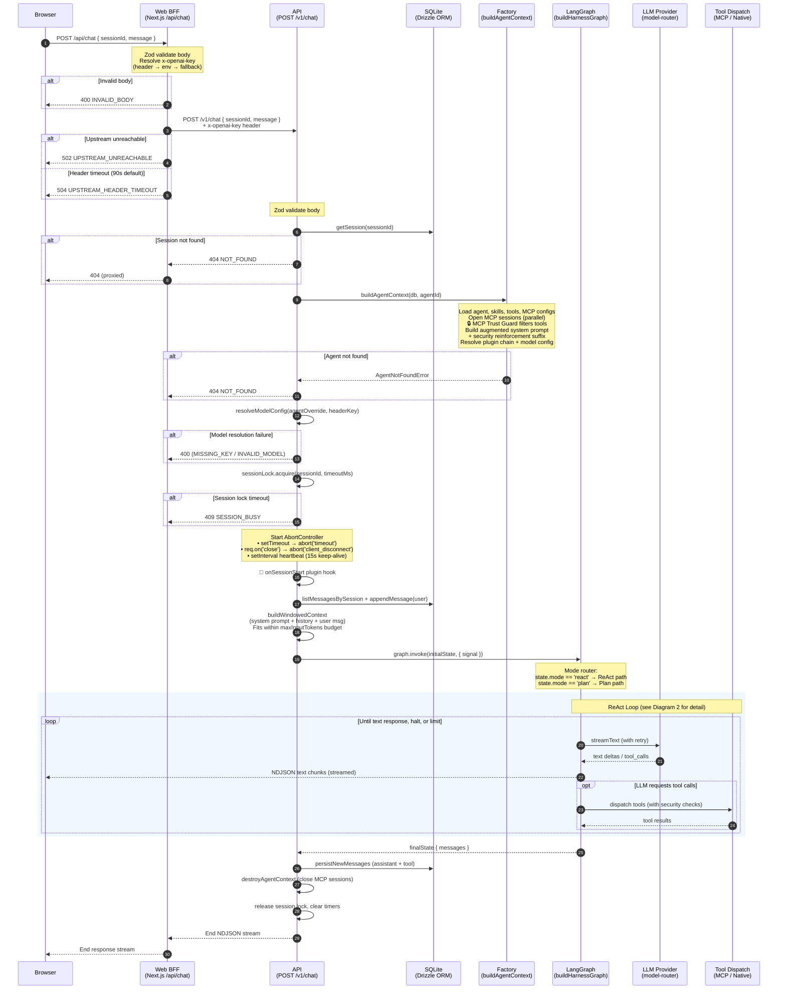
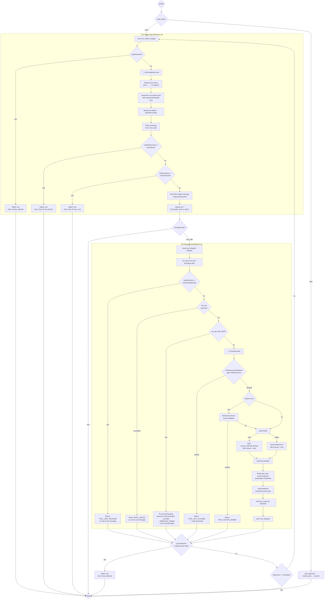
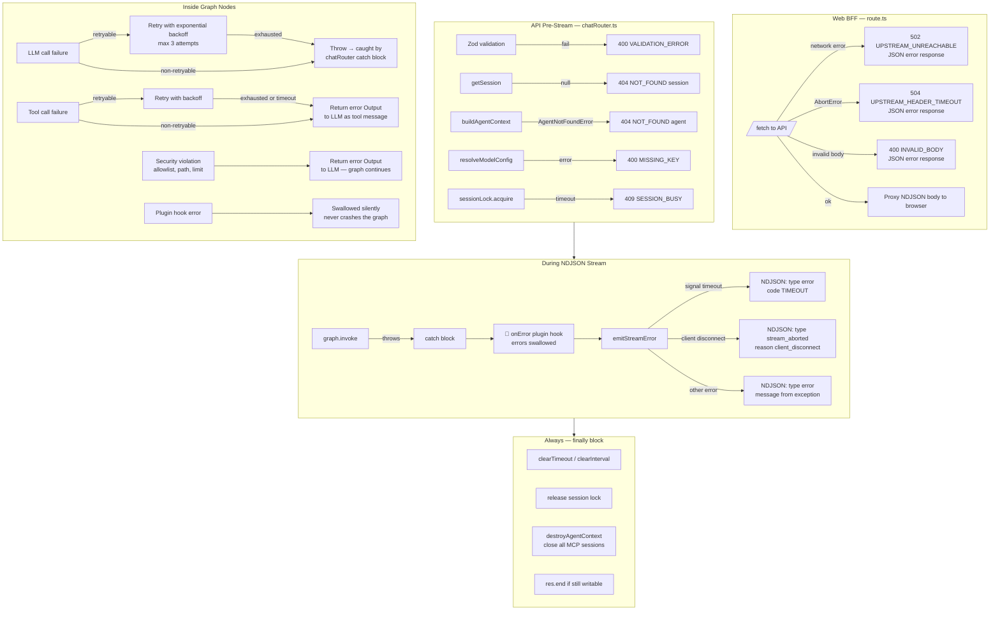

# Message Flow — Agent Platform

This document traces the complete lifecycle of a chat message, from the user's browser to the LLM response. It is the canonical reference for understanding security checkpoints, error handling, and the ReAct execution loop.

> **Audience:** AI agents working on this codebase, and human developers.
> Source files are annotated in each section so you can `grep` for the exact code.

---

## 1. End-to-End Request Flow

This is the primary diagram. It shows every layer a message passes through and where errors are caught.

**Key source files:**

- `apps/web/app/api/chat/route.ts` — BFF proxy
- `apps/api/src/infrastructure/http/v1/chatRouter.ts` — API handler
- `packages/harness/src/factory.ts` — agent context assembly
- `packages/harness/src/buildGraph.ts` — graph construction
- `packages/harness/src/contextBuilder.ts` — context windowing

---

## 2. ReAct Loop — LLM ↔ Tool Dispatch

This diagram zooms into the LangGraph ReAct cycle, showing every security checkpoint and limit check.

**Key source files:**

- `packages/harness/src/nodes/llmReason.ts` — LLM streaming, budget checks, retry
- `packages/harness/src/nodes/toolDispatch.ts` — tool dispatch, security scans
- `packages/harness/src/buildGraph.ts` — wrappers (step counting, loop detection)
- `packages/harness/src/security/injectionGuard.ts` — injection scanning + content wrapping
- `packages/harness/src/security/outputGuard.ts` — credential leak detection

---

## 3. Security Checkpoints

All security guards mapped to where they execute in the flow.

```mermaid
flowchart LR
    subgraph BOOT ["Agent Boot — factory.ts"]
        A1["🔒 MCP Trust Guard<br/>Blocks: shadowing,<br/>description injection,<br/>suspicious schemas"]
        A2["🔒 Security Reinforcement<br/>Appended to system prompt<br/>never dropped by windowing"]
    end

    subgraph REASON ["LLM Reasoning"]
        B1["Tool name sanitisation<br/>colon to __ for provider"]
        B2["Token/cost budget limits"]
    end

    subgraph DISPATCH ["Tool Dispatch"]
        C1["🔒 Agent allowlist check"]
        C2["🔒 PathJail enforcement<br/>mount boundaries"]
        C3["🔒 Cumulative tool call limit"]
        C4["🔒 Tool timeout + retry"]
        C5["🔒 Injection scan on result"]
        C6["🔒 Credential leak scan"]
        C7["🔒 Untrusted content wrap"]
    end

    subgraph GRAPH ["Graph Level"]
        D1["🔒 Loop detection<br/>3 identical calls then halt"]
        D2["🔒 Max steps limit"]
        D3["🔒 Abort signal<br/>timeout / disconnect"]
    end

    BOOT --> REASON --> DISPATCH --> GRAPH
```

**Source locations:**

| Guard                  | File                                              | Integration point                              |
| ---------------------- | ------------------------------------------------- | ---------------------------------------------- |
| MCP Trust Guard        | `packages/harness/src/security/mcpTrustGuard.ts`  | `factory.ts` → `discoverMcpTools()`            |
| Security Reinforcement | `packages/harness/src/security/injectionGuard.ts` | `factory.ts` → `buildAugmentedPrompt()`        |
| Agent Allowlist        | `packages/agent-validation`                       | `toolDispatch.ts` → `isToolExecutionAllowed()` |
| PathJail               | `packages/harness/src/security/pathJail.ts`       | `toolDispatch.ts` → `enforcePathJail()`        |
| Injection Scan         | `packages/harness/src/security/injectionGuard.ts` | `toolDispatch.ts` → `scanToolOutput()`         |
| Credential Scan        | `packages/harness/src/security/outputGuard.ts`    | `toolDispatch.ts` → `scanToolOutput()`         |
| Content Wrapping       | `packages/harness/src/security/injectionGuard.ts` | `toolDispatch.ts` → `outputToContent()`        |
| URL Guard              | `packages/harness/src/security/urlGuard.ts`       | `mediumRiskTools.ts`                           |
| Bash Guard             | `packages/harness/src/security/bashGuard.ts`      | System tool level                              |
| Loop Detection         | `packages/harness/src/buildGraph.ts`              | `createReactToolWrapper()`                     |
| Budget Limits          | `packages/harness/src/nodes/llmReason.ts`         | `checkBudgetLimits()`                          |
| Cumulative Tool Limit  | `packages/harness/src/nodes/toolDispatch.ts`      | Top of tool dispatch loop                      |

---

## 4. Error Handling

How errors propagate and are handled at each layer.

### Error handling principles

1. **Pre-stream errors** (validation, auth, locking) return standard JSON `{ error: { code, message } }` with appropriate HTTP status codes.
2. **Mid-stream errors** (graph execution failures) are written as NDJSON error events to the open stream, then the stream ends.
3. **Tool errors** are returned to the LLM as tool-result messages — the graph continues and the LLM can reason about the failure.
4. **Plugin errors** are always swallowed. Plugin failures must never crash a user request.
5. **Cleanup** runs unconditionally via the `finally` block: timers cleared, session lock released, MCP sessions closed, stream ended.

---

## 5. NDJSON Event Types

The streaming protocol emits these event types to the client (each as a JSON line):

| Event            | When                         | Key fields                  |
| ---------------- | ---------------------------- | --------------------------- |
| `text`           | LLM text delta               | `content`                   |
| `thinking`       | LLM reasoning delta          | `content`                   |
| `code`           | Code block                   | `content`, `language`       |
| `tool_result`    | Tool execution complete      | `toolId`, `data`            |
| `image`          | Screenshot / image from MCP  | `data` (base64), `mimeType` |
| `error`          | Fatal or budget limit hit    | `code`, `message`           |
| `stream_aborted` | Client disconnect or timeout | `reason`                    |

The browser (`apps/web/hooks/useHarnessChat.ts`) reads these via `ReadableStream`, parsing each NDJSON line and dispatching to the appropriate UI handler. Tool-scoped errors (codes prefixed `TOOL_`, `MCP_`, `NATIVE_`) are rendered inline; other errors surface as a top-level error banner.
