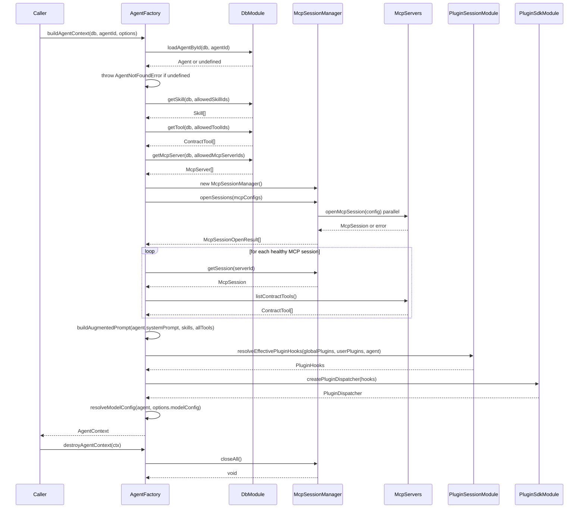
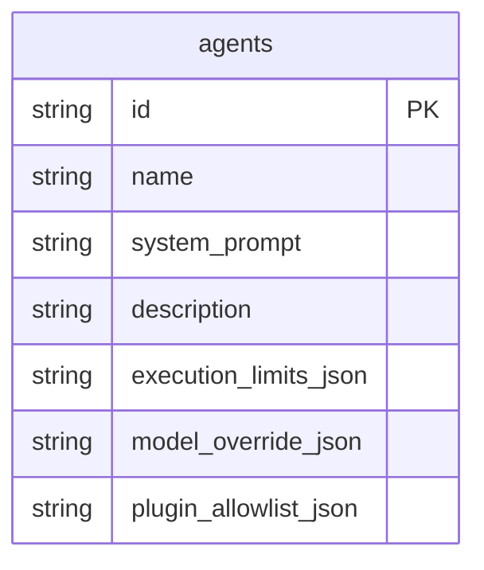
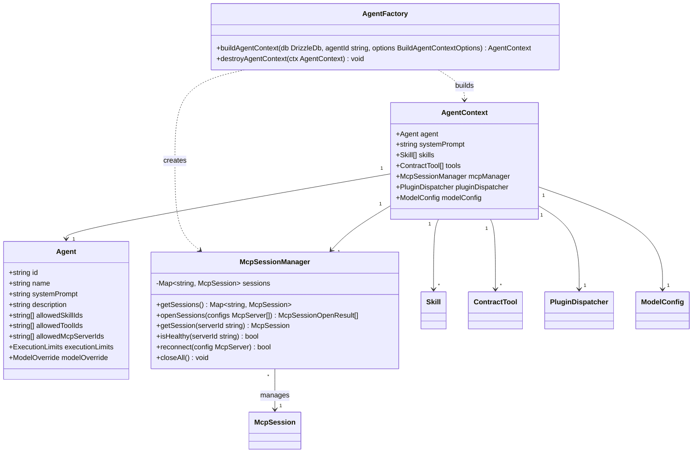

# Epic 1 — Agent Schema & Factory: Architecture Reference

Source: Sourcery AI review of PR #24 (`feature/agent-platform-runtime` → `main`)

## buildAgentContext Assembly Flow

## Agent Schema (DB)

## Class Relationships

