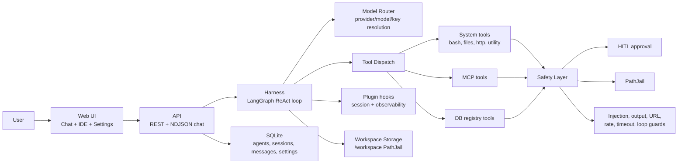
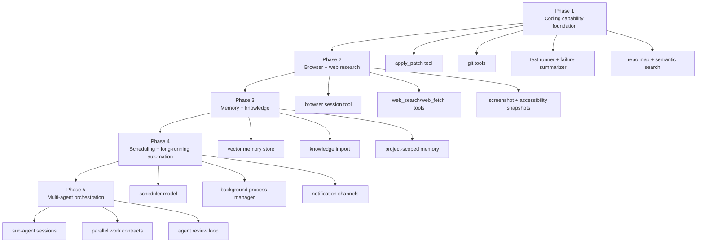
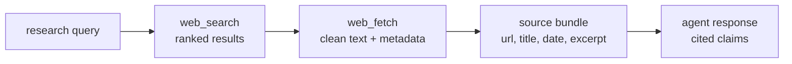
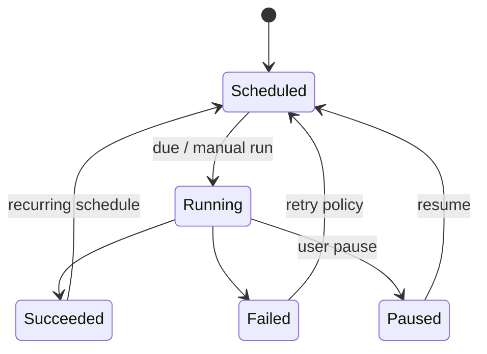

# Harness Gap Analysis — Coding And General Automation

## Scope

This report reviews the current Agent Platform codebase after the HITL and workspace-storage epics. It compares the implemented harness against the target of a strong coding and general automation agent, using the local codebase as the primary source of truth and public agent-framework references as external benchmarks.

External references used:

- [OpenClaw Tools](https://openclaw.com.au/tools): native capability categories including filesystem, runtime, web research, browser automation, sessions/agents, memory, cron, messaging, and device nodes.
- [OpenClaw Skills](https://www.open-claw-skills.com/): large skill registry with coding, browser automation, DevOps, data analysis, search/research, security/compliance, and content categories.
- [Agent Zero](https://www.agent-zero.ai/p/index/): sandboxed agent environment plus host connector for working on real files.
- [Agent Zero usage guide](https://github.com/agent0ai/agent-zero/blob/main/docs/guides/usage.md): project-scoped workspaces, scheduler, memory management, knowledge import, backups, and project secrets.

The "pi" comparison remains ambiguous. If this means Raspberry Pi as a deployment target, it affects packaging and resource constraints more than harness capability. If it means another agent framework, add the exact project URL before using it as a formal benchmark.

## Current Capability Graph



## Capability Inventory

```json
{
  "implemented": {
    "agent_configuration": [
      "agents",
      "skills",
      "tools",
      "mcp_servers",
      "model_configs",
      "execution_limits"
    ],
    "execution": [
      "react_loop",
      "llm_tool_call_dispatch",
      "critic_revision_loop",
      "definition_of_done_gate",
      "streaming_ndjson",
      "session_locking"
    ],
    "tools": {
      "filesystem": [
        "read_file",
        "write_file",
        "list_files",
        "file_exists",
        "file_info",
        "find_files",
        "append_file",
        "copy_file",
        "create_directory",
        "download_file"
      ],
      "runtime": ["bash"],
      "network": ["http_request"],
      "utility": [
        "generate_uuid",
        "get_current_time",
        "json_parse",
        "json_stringify",
        "regex_match",
        "regex_replace",
        "count_tokens",
        "base64_encode",
        "base64_decode",
        "hash_string",
        "template_render"
      ],
      "observability": ["query_logs", "query_recent_errors", "inspect_trace"],
      "extension": ["mcp", "lazy_skill_loading", "plugin_hooks"]
    },
    "safety": [
      "risk_tiers",
      "requires_approval",
      "durable_approval_requests",
      "approval_resume",
      "PathJail",
      "bash_workspace_policy",
      "MCP_trust_guard",
      "URL_guard",
      "credential_scan",
      "prompt_injection_scan",
      "tool_timeout",
      "tool_rate_limit",
      "loop_detection"
    ],
    "workspace": [
      "host_backed_workspace",
      "workspace_init",
      "workspace_cleanup",
      "workspace_ui",
      "workspace_file_download",
      "compose_restart_persistence_check"
    ]
  },
  "not_yet_first_class": {
    "coding": [
      "apply_patch_or_structured_edit_tool",
      "git_status_diff_commit_pr_tools",
      "test_runner_with_failure_ingestion",
      "dependency_install_policy",
      "code_search_semantic_index",
      "repository_map_refresh"
    ],
    "automation": [
      "browser_automation",
      "scheduled_tasks",
      "background_processes",
      "notifications",
      "email_calendar_messaging_connectors",
      "workflow_templates"
    ],
    "memory": [
      "persistent_semantic_memory",
      "knowledge_import",
      "project_scoped_memory",
      "memory_review_and_cleanup"
    ],
    "orchestration": [
      "sub_agent_spawn",
      "parallel_task_coordination",
      "agent_to_agent_review",
      "long_running_task_resume",
      "CI_PR_feedback_loop"
    ]
  }
}
```

## Benchmark Matrix

| Capability area        | Current platform                                             | Benchmark signal                                                                                           | Gap severity |
| ---------------------- | ------------------------------------------------------------ | ---------------------------------------------------------------------------------------------------------- | ------------ |
| Workspace + filesystem | Strong: host-backed workspace, PathJail, UI list/download    | OpenClaw and Agent Zero both treat project/workspace files as central                                      | Low          |
| Shell/runtime          | Present: approved `bash`, timeout, workspace policy          | OpenClaw documents background process, PTY, and remote-node execution                                      | Medium       |
| Structured editing     | Basic file write/append/copy                                 | Coding agents typically need diff/patch/edit operations that preserve context                              | High         |
| Browser automation     | No first-class runtime browser tool                          | OpenClaw exposes browser actions and screenshots as core tools                                             | High         |
| Web research           | Basic guarded `http_request`; no search/fetch abstraction    | OpenClaw separates web search from web fetch and routes JS-heavy work to browser                           | High         |
| Scheduling             | No scheduler or cron runtime                                 | OpenClaw and Agent Zero both expose scheduled/recurring task models                                        | High         |
| Persistent memory      | Sessions/messages exist; no semantic memory or knowledge UI  | Agent Zero has memory dashboard, project memory isolation, knowledge import, and backup/restore            | High         |
| Multi-agent execution  | No sub-agent orchestration in runtime                        | OpenClaw exposes session spawn/status; Agent Zero supports subagent settings inside projects               | High         |
| Observability          | Good session-scoped logs/traces tools                        | Mature agents use observability as feedback for autonomous repair                                          | Medium       |
| Security               | Strong for current scope: HITL, PathJail, MCP/output guards  | Comparable systems need policy profiles as capability grows                                                | Medium       |
| Skill ecosystem        | Lazy skill loading exists; no install/discovery registry yet | OpenClaw Skills emphasizes broad, audited skill discovery across coding, browser, DevOps, data, and search | High         |

## Recommended Capability Roadmap



## Highest-Value Additions

Memory management is a first-order capability, not a supporting feature. See [Memory Management Architecture](memory-management.md) for the proposed short-term memory, long-term memory, and self-learning design.

### 1. Structured Coding Tool Pack

Add first-class tools for coding work instead of forcing everything through shell and raw file writes.

```json
{
  "tools": [
    {
      "name": "apply_patch",
      "risk": "medium",
      "why": "Reliable multi-file edits with readable diffs and smaller blast radius than arbitrary shell writes"
    },
    {
      "name": "git_status",
      "risk": "low",
      "why": "Lets the agent reason about dirty state before and after edits"
    },
    {
      "name": "git_diff",
      "risk": "low",
      "why": "Grounds review and self-correction in actual changed lines"
    },
    {
      "name": "run_tests",
      "risk": "medium",
      "why": "Standardizes test execution, timeout, parsing, and failure summaries"
    }
  ]
}
```

The memory plane should explicitly support self-learning from mistakes. Corrections, failed commands, failed tests, repeated denials, and successful remediations should become candidate memories with source links, confidence scores, and user-visible review controls. The platform should not silently "believe" its own conclusions; learned memories need provenance, expiry, edit/delete controls, and secret scanning before storage.

Security stance: keep writes PathJail-bound, put commits/pushes behind explicit approval, and store command/test output as structured artifacts for critic and DoD checks.

### 2. Browser Automation Tool

General automation requires a real browser path for login flows, web apps, screenshots, UI validation, and data entry.

Minimum useful API:

```json
{
  "browser_tool": {
    "actions": ["start", "navigate", "snapshot", "click", "type", "press", "screenshot", "close"],
    "risk": {
      "read_only": ["snapshot", "screenshot"],
      "medium": ["navigate"],
      "high": ["click", "type", "press"]
    },
    "guardrails": ["domain_allowlist", "credential_redaction", "HITL_for_submit_or_payment_actions"]
  }
}
```

### 3. Web Research Tools

`http_request` is useful but too low-level for research. Add search/fetch tools that return source metadata and citation-friendly snippets.



### 4. Project Memory And Knowledge

The platform has sessions and workspace files, but not a memory plane. For coding and automation, memory should be scoped by project/agent/session and be inspectable by the user.

Recommended model:

```json
{
  "memory": {
    "scopes": ["global", "project", "agent", "session"],
    "types": ["fact", "preference", "decision", "failure_learning", "knowledge_chunk"],
    "operations": ["store", "search", "get", "update", "delete", "clear_scope"],
    "review": ["source", "created_at", "confidence", "expiry", "user_editable"]
  }
}
```

### 5. Scheduler And Background Work

Coding agents need long-running tests and dev servers; automation agents need recurring jobs. Add a durable task runner instead of relying on active chat requests.



### 6. Multi-Agent Orchestration

Once coding tools, browser automation, and memory exist, add sub-agent execution for parallel work. Keep this bounded by explicit work contracts.

```json
{
  "sub_agent_contract": {
    "inputs": ["goal", "scope", "allowed_paths", "allowed_tools", "timeout_ms"],
    "outputs": ["summary", "changed_files", "evidence", "open_risks"],
    "coordination": ["spawn", "status", "cancel", "collect_result"]
  }
}
```

## Proposed Epic Sequence

1. `agent-platform-code-tools`: Add structured edit, git read-only, and test-runner tools.
2. `agent-platform-browser-tools`: Add browser automation with screenshots, snapshots, and domain/action policy.
3. `agent-platform-research-tools`: Add web search/fetch with source bundles and citation metadata.
4. `agent-platform-memory`: Add short-term working memory, persistent semantic memory, project knowledge import, self-learning from corrections/failures, and memory UI.
5. `agent-platform-scheduler`: Add scheduled tasks, background process tracking, and notification hooks.
6. `agent-platform-multi-agent`: Add sub-agent sessions, work contracts, and agent review loops.
7. `agent-platform-capability-registry`: Add tool/skill discovery, install workflow, policy profiles, and compatibility checks.

## Design Principles For The Next Work

- Prefer typed native tools for common actions; reserve shell for escape hatches.
- Make every new capability inspectable in UI and queryable by the agent.
- Keep approval policy explicit: high-risk actions need HITL, but low-risk read-only work should be fast.
- Store evidence as structured artifacts so critic/DoD checks can reason over actual outputs.
- Use policy profiles by agent type: `minimal`, `coding`, `research`, `automation`, and `full`.
- Treat memory and scheduled automation as user-owned data with export, cleanup, and audit trails.
