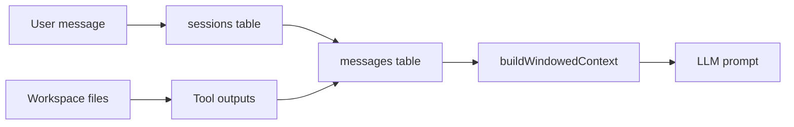
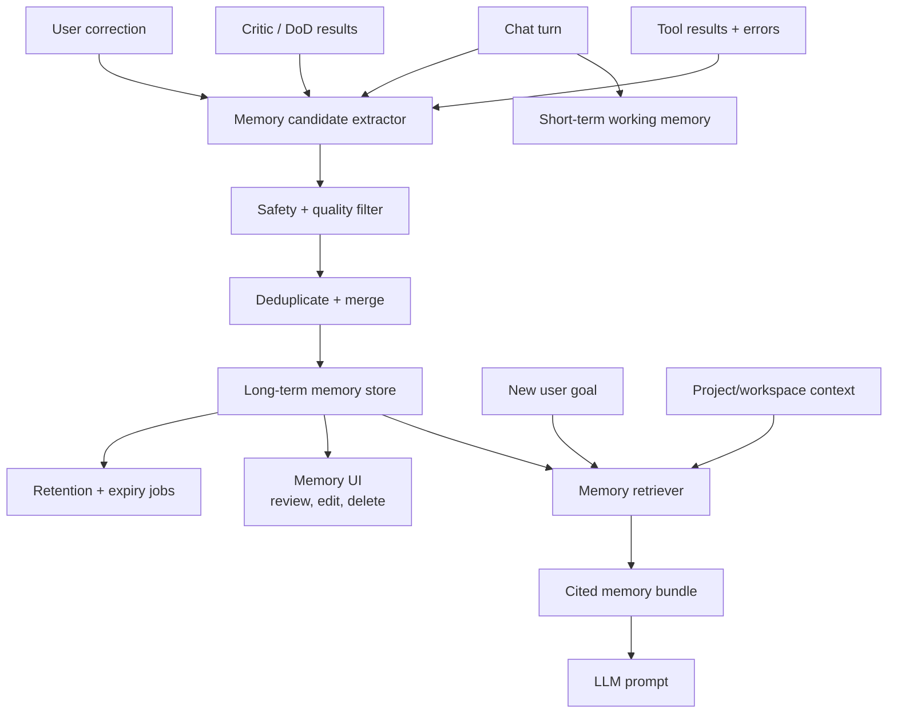
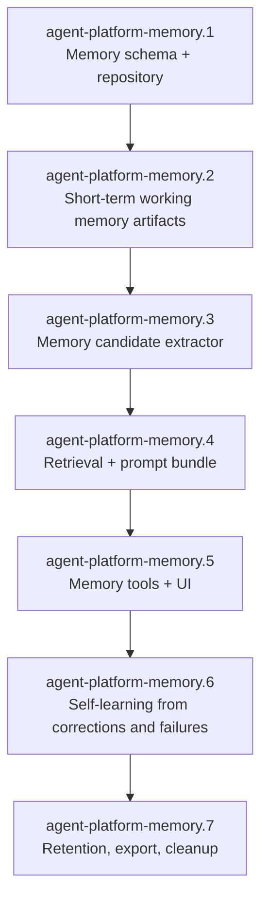

# Memory Management Architecture

## Purpose

Agent Platform needs memory at two different horizons:

- **Short-term memory:** working context for the current task, recent conversation, tool evidence, and temporary decisions.
- **Long-term memory:** durable facts, preferences, project knowledge, lessons learned, mistakes, corrections, and reusable task patterns.

The current platform has sessions, messages, workspace files, and observability traces. That is enough to replay recent work, but it is not yet a memory system. A memory system must retrieve relevant prior knowledge, learn from mistakes, expose what it knows to the user, and forget safely when memory becomes stale or wrong.

## Current State



Current behavior:

- Conversation history is persisted in `messages`.
- The context builder includes the newest messages that fit within the token budget.
- Workspace files persist outside the prompt and can be listed/downloaded.
- Observability events are session-scoped and queryable during runtime.

Missing behavior:

- No semantic retrieval across sessions or projects.
- No project knowledge import.
- No durable store for mistakes and corrections.
- No explicit memory confidence, source, expiry, or review workflow.
- No memory UI for users to inspect, edit, or delete learned facts.

## Target Memory Model

```json
{
  "memory_scopes": ["global", "project", "agent", "session"],
  "memory_types": [
    "fact",
    "preference",
    "decision",
    "procedure",
    "failure_learning",
    "correction",
    "knowledge_chunk"
  ],
  "memory_lifecycle": [
    "candidate_capture",
    "safety_filter",
    "deduplicate",
    "score_confidence",
    "store",
    "retrieve",
    "use_with_citation",
    "review",
    "update_or_forget"
  ]
}
```

## Architecture



## Short-Term Memory

Short-term memory should remain task-local and cheap to update. It should not require vector search.

| Component           | Scope        | Purpose                                                      |
| ------------------- | ------------ | ------------------------------------------------------------ |
| Conversation window | Session      | Recent messages within token budget                          |
| Working notes       | Run/session  | Current plan, assumptions, unresolved questions, tool output |
| Evidence bundle     | Run/session  | Test output, diffs, screenshots, logs, downloaded documents  |
| Pending decisions   | Run/session  | Approvals, user choices, blocked steps                       |
| Scratch memory      | Task/session | Temporary calculations and intermediate structured state     |

Short-term memory should be visible to the critic and DoD checker. It should be discarded or summarized when the task completes.

## Long-Term Memory

Long-term memory should only store information that is useful across future sessions. It should be queryable by scope and source.

Recommended schema shape:

```json
{
  "memory": {
    "id": "uuid",
    "scope": "project",
    "scopeId": "agent-platform",
    "type": "failure_learning",
    "content": "When workspace compose tests create files, ensure generated artifacts are ignored or removed from version control before PR merge.",
    "summary": "Remove generated workspace artifacts before merge",
    "source": {
      "kind": "user_correction",
      "sessionId": "session-id",
      "messageId": "message-id",
      "runId": "run-id"
    },
    "confidence": 0.86,
    "status": "active",
    "tags": ["git", "workspace", "ci"],
    "createdAtMs": 1770000000000,
    "updatedAtMs": 1770000000000,
    "expiresAtMs": null
  }
}
```

Vector embeddings are useful for retrieval, but the canonical memory record should remain structured and inspectable. Embeddings should be treated as an index, not the source of truth.

## Self-Learning From Mistakes

The platform should learn from mistakes through explicit evidence, not silent self-belief.

```mermaid
sequenceDiagram
    autonumber
    participant U as User
    participant A as Agent
    participant E as Extractor
    participant M as Memory Store
    participant R as Retriever

    U->>A: "That was wrong; the feature branch did not contain ws.5"
    A->>E: Capture correction candidate
    E->>E: Classify as correction + failure_learning
    E->>E: Link source session/message/run
    E->>M: Store active memory with confidence + tags
    R->>M: Later similar PR/branch task
    M-->>R: Return correction memory with source
    R-->>A: Prompt bundle: verify branch ancestry before merge advice
```

Self-learning triggers:

| Trigger                       | Example memory candidate                                               | Review mode           |
| ----------------------------- | ---------------------------------------------------------------------- | --------------------- |
| User correction               | "Check PR head branch before saying feature branch is current."        | Store by default      |
| Failed command/test           | "Run `make workspace-init` before compose in CI."                      | Store after success   |
| Repeated tool denial          | "Use workspace-relative paths; absolute host paths are denied."        | Store after threshold |
| Successful remediation        | "Regex parser replaced vulnerable shell separator regex."              | Store as procedure    |
| Critic or DoD repeated revise | "Need exact tool result messages after OpenAI tool calls."             | Store after pass      |
| Manual user preference        | "Prefer task branches chained into a final tip branch before feature." | Store by confirmation |

## Retrieval And Prompt Injection

Memory retrieval must be conservative. Retrieved memories are context, not policy.


Rules:

- Always include source metadata for long-term memories.
- Prefer project and agent memory over global memory.
- Do not inject low-confidence or stale memories by default.
- Cap retrieved memory by token budget and type.
- Distinguish user-approved memory from inferred memory.

## Safety And Governance

Memory expands capability and risk. It needs the same explicit boundaries as tools.

| Risk                 | Guardrail                                                                 |
| -------------------- | ------------------------------------------------------------------------- |
| Storing secrets      | Run credential scan before storage; never embed API keys or tokens        |
| Learning bad facts   | Track source, confidence, status, and user edits                          |
| Privacy leakage      | Scope memories by project/agent/session; avoid cross-project retrieval    |
| Stale behavior       | Add expiry, last-used timestamps, and review queues                       |
| Prompt injection     | Treat imported knowledge and memories as untrusted context unless trusted |
| User loss of control | Provide UI to inspect, edit, delete, export, and clear memories           |

## User Experience

The Memory UI should support:

- Search and filter by scope, type, tag, confidence, and source.
- Inspect full memory content and source evidence.
- Edit or delete individual memories.
- Disable memory capture per agent or session.
- Approve suggested memories when auto-store is not appropriate.
- Clear memory by scope with confirmation.
- Export memory records as JSON.

## Proposed Epics



Suggested first task:

```json
{
  "id": "agent-platform-memory.1",
  "title": "Add memory schema, repository, and policy model",
  "deliverables": [
    "memory_records table",
    "memory_embeddings table or pluggable embedding index interface",
    "memory repository CRUD",
    "memory type/scope/status contracts",
    "credential scan before memory storage",
    "docs and tests"
  ],
  "non_goals": [
    "No automatic self-learning yet",
    "No vector provider lock-in",
    "No cross-project memory retrieval"
  ]
}
```
