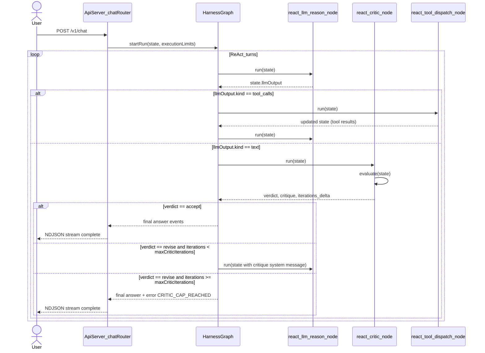
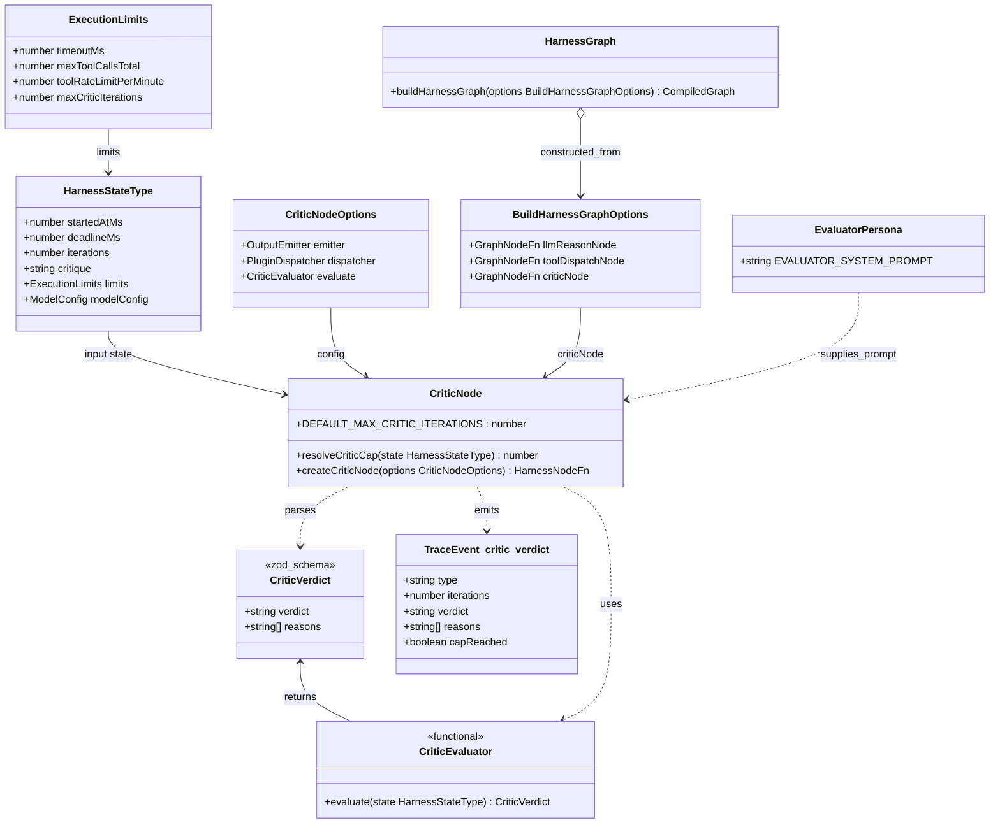
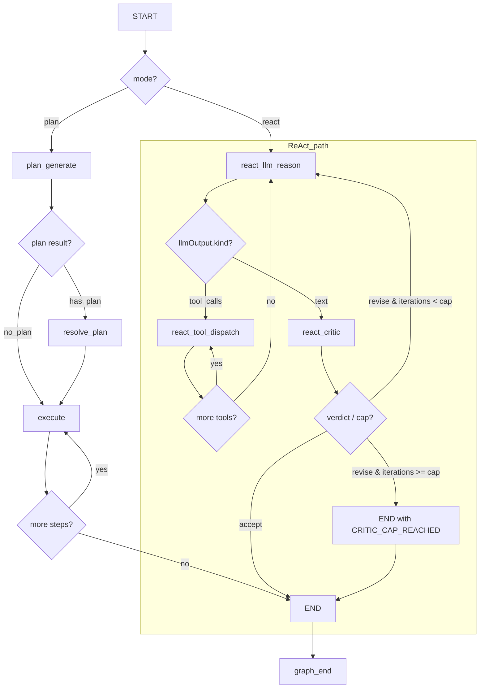

<!-- Generated by sourcery-ai[bot]: start review_guide -->

## Reviewer's Guide

Introduces a critic/evaluator loop into the harness ReAct graph, adds execution limits and contracts for critic behavior, wires a new evaluator persona and node into the chat API, and updates documentation and Beads integration to standardize issue tracking, session completion, and future tasks in the Tier 1 gap-remediation epic.

#### Sequence diagram for ReAct critic evaluation loop

#### Class diagram for critic evaluator contracts and state

#### Flow diagram for updated ReAct path with critic node

### File-Level Changes

| Change                                                                                                                                            | Details                                                                                                                                                                                                                                                                                                                                                                                                                                                                                                                                                                                                                                                                                                                                                                                           | Files                                                                                                                                                                                                                                                                               |
| ------------------------------------------------------------------------------------------------------------------------------------------------- | ------------------------------------------------------------------------------------------------------------------------------------------------------------------------------------------------------------------------------------------------------------------------------------------------------------------------------------------------------------------------------------------------------------------------------------------------------------------------------------------------------------------------------------------------------------------------------------------------------------------------------------------------------------------------------------------------------------------------------------------------------------------------------------------------- | ----------------------------------------------------------------------------------------------------------------------------------------------------------------------------------------------------------------------------------------------------------------------------------- |
| Add critic/evaluator node and loop to the harness ReAct graph with capped iterations.                                                             | <ul><li>Extend BuildHarnessGraphOptions to accept an optional critic node and wire it between llmReason and END, routing through critic back to llmReason or END based on verdict and iteration cap.</li><li>Introduce routing helpers routeAfterLlmWithCritic and routeAfterCritic that respect halted/deadline state and a configurable maxCriticIterations cap.</li><li>Track critic iterations and critique text in HarnessState via new annotations and integrate critic flow into the architecture diagrams.</li></ul>                                                                                                                                                                                                                                                                      | `packages/harness/src/buildGraph.ts` `packages/harness/src/graphState.ts` `docs/architecture/message-flow.md` `docs/architecture.md`                                                                                                                                    |
| Implement critic contract, evaluator persona, and critic node implementation, plus exports and tracing.                                           | <ul><li>Define CriticVerdictSchema and type in contracts and export them from the contracts barrel.</li><li>Add ExecutionLimitsSchema support for maxCriticIterations with defaulting behavior resolved in the harness.</li><li>Implement evaluator system prompt persona and critic node that calls model-router/LLM, parses verdict JSON, emits thinking and critic_verdict trace events, enforces iteration cap, and injects critique system messages.</li><li>Export critic-related APIs and constants from the harness index and extend TraceEvent union with critic_verdict events.</li></ul>                                                                                                                                                                                               | `packages/contracts/src/critic.ts` `packages/contracts/src/limits.ts` `packages/contracts/src/index.ts` `packages/harness/src/personas/evaluator.ts` `packages/harness/src/nodes/critic.ts` `packages/harness/src/index.ts` `packages/harness/src/trace.ts` |
| Wire critic node into the HTTP chat router and ensure execution limits/critic verdict schemas are covered by tests.                               | <ul><li>Update chatRouter to pass a criticNode into buildHarnessGraph so ReAct mode runs through the evaluator.</li><li>Extend contracts roundtrip tests to cover CriticVerdictSchema and ExecutionLimitsSchema including maxCriticIterations.</li><li>Add focused unit and integration tests for critic node behavior, iteration caps, malformed evaluator output, and graph-level routing.</li><li>Ensure critic default cap constant is reused between implementation and tests.</li></ul>                                                                                                                                                                                                                                                                                                     | `apps/api/src/infrastructure/http/v1/chatRouter.ts` `packages/contracts/test/roundtrip.test.ts` `packages/harness/test/critic.test.ts`                                                                                                                                      |
| Standardize Beads (bd) integration, session completion workflow, and Beads config for this repo, and introduce Tier 1 gap-remediation task specs. | <ul><li>Replace and shrink Beads guidance in AGENTS.md into a minimal profile that points to bd prime, clarifies rules around bd vs TODOs/MEMORY, and simplifies session completion workflow to always push to remote including bd dolt push.</li><li>Add the same minimal Beads integration section to CLAUDE.md so both human and AI-facing docs share the workflow.</li><li>Update Beads config to use BEADS_ACTOR, configure sync remote for this repo, and disable auto export; add hook skeletons and ignore/log updates as part of Beads setup.</li><li>Add detailed task specs under docs/tasks for the evaluator loop, DoD contract phase, observability tools, docs CI/ADR/de-dup, and the parent epic, defining dependencies, implementation plans, and definitions of done.</li></ul> | `AGENTS.md` `CLAUDE.md` `.beads/config.yaml` `.beads/hooks/*` `docs/tasks/agent-platform-7ga.md` `docs/tasks/agent-platform-fc8.md` `docs/tasks/agent-platform-2v6.md` `docs/tasks/agent-platform-n6t.md` `docs/tasks/agent-platform-d87.md`        |

---

Tips and commands

#### Interacting with Sourcery

- **Trigger a new review:** Comment `@sourcery-ai review` on the pull request.
- **Continue discussions:** Reply directly to Sourcery's review comments.
- **Generate a GitHub issue from a review comment:** Ask Sourcery to create an
  issue from a review comment by replying to it. You can also reply to a
  review comment with `@sourcery-ai issue` to create an issue from it.
- **Generate a pull request title:** Write `@sourcery-ai` anywhere in the pull
  request title to generate a title at any time. You can also comment
  `@sourcery-ai title` on the pull request to (re-)generate the title at any time.
- **Generate a pull request summary:** Write `@sourcery-ai summary` anywhere in
  the pull request body to generate a PR summary at any time exactly where you
  want it. You can also comment `@sourcery-ai summary` on the pull request to
  (re-)generate the summary at any time.
- **Generate reviewer's guide:** Comment `@sourcery-ai guide` on the pull
  request to (re-)generate the reviewer's guide at any time.
- **Resolve all Sourcery comments:** Comment `@sourcery-ai resolve` on the
  pull request to resolve all Sourcery comments. Useful if you've already
  addressed all the comments and don't want to see them anymore.
- **Dismiss all Sourcery reviews:** Comment `@sourcery-ai dismiss` on the pull
  request to dismiss all existing Sourcery reviews. Especially useful if you
  want to start fresh with a new review - don't forget to comment
  `@sourcery-ai review` to trigger a new review!

#### Customizing Your Experience

Access your [dashboard](https://app.sourcery.ai) to:

- Enable or disable review features such as the Sourcery-generated pull request
  summary, the reviewer's guide, and others.
- Change the review language.
- Add, remove or edit custom review instructions.
- Adjust other review settings.

#### Getting Help

- [Contact our support team](mailto:support@sourcery.ai) for questions or feedback.
- Visit our [documentation](https://docs.sourcery.ai) for detailed guides and information.
- Keep in touch with the Sourcery team by following us on [X/Twitter](https://x.com/SourceryAI), [LinkedIn](https://www.linkedin.com/company/sourcery-ai/) or [GitHub](https://github.com/sourcery-ai).

<!-- Generated by sourcery-ai[bot]: end review_guide -->
