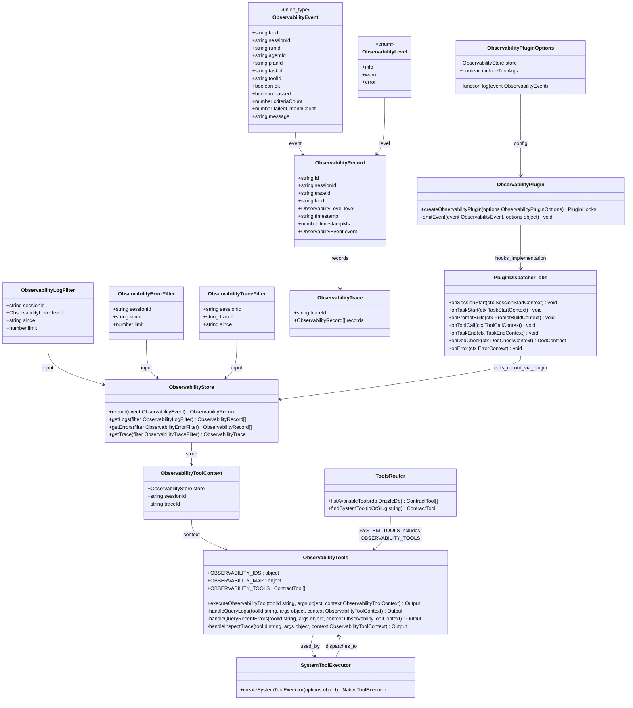
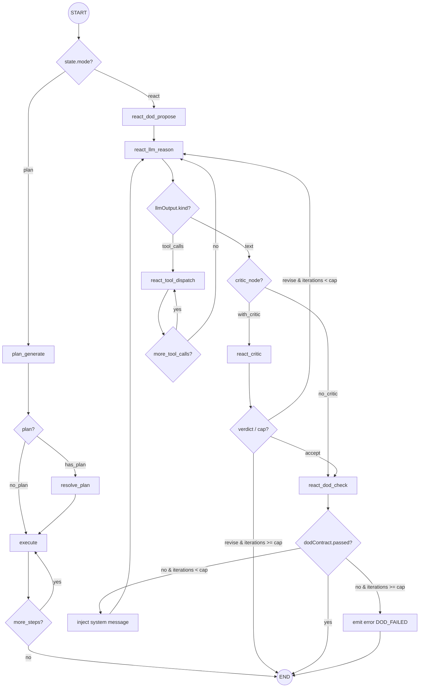

<!-- Generated by sourcery-ai[bot]: start review_guide -->

## Reviewer's Guide

Adds a Definition-of-Done (DoD) contract phase to the harness ReAct loop, wires new DoD and observability capabilities through the plugin system and API runtime, and exposes session-scoped observability tools that agents can call via the standard tools API, with accompanying routing changes, hooks, and tests.

#### Class diagram for DoD contract and harness nodes (class)

```mermaid
classDiagram
  class DodContract {
    +string[] criteria
    +string[] evidence
    +boolean passed
    +string[] failedCriteria
  }

  class HarnessStateType {
    +string sessionId
    +string runId
    +number iterations
    +ExecutionLimits limits
    +DodContract dodContract
    +ChatMessage[] messages
    +ModelConfig modelConfig
  }

  class ExecutionLimits {
    +number timeoutMs
    +number maxToolCallsTotal
    +number toolRateLimitPerMinute
    +number maxCriticIterations
  }

  class DodProposeNodeOptions {
    +DodCriteriaProposer propose
  }

  class DodCheckNodeOptions {
    +OutputEmitter emitter
    +PluginDispatcher dispatcher
    +DodCheckEvaluator evaluate
  }

  class DodCriteriaProposer {
    <<functional>>
    +propose(state HarnessStateType) string[]
  }

  class DodCheckEvaluator {
    <<functional>>
    +evaluate(state HarnessStateType, contract DodContract) DodContract
  }

  class DodProposeNode {
    +createDodProposeNode(options DodProposeNodeOptions) GraphNodeFn
    -parseCriteria(json string) string[]
    -defaultPropose(state HarnessStateType) string[]
    -buildInitialDodContract(criteria string[]) DodContract
  }

  class DodCheckNode {
    +createDodCheckNode(options DodCheckNodeOptions) GraphNodeFn
    -buildEvidence(state HarnessStateType) string[]
    -buildCandidateContract(state HarnessStateType) DodContract
    -buildFailureContract(contract DodContract, note string) DodContract
    -normalizeDodContract(contract DodContract) DodContract
    -defaultEvaluate(state HarnessStateType, contract DodContract) DodContract
    -applyDispatcherOverride(dispatcher PluginDispatcher, state HarnessStateType, contract DodContract) DodContract
    -buildTrace(contract DodContract) TraceEvent[]
    -buildFailureNote(contract DodContract) string
    -buildSummary(contract DodContract) string
  }

  class PluginDispatcher {
    +onDodCheck(ctx DodCheckContext) DodContract
    +onError(ctx ErrorContext) void
  }

  class DodCheckContext {
    +string sessionId
    +string runId
    +DodContract contract
  }

  class TraceEvent_dod_check {
    +string type
    +boolean passed
    +number criteriaCount
    +string[] failedCriteria
  }

  class BuildHarnessGraphOptions {
    +GraphNodeFn llmReasonNode
    +GraphNodeFn toolDispatchNode
    +GraphNodeFn criticNode
    +GraphNodeFn dodProposeNode
    +GraphNodeFn dodCheckNode
  }

  class StateGraph {
    +addNode(name string, fn GraphNodeFn) StateGraph
    +addConditionalEdges(from string, router function) StateGraph
    +addEdge(from string, to string) StateGraph
    +compile(config object) CompiledGraph
  }

  DodContract <-- HarnessStateType : dodContract
  ExecutionLimits <-- HarnessStateType : limits
  DodCriteriaProposer <-- DodProposeNodeOptions : propose
  DodCheckEvaluator <-- DodCheckNodeOptions : evaluate
  DodProposeNodeOptions --> DodProposeNode : config
  DodCheckNodeOptions --> DodCheckNode : config
  PluginDispatcher --> DodCheckNode : dispatcher
  DodCheckContext --> PluginDispatcher : argument
  TraceEvent_dod_check <-- DodCheckNode : emits
  BuildHarnessGraphOptions --> StateGraph : used_to_build
  BuildHarnessGraphOptions --> DodProposeNode : dodProposeNode
  BuildHarnessGraphOptions --> DodCheckNode : dodCheckNode
  BuildHarnessGraphOptions --> HarnessStateType : shapes_state
```

#### Class diagram for observability store and tools (class)

#### Flow diagram for ReAct graph routing with critic and DoD (flow)

### File-Level Changes

| Change                                                                                                                                                                                                                       | Details                                                                                                                                                                                                                                                                                                                                                                                                                                                                                                                                                                                                                                                                                                                                                                                                                                  | Files                                                                                                                                                                                                                                                                                                                                                                                                                                                                                                                                                                  |
| ---------------------------------------------------------------------------------------------------------------------------------------------------------------------------------------------------------------------------- | ---------------------------------------------------------------------------------------------------------------------------------------------------------------------------------------------------------------------------------------------------------------------------------------------------------------------------------------------------------------------------------------------------------------------------------------------------------------------------------------------------------------------------------------------------------------------------------------------------------------------------------------------------------------------------------------------------------------------------------------------------------------------------------------------------------------------------------------- | ---------------------------------------------------------------------------------------------------------------------------------------------------------------------------------------------------------------------------------------------------------------------------------------------------------------------------------------------------------------------------------------------------------------------------------------------------------------------------------------------------------------------------------------------------------------------- |
| Extend the harness ReAct graph with a DoD contract phase and integrate it with the existing critic loop and execution limits.                                                                                                | <ul><li>Add optional dodProposeNode and dodCheckNode to BuildHarnessGraphOptions and construct new graph variants when they are provided (with/without criticNode).</li><li>Introduce routing helpers that ensure DoD proposal runs once at the start of react mode, DoD checks gate graph termination after tool-free drafts and critic acceptance, and cap DoD retries using maxCriticIterations.</li><li>Extend HarnessState with a dodContract field and update trace events with a new dod_check type to record DoD outcomes.</li></ul>                                                                                                                                                                                                                                                                                             | `packages/harness/src/buildGraph.ts` `packages/harness/src/graphState.ts` `packages/harness/src/trace.ts` `packages/harness/test/reactLoop.test.ts`                                                                                                                                                                                                                                                                                                                                                                                                        |
| Implement DoD proposer/checker nodes and contracts, including plugin override semantics and user-facing feedback, plus shared JSON parsing utilities.                                                                        | <ul><li>Introduce DodContractSchema in contracts and export it from the contracts barrel.</li><li>Add createDodProposeNode and createDodCheckNode in the harness, including default LLM-backed implementations, plugin onDodCheck override handling, normalization of failed criteria, iteration-cap handling with DOD_FAILED errors, and summary/feedback text injection.</li><li>Extract extractFirstJsonObject helper into jsonUtils and reuse it from critic and DoD nodes, and add focused unit tests for DoD nodes and helpers in the harness test suite.</li></ul>                                                                                                                                                                                                                                                                | `packages/contracts/src/dod.ts` `packages/contracts/src/index.ts` `packages/harness/src/nodes/dodPropose.ts` `packages/harness/src/nodes/dodCheck.ts` `packages/harness/src/nodes/jsonUtils.ts` `packages/harness/src/nodes/critic.ts` `packages/harness/test/dodPropose.test.ts` `packages/harness/test/dodCheck.test.ts` `packages/harness/test/testUtils.ts` `packages/harness/test/critic.test.ts`                                                                                                                             |
| Extend the plugin SDK and observability plugin with DoD-specific hooks and a pluggable in-memory observability store that powers new observability events and tools.                                                         | <ul><li>Add DodCheckContext and onDodCheck to PluginHooks and PluginDispatcher with last-write-wins override semantics, plus tests verifying override behavior and no-op behavior.</li><li>Extend ObservabilityEvent with a dod_check kind and implement an ObservabilityStore with record/getLogs/getErrors/getTrace helpers, including level derivation and session/trace filtering.</li><li>Update createObservabilityPlugin to accept optional log and store, route all events through a shared emitEvent helper, emit dod_check events on DoD evaluation, and record into the store when configured, with tests covering both logging and storage behavior.</li></ul>                                                                                                                                                               | `packages/plugin-sdk/src/contexts.ts` `packages/plugin-sdk/src/hooks.ts` `packages/plugin-sdk/src/dispatch.ts` `packages/plugin-sdk/src/index.ts` `packages/plugin-sdk/test/dispatch.test.ts` `packages/plugin-observability/src/events.ts` `packages/plugin-observability/src/observability.ts` `packages/plugin-observability/src/store.ts` `packages/plugin-observability/src/index.ts` `packages/plugin-observability/test/observability.test.ts` `packages/plugin-observability/test/store.test.ts`                       |
| Expose session-scoped observability tools (query_logs, query_recent_errors, inspect_trace) through the harness system tools and the public tools API, and wire them into the API runtime with a global observability plugin. | <ul><li>Define zero-risk OBSERVABILITY_TOOLS and executeObservabilityTool in the harness, including argument validation, session-bound context requirements, truncation by count and payload size, and integration into SYSTEM_TOOLS, SYSTEM_TOOL_RISK, and createSystemToolExecutor.</li><li>Create an ObservabilityToolContext that carries store/sessionId/traceId and pass it from the API chat router into createSystemToolExecutor so observability tools are jailed to the current session/run.</li><li>Update the tools router and integration tests so GET /v1/tools returns both DB tools and built-in system tools, GET /v1/tools/:idOrSlug can resolve system tools by id or slug, and confirm observability tool presence and retrieval, plus end-to-end coverage of query_recent_errors in a mocked harness run.</li></ul> | `packages/harness/src/tools/observabilityTools.ts` `packages/harness/src/tools/index.ts` `packages/harness/src/systemTools.ts` `apps/api/src/infrastructure/http/v1/chatRouter.ts` `apps/api/src/infrastructure/http/v1/toolsRouter.ts` `apps/api/src/infrastructure/http/v1/v1Router.ts` `apps/api/package.json` `apps/api/test/crud.integration.test.ts` `apps/api/test/observability.integration.test.ts` `docs/api-reference.md` `docs/plugin-guide.md` `docs/architecture.md` `docs/architecture/message-flow.md` |
| Tighten tool-dispatch observability/error reporting and improve critic node messaging semantics.                                                                                                                             | <ul><li>Fire dispatcher.onError when a native tool returns an error Output, including phase='tool' and a synthesized Error containing the tool id and message.</li><li>Refine critic node iteration accounting so accept verdicts do not bump iterations, critic_verdict trace events and thinking messages use the actual iteration count and more descriptive content, and tests reflect the new iteration behavior.</li><li>Move emitter-capture helpers into shared test utilities and reuse them across critic and DoD tests.</li></ul>                                                                                                                                                                                                                                                                                             | `packages/harness/src/nodes/toolDispatch.ts` `packages/harness/test/toolDispatch.test.ts` `packages/harness/src/nodes/critic.ts` `packages/harness/test/critic.test.ts` `packages/harness/test/testUtils.ts`                                                                                                                                                                                                                                                                                                                                           |
| Wire the new DoD and observability behavior into the chat API lifecycle and documentation, and update session notes for the fc8 task completion and 2v6 kickoff.                                                             | <ul><li>Extend chatRouter to accept ChatRouterOptions with globalPlugins and observabilityStore, pass globalPlugins into buildAgentContext, generate a per-run runId used consistently for plugins, run onTaskStart/onTaskEnd hooks around harness.invoke, and ensure onError receives the correct runId.</li><li>Adjust buildInitialState to take a runId parameter so runId is stable for the run, and update call sites accordingly.</li><li>Update high-level docs (architecture, message-flow, plugin-guide, api-reference) to explain the DoD phase, plugin onDodCheck hook, observability store API, and the three built-in observability tools, and refresh session.md to describe fc8 completion and the 2v6 task scope and next steps.</li></ul>                                                                               | `apps/api/src/infrastructure/http/v1/chatRouter.ts` `apps/api/src/infrastructure/http/v1/v1Router.ts` `apps/api/src/infrastructure/http/v1/chatRouter.ts` `docs/architecture.md` `docs/architecture/message-flow.md` `docs/plugin-guide.md` `docs/api-reference.md` `session.md`                                                                                                                                                                                                                                                           |

---

Tips and commands

#### Interacting with Sourcery

- **Trigger a new review:** Comment `@sourcery-ai review` on the pull request.
- **Continue discussions:** Reply directly to Sourcery's review comments.
- **Generate a GitHub issue from a review comment:** Ask Sourcery to create an
  issue from a review comment by replying to it. You can also reply to a
  review comment with `@sourcery-ai issue` to create an issue from it.
- **Generate a pull request title:** Write `@sourcery-ai` anywhere in the pull
  request title to generate a title at any time. You can also comment
  `@sourcery-ai title` on the pull request to (re-)generate the title at any time.
- **Generate a pull request summary:** Write `@sourcery-ai summary` anywhere in
  the pull request body to generate a PR summary at any time exactly where you
  want it. You can also comment `@sourcery-ai summary` on the pull request to
  (re-)generate the summary at any time.
- **Generate reviewer's guide:** Comment `@sourcery-ai guide` on the pull
  request to (re-)generate the reviewer's guide at any time.
- **Resolve all Sourcery comments:** Comment `@sourcery-ai resolve` on the
  pull request to resolve all Sourcery comments. Useful if you've already
  addressed all the comments and don't want to see them anymore.
- **Dismiss all Sourcery reviews:** Comment `@sourcery-ai dismiss` on the pull
  request to dismiss all existing Sourcery reviews. Especially useful if you
  want to start fresh with a new review - don't forget to comment
  `@sourcery-ai review` to trigger a new review!

#### Customizing Your Experience

Access your [dashboard](https://app.sourcery.ai) to:

- Enable or disable review features such as the Sourcery-generated pull request
  summary, the reviewer's guide, and others.
- Change the review language.
- Add, remove or edit custom review instructions.
- Adjust other review settings.

#### Getting Help

- [Contact our support team](mailto:support@sourcery.ai) for questions or feedback.
- Visit our [documentation](https://docs.sourcery.ai) for detailed guides and information.
- Keep in touch with the Sourcery team by following us on [X/Twitter](https://x.com/SourceryAI), [LinkedIn](https://www.linkedin.com/company/sourcery-ai/) or [GitHub](https://github.com/sourcery-ai).

<!-- Generated by sourcery-ai[bot]: end review_guide -->
