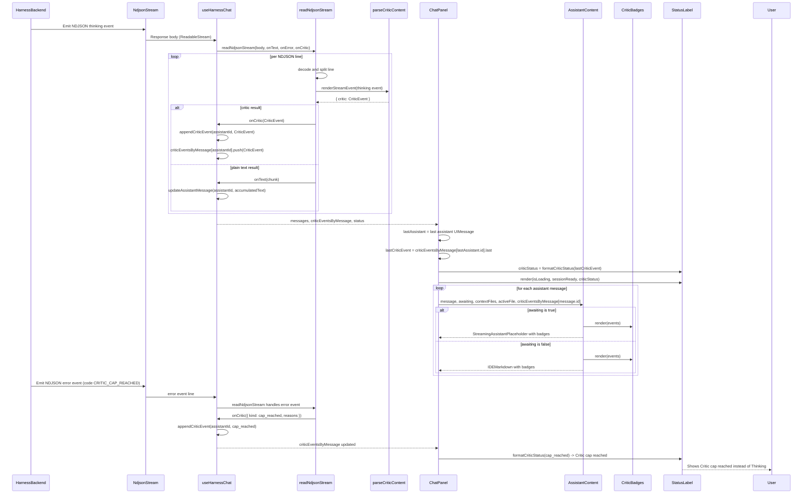
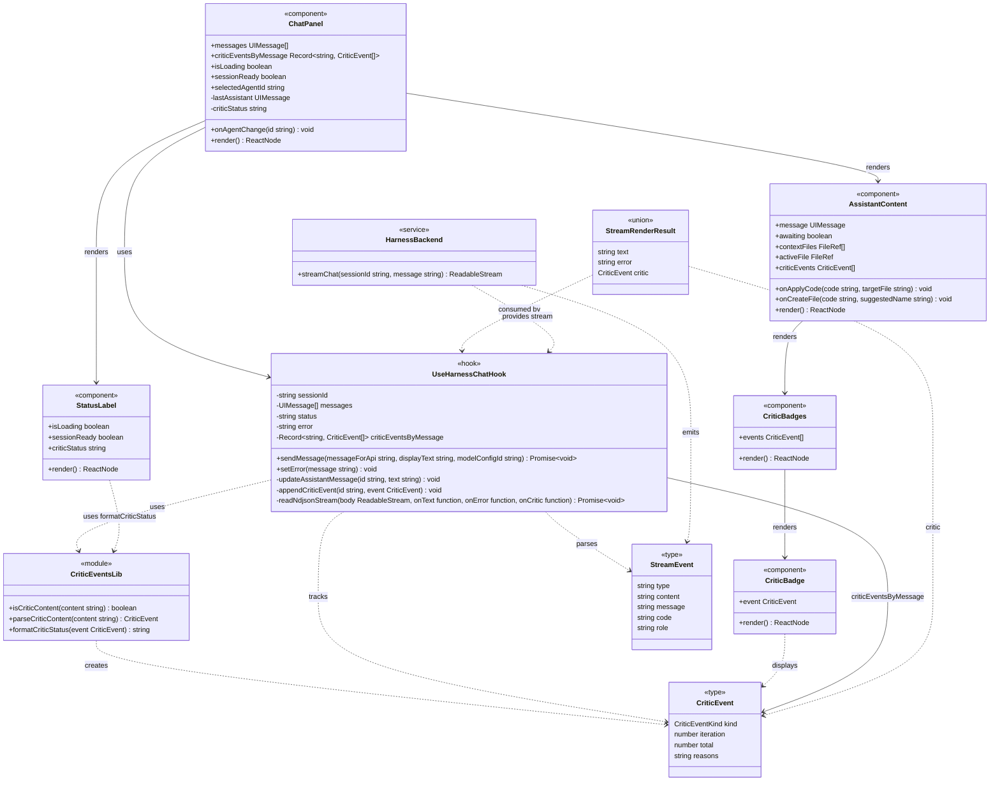

<!-- Generated by sourcery-ai[bot]: start review_guide -->

## Reviewer's Guide

Adds frontend support for harness critic iterations by parsing critic NDJSON thinking/error events into structured CriticEvent objects, tracking them per assistant message in useHarnessChat, and rendering them as badges in the chat UI while driving the chat status label from the latest critic state; also updates session documentation for this work.

#### Sequence diagram for critic events flowing from NDJSON stream to chat UI badges and status

#### Class diagram for critic events, hook state, and chat UI components

### File-Level Changes

| Change                                                                                                                          | Details                                                                                                                                                                                                                                                                                                                                                                                                                                                                                                                                                                                                                                                                  | Files                                                                                                                      |
| ------------------------------------------------------------------------------------------------------------------------------- | ------------------------------------------------------------------------------------------------------------------------------------------------------------------------------------------------------------------------------------------------------------------------------------------------------------------------------------------------------------------------------------------------------------------------------------------------------------------------------------------------------------------------------------------------------------------------------------------------------------------------------------------------------------------------ | -------------------------------------------------------------------------------------------------------------------------- |
| Track structured critic iteration events in the harness chat hook instead of streaming raw critic thinking into assistant text. | <ul><li>Introduce CriticEvent type and parseCriticContent helper usage in the harness chat stream reader.</li><li>Extend renderStreamEvent pipeline to interpret critic thinking content and CRITIC_CAP_REACHED errors into CriticEvent results.</li><li>Augment readNdjsonStream to emit critic events via an onCritic callback in addition to text and error handlers.</li><li>Add criticEventsByMessage state keyed by assistant message id, append events during streaming, and clear them on session reset or stream failure.</li><li>Expose criticEventsByMessage from useHarnessChat so callers can render critic UI without changing NDJSON contracts.</li></ul> | `apps/web/hooks/use-harness-chat.ts` `apps/web/lib/critic-events.ts`                                                   |
| Surface critic iterations and status in the IDE chat UI using badges and an enriched status label.                              | <ul><li>Add CriticBadges and CriticEvent wiring to AssistantContent so critic badges appear above streaming and final assistant messages when present.</li><li>Compute the latest assistant critic status in ChatPanel from criticEventsByMessage and pass it into StatusLabel.</li><li>Extend StatusLabel to accept an optional criticStatus string, prefer it over the generic 'Thinking…', and add a data-testid for testing.</li><li>Thread criticEventsByMessage from IDEWithChat through ChatPanel to AssistantContent so each assistant turn can render its own critic badges.</li></ul>                                                                          | `apps/web/components/ide/ide-with-chat.tsx` `apps/web/components/chat/critic-badges.tsx`                               |
| Provide reusable critic event parsing/formatting utilities and tests.                                                           | <ul><li>Create critic-events helper with CriticEvent model, critic content detection, parsing for revise/accept variants, and status-label formatting for the latest critic event.</li><li>Implement badge label/icon/class helpers and CriticBadge/CriticBadges components with stable test ids and accessibility labels.</li><li>Add unit tests for critic parsing and formatting to validate revise/accept variants, missing reasons, and non-critic discrimination.</li></ul>                                                                                                                                                                                        | `apps/web/lib/critic-events.ts` `apps/web/components/chat/critic-badges.tsx` `apps/web/test/critic-events.test.ts` |
| Update session documentation to record the critic-UI work and current repo state.                                               | <ul><li>Replace previous session notes with a summary of the agent-platform-btm critic UI changes, quality gate status, and next steps.</li><li>Refresh key commits table and branch state to reference the new task branch and commit.</li><li>Clarify current blockers related to sandbox SSH preventing pushes and dolt sync.</li></ul>                                                                                                                                                                                                                                                                                                                               | `session.md`                                                                                                               |

---

Tips and commands

#### Interacting with Sourcery

- **Trigger a new review:** Comment `@sourcery-ai review` on the pull request.
- **Continue discussions:** Reply directly to Sourcery's review comments.
- **Generate a GitHub issue from a review comment:** Ask Sourcery to create an
  issue from a review comment by replying to it. You can also reply to a
  review comment with `@sourcery-ai issue` to create an issue from it.
- **Generate a pull request title:** Write `@sourcery-ai` anywhere in the pull
  request title to generate a title at any time. You can also comment
  `@sourcery-ai title` on the pull request to (re-)generate the title at any time.
- **Generate a pull request summary:** Write `@sourcery-ai summary` anywhere in
  the pull request body to generate a PR summary at any time exactly where you
  want it. You can also comment `@sourcery-ai summary` on the pull request to
  (re-)generate the summary at any time.
- **Generate reviewer's guide:** Comment `@sourcery-ai guide` on the pull
  request to (re-)generate the reviewer's guide at any time.
- **Resolve all Sourcery comments:** Comment `@sourcery-ai resolve` on the
  pull request to resolve all Sourcery comments. Useful if you've already
  addressed all the comments and don't want to see them anymore.
- **Dismiss all Sourcery reviews:** Comment `@sourcery-ai dismiss` on the pull
  request to dismiss all existing Sourcery reviews. Especially useful if you
  want to start fresh with a new review - don't forget to comment
  `@sourcery-ai review` to trigger a new review!

#### Customizing Your Experience

Access your [dashboard](https://app.sourcery.ai) to:

- Enable or disable review features such as the Sourcery-generated pull request
  summary, the reviewer's guide, and others.
- Change the review language.
- Add, remove or edit custom review instructions.
- Adjust other review settings.

#### Getting Help

- [Contact our support team](mailto:support@sourcery.ai) for questions or feedback.
- Visit our [documentation](https://docs.sourcery.ai) for detailed guides and information.
- Keep in touch with the Sourcery team by following us on [X/Twitter](https://x.com/SourceryAI), [LinkedIn](https://www.linkedin.com/company/sourcery-ai/) or [GitHub](https://github.com/sourcery-ai).

<!-- Generated by sourcery-ai[bot]: end review_guide -->
