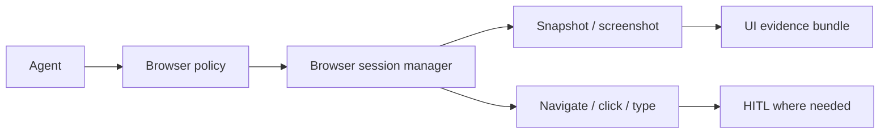

# Epic: Browser automation tool pack

**Beads id:** `agent-platform-browser-tools`  
**Planning source:** [Harness Gap Analysis](../planning/harness-gap-analysis-2026-04-29.md)

## Objective

Add governed browser automation for web UI validation and general automation tasks. The browser tool should support navigation, snapshots, screenshots, clicks, typing, and closing sessions with explicit policy controls.

## Implementation Direction

- **Core runtime:** Playwright, owned inside the platform runtime.
- **Optional adapters:** Playwright MCP and future remote browser providers can be discovered and used as providers, but the core browser tools should not depend on a user-configured MCP server.
- **Initial scope:** local/dev web apps first, including `localhost`, `127.0.0.1`, and configured project URLs. External websites require explicit domain policy.
- **Policy ownership:** domain allow/deny rules, action risk scoring, HITL routing, evidence bounding, and artifact storage are platform-owned.
- **UI-quality relationship:** this epic captures browser evidence and enforces policy. UI/UX grading belongs to `agent-platform-ui-quality-sensors` and should consume these evidence artifacts later.
- **Accessibility evidence:** prefer ARIA snapshots and later Axe-style rule checks; do not build new work around deprecated Playwright accessibility snapshot APIs.

## Capability Map

```json
{
  "actions": ["start", "navigate", "snapshot", "click", "type", "press", "screenshot", "close"],
  "risk": {
    "read_only": ["snapshot", "screenshot"],
    "medium": ["start", "navigate", "close"],
    "high": ["click", "type", "press"]
  },
  "guardrails": ["domain_allowlist", "secret_redaction", "submit_action_hitl", "session_timeout"]
}
```

## Proposed Task Chain

| Task                             | Purpose                                                                     |
| -------------------------------- | --------------------------------------------------------------------------- |
| `agent-platform-browser-tools.1` | Define browser session contracts, risk tiers, and policy profile            |
| `agent-platform-browser-tools.2` | Implement browser session lifecycle and read-only snapshot/screenshot tools |
| `agent-platform-browser-tools.3` | Add navigation, click, type, and press actions with HITL-sensitive policies |
| `agent-platform-browser-tools.4` | Add UI/API observability for browser sessions and screenshots               |
| `agent-platform-browser-tools.5` | Add E2E validation flows and security tests                                 |

## Architecture



## Contract And Policy Model

Task `.1` defines the shared browser automation contracts in `packages/contracts`.
The model is provider-neutral, with Playwright as the intended first internal
runtime. MCP/browser providers remain optional adapters rather than the core
runtime dependency.

The contract surface covers:

- Browser sessions and current page state.
- Action requests for `start`, `navigate`, `snapshot`, `screenshot`, `click`,
  `type`, `press`, and `close`.
- Risk classification for read-only, medium-risk, and high-risk actions.
- URL/domain policy inputs, including localhost/dev URLs, external domains,
  deny lists, protocol limits, redirects, and approval-required decisions.
- Bounded evidence artifacts for screenshots, ARIA snapshots, DOM summaries,
  console/network summaries, traces, page metadata, viewport, URL, timestamp,
  truncation, and redaction metadata.

UI/UX grading remains in `agent-platform-ui-quality-sensors`; this epic captures
browser evidence and enforces automation policy.

Task `.2` adds the first harness implementation for read-only browser tooling:
`sys_browser_start`, `sys_browser_snapshot`, `sys_browser_screenshot`, and
`sys_browser_close`. The tools use a Playwright-backed session manager with an
injectable driver for tests, bounded workspace artifacts, local/dev URL policy
checks, inactive-session expiry, and explicit runtime-unavailable results when
Chromium, Docker dependencies, sandbox permissions, or network access block
launch.

Task `.3` extends the same manager with governed navigation and input tools:
`sys_browser_navigate`, `sys_browser_click`, `sys_browser_type`, and
`sys_browser_press`. Navigation is checked before the request and after
redirects. Interaction tools prefer user-facing locator strategies and produce
bounded before/after evidence. Submit-like, destructive, and sensitive actions
surface approval-required policy results so the existing HITL flow can protect
risky page mutations.

Task `.4` exposes browser evidence through `/v1/browser/artifacts` and
`/v1/browser/artifacts/download`, backed by artifact metadata sidecars written
by the browser session manager. The chat UI summarizes browser tool results as
compact browser activity with artifact links rather than raw JSON, while the
API keeps downloads bounded to `.agent-platform/browser/**`.

Task `.5` adds real browser validation against a local web fixture using the
Playwright-backed browser driver. The integration coverage exercises
start/navigate/snapshot/screenshot/click/type/press/close, external-domain and
redirect approval requirements, sensitive-input approval requirements,
ambiguous-target failures, bounded artifact content, and workspace-relative
sidecar metadata.

## Definition Of Done

- [x] Browser sessions are bounded by timeout and policy.
- [x] Read-only inspection can run without unnecessary approval.
- [x] Mutating actions are risk-scored and approval-gated when appropriate.
- [x] Screenshots/snapshots are stored as evidence artifacts.
- [x] Tests cover successful UI validation and blocked risky actions.
- [x] Child task specs exist for `.1` through `.5` and Beads dependencies match the proposed chain.

## Usage Guide

For practical usage patterns, example prompts, approval behaviour, artifact inspection, and troubleshooting, see [Browser Tools Guide](../browser-tools.md).
