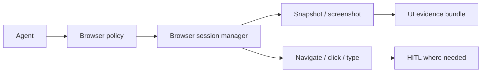

# Epic: Browser automation tool pack

**Beads id:** `agent-platform-browser-tools`  
**Planning source:** [Harness Gap Analysis](../planning/harness-gap-analysis-2026-04-29.md)

## Objective

Add governed browser automation for web UI validation and general automation tasks. The browser tool should support navigation, snapshots, screenshots, clicks, typing, and closing sessions with explicit policy controls.

## Capability Map

```json
{
  "actions": ["start", "navigate", "snapshot", "click", "type", "press", "screenshot", "close"],
  "risk": {
    "read_only": ["snapshot", "screenshot"],
    "medium": ["start", "navigate", "close"],
    "high": ["click", "type", "press"]
  },
  "guardrails": ["domain_allowlist", "secret_redaction", "submit_action_hitl", "session_timeout"]
}
```

## Proposed Task Chain

| Task                             | Purpose                                                                     |
| -------------------------------- | --------------------------------------------------------------------------- |
| `agent-platform-browser-tools.1` | Define browser session contracts, risk tiers, and policy profile            |
| `agent-platform-browser-tools.2` | Implement browser session lifecycle and read-only snapshot/screenshot tools |
| `agent-platform-browser-tools.3` | Add navigation, click, type, and press actions with HITL-sensitive policies |
| `agent-platform-browser-tools.4` | Add UI/API observability for browser sessions and screenshots               |
| `agent-platform-browser-tools.5` | Add E2E validation flows and security tests                                 |

## Architecture



## Definition Of Done

- Browser sessions are bounded by timeout and policy.
- Read-only inspection can run without unnecessary approval.
- Mutating actions are risk-scored and approval-gated when appropriate.
- Screenshots/snapshots are stored as evidence artifacts.
- Tests cover successful UI validation and blocked risky actions.
