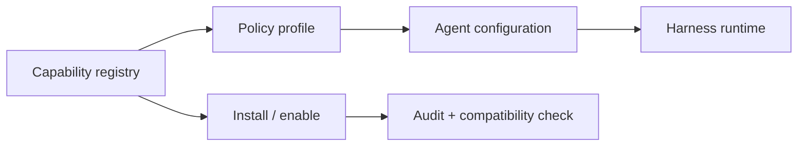

# Epic: Capability registry and policy profiles

**Beads id:** `agent-platform-capability-registry`  
**Planning source:** [Harness Gap Analysis](../planning/harness-gap-analysis-2026-04-29.md)

## Objective

Add discovery, installation, enablement, compatibility checks, and policy profiles for tools, skills, MCP servers, and agent capability bundles.

## Capability Map

```json
{
  "registry_items": ["tool", "skill", "mcp_server", "capability_bundle", "policy_profile"],
  "operations": ["discover", "install", "enable", "disable", "upgrade", "audit"],
  "metadata": ["version", "source", "checksum", "risk", "permissions", "compatibility"],
  "profiles": ["minimal", "coding", "research", "automation", "full"]
}
```

## Proposed Task Chain

| Task                                   | Purpose                                                        |
| -------------------------------------- | -------------------------------------------------------------- |
| `agent-platform-capability-registry.1` | Define capability registry contracts and policy profile schema |
| `agent-platform-capability-registry.2` | Implement registry storage and compatibility checks            |
| `agent-platform-capability-registry.3` | Add install/enable/disable flows for tools and skills          |
| `agent-platform-capability-registry.4` | Add MCP/capability bundle support and audit trails             |
| `agent-platform-capability-registry.5` | Add UI and tests for policy profile selection                  |

## Architecture



## Definition Of Done

- Capability metadata is explicit, versioned, and auditable.
- Users can enable/disable capabilities safely.
- Policy profiles make risk visible before runtime.
- Compatibility checks prevent invalid capability bundles.
- Tests cover install, disable, upgrade, and policy enforcement.
