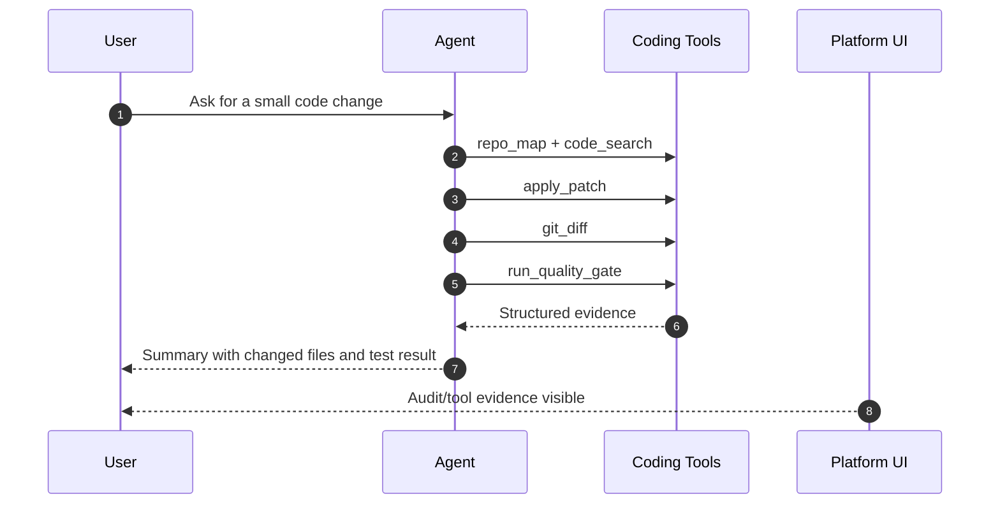

# Task: Add coding tools visibility and E2E validation

**Beads id:** `agent-platform-code-tools.7`  
**Parent epic:** `agent-platform-code-tools` - Structured coding tool pack

## Summary

Complete the structured coding tool epic by adding user-visible auditability, documentation, and end-to-end validation across edit, git, test, and search workflows.

## Requirements

- Add UI/API visibility where needed for coding tool results and audit trails.
- Keep tool-call status/results separate from the assistant's final answer in chat.
- Surface recoverable tool execution failures as tool activity, not global chat errors, when the agent continues and completes the task.
- Collapse completed tool activity by default while keeping it expandable for auditability.
- Document the coding runtime baseline and tool usage.
- Verify end-to-end coding workflows with realistic prompts or API-level simulations.
- Confirm HITL and denial behavior for high-risk operations.
- Ensure feature branch CI is green before merge to main.

## E2E Flow

## Implementation Plan

1. Review all previous coding tool outputs for UI/API requirements.
2. Add result rendering or audit views if existing components are insufficient.
3. Add chat rendering for compact, collapsible tool activity separate from final assistant text.
4. Add regression coverage for recoverable tool errors such as missing parent directories during file creation.
5. Add final docs for user/admin/operator workflows.
6. Add E2E or integration coverage for the full flow.
7. Update epic docs and session state.

## Dependency Order

| Upstream                      | Downstream |
| ----------------------------- | ---------- |
| `agent-platform-code-tools.6` | none       |

Beads dependency: this task depends on `agent-platform-code-tools.6`.

## Tests And Verification

- E2E or integration test for repo discovery, edit, diff, and test runner evidence.
- UI/unit coverage proving tool results and recoverable tool errors do not remain in final assistant text.
- Denial/HITL test for high-risk git or dependency actions.
- Docs lint, format, lint, typecheck, unit tests, and relevant E2E pass.

## Definition Of Done

- Coding tool pack is visible, auditable, and documented.
- Completed chat tool activity is collapsed by default and expandable.
- Recoverable tool failures are shown as tool activity without blocking the completed answer.
- Full workflow is verified end to end.
- Generated artifacts are not committed.
- Feature branch PR is green before main merge.
