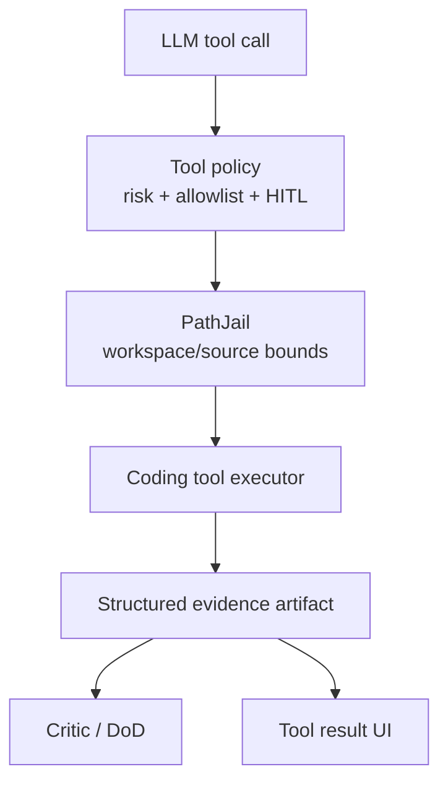

# Epic: Structured coding tool pack

**Beads id:** `agent-platform-code-tools`  
**Planning source:** [Harness Gap Analysis](../planning/harness-gap-analysis-2026-04-29.md)

## Objective

Add first-class coding tools so agents can edit, inspect, test, and review repositories through typed, policy-aware operations instead of relying on raw shell commands and broad file writes.

## Capability Map

```json
{
  "capabilities": [
    "apply_patch_or_structured_edit_tool",
    "git_status",
    "git_diff",
    "test_runner_with_failure_ingestion",
    "repository_map",
    "code_search"
  ],
  "policy": {
    "read_only_git": "low",
    "workspace_edits": "medium",
    "commit_or_push": "high_or_human_approval",
    "dependency_install": "high_or_human_approval"
  }
}
```

## Proposed Task Chain

| Task                          | Purpose                                                                 |
| ----------------------------- | ----------------------------------------------------------------------- |
| `agent-platform-code-tools.1` | Define coding runtime baseline and CLI policy                           |
| `agent-platform-code-tools.2` | Define coding tool contracts, policy model, and evidence artifact shape |
| `agent-platform-code-tools.3` | Implement structured edit/apply patch tool with PathJail enforcement    |
| `agent-platform-code-tools.4` | Implement read-only git status/diff/log tools                           |
| `agent-platform-code-tools.5` | Implement governed test runner and failure summarizer                   |
| `agent-platform-code-tools.6` | Implement repository map and code search helpers                        |
| `agent-platform-code-tools.7` | Add UI/API visibility, audit trails, and end-to-end validation          |

## Architecture



## Definition Of Done

- Coding tools are typed, audited, and governed by risk tiers.
- Edits are workspace/repo bounded and produce readable diffs.
- Test failures are summarized as structured evidence.
- Critic and DoD checks can consume edit/test evidence.
- Unit, integration, and E2E coverage prove allowed and denied paths.
