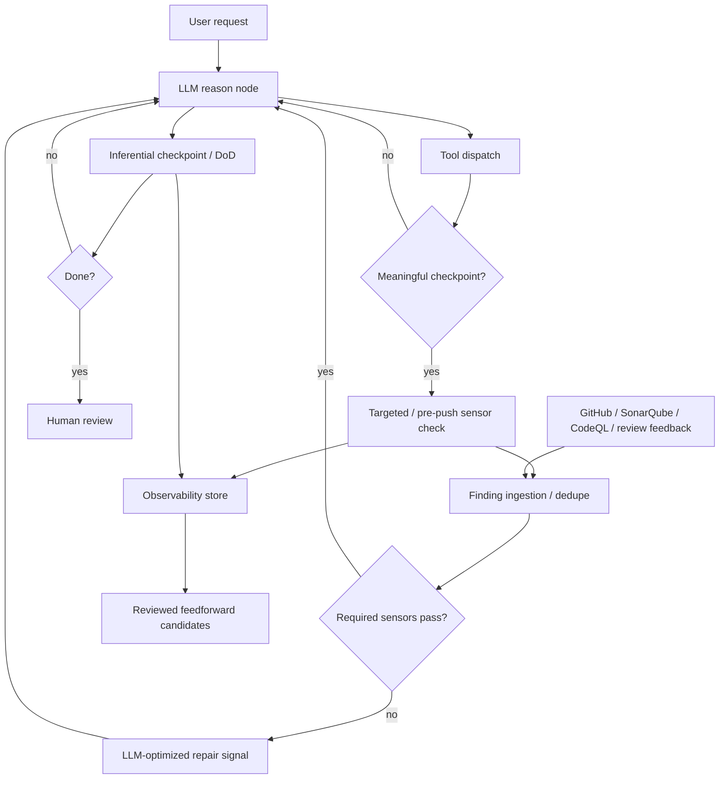

# Epic: Feedback sensors harness

**Beads id:** `agent-platform-feedback-sensors`  
**Planning source:** Birgitta Böckeler, "Harness engineering for coding agent users" (02 April 2026), plus Thoughtworks Technology Radar "Feedback sensors for coding agents" (April 2026)

## Objective

Add first-class feedback sensors to the coding harness so deterministic and inferential checks can observe agent actions, ingest local/IDE/remote findings, produce LLM-optimized repair signals, and drive bounded self-correction loops before final human review.

## Capability Map

```json
{
  "capabilities": [
    "sensor_contracts",
    "capability_discovery",
    "finding_ingestion",
    "runtime_environment_discovery",
    "agent_scope_policy",
    "computational_sensor_runner",
    "react_sensor_check_node",
    "pre_push_validation",
    "post_push_feedback_import",
    "inferential_sensor_checkpoints",
    "sensor_observability",
    "feedback_flywheel_candidates",
    "api_ui_sensor_visibility"
  ],
  "sensor_types": {
    "computational": [
      "typecheck",
      "lint",
      "test",
      "format",
      "docs",
      "build",
      "sonarqube",
      "codeql",
      "github_checks",
      "ide_problems",
      "ide_terminal_output",
      "agent_code_comments"
    ],
    "inferential": ["critic", "definition_of_done", "diff_intent_review", "architecture_fit_review"]
  },
  "feedback_sources": [
    "local_command",
    "ide_problems",
    "ide_terminal_output",
    "ide_plugin_finding",
    "container_runtime",
    "sandbox_runtime",
    "sonarqube_local",
    "sonarqube_remote",
    "codeql_local",
    "codeql_remote",
    "github_check_run",
    "github_pr_review",
    "github_pr_annotation",
    "agent_code_comment",
    "user_feedback"
  ],
  "policy": {
    "fast_sensors": "run_targeted_checks_only_when_useful",
    "slow_sensors": "run_at_pre_push_or_explicit_checkpoints",
    "remote_sensors": "import_after_push_or_when_requested",
    "agent_scope": "enabled_by_agent_profile_and_task_context",
    "repeated_failures": "propose_feedforward_improvements_for_human_review",
    "autonomous_instruction_changes": "disallowed"
  }
}
```

## Agent Scope And Profiles

Feedback sensors are not globally enabled for every agent. Each sensor definition should declare the agent scopes, task contexts, and capability profile it applies to. The default coding profile should use the richest local/IDE/remote quality feedback because it changes repositories and needs pre-push confidence. A general personal-assistant profile should not run coding quality gates unless the task enters a coding workspace or the user explicitly asks for repository validation.

Initial profiles:

- **personal_assistant:** lightweight task-satisfaction and safety checks; no coding gates, GitHub checks, SonarQube, CodeQL, IDE terminal ingestion, or Docker validation unless explicitly requested and authorized.
- **coding:** full coding sensor profile, including local gates, IDE/plugin feedback, SonarQube, CodeQL, GitHub checks, pre-push validation, post-push import, and runtime limitation reporting.
- **research:** source/citation and browsing-related sensors; coding gates only if research produces repository changes.
- **automation:** action-risk, external-system, and completion-state sensors; coding gates only when filesystem/repository changes are in scope.
- **custom:** user/admin-selected capability bundle, with explicit risk and provider requirements.

The future capability registry and policy-profile work should own reusable bundles, but feedback sensors must be designed so a sensor can answer: "which agent profiles may use me, when am I required, and what provider/runtime permissions do I need?"

## Execution Cadence

Sensors should improve the coding flow without turning every edit into a full CI run.

- **During work:** run only cheap, targeted checks when they are likely to produce useful feedback, such as a package-level test after a focused source change, a path/security check after a risky action, or ingestion of already-produced IDE/plugin feedback.
- **Before commit/push:** run the required local completion gate. This is the primary computational checkpoint and should approximate the repository's CI expectations before code reaches GitHub Actions.
- **After push:** import remote feedback instead of rerunning everything locally. This includes GitHub check runs, CodeQL/code scanning alerts, SonarQube quality gates, PR annotations, and review comments.
- **Manual:** allow the user or agent to request sensor discovery, local validation, remote feedback import, or a specific provider check.
- **Scheduled:** later orchestration can poll long-running remote checks and repeated failure patterns.

Capability discovery comes before user confirmation. The platform should inspect local scripts, repository instructions, SonarQube/CodeQL configuration, IDE/problem surfaces, IDE/plugin terminal-output providers, GitHub remotes, branch protection, and check runs where authenticated access is available. Missing auth or missing IDE/plugin access should be represented as an `auth_required`, `not_configured`, or `unavailable` sensor result with a clear repair action, not as absence of a gate.

Capability discovery is filtered by agent scope. For example, discovering GitHub and SonarQube should make them available to a coding agent's profile, but should not cause a personal-assistant agent to start running repository gates during ordinary non-coding work.

## Runtime Environment Constraints

The platform currently runs the application stack in Docker, and future work may introduce more isolated sandboxes for specific commands. Sensors must discover and report the runtime they are operating in so failures are not misread as code problems.

Edge cases to model early:

- host paths and container paths may differ, so findings need path mapping metadata for files, evidence artifacts, and editor links
- required tools may be installed on the host, in the app container, in an IDE plugin, or in a future command sandbox, but not in every runtime
- Docker services may be stopped, unhealthy, missing mounts, or using stale volumes
- a sensor may need network, GitHub auth, SonarQube auth, CodeQL databases, browser dependencies, or workspace mounts that are unavailable inside the current runtime
- future command sandboxes may block process inspection, outbound network, Docker socket access, host IDE access, or writes outside an approved workspace
- terminal output from IDEs/plugins may reflect host-side commands while local quality gates run inside containers, so results must preserve producer/runtime metadata

Sensors should return structured environment limitations such as `runtime_unavailable`, `missing_mount`, `tool_unavailable`, `network_unavailable`, `permission_denied`, or `path_mapping_required` with repair actions. They should not silently downgrade required checks when a runtime boundary prevents execution.

## IDE Feedback Integration

The sandbox should support approved, bounded reads from IDE-exposed feedback surfaces so agents can see problems already identified by the user's development tools. This should not require broad filesystem or process access. Preferred integrations are IDE plugins or local adapters that expose:

- diagnostics/problems from the editor
- terminal output from user-run tasks, test watchers, linters, SonarQube plugins, CodeQL tools, and review agents
- code comments or annotations produced by IDE extensions
- provider status such as connected, unavailable, permission denied, or plugin not installed

The application should encourage users to connect supported IDE plugins when available. If a repo or workflow would benefit from IDE feedback but no provider is configured, the sensor should return a structured setup action rather than silently ignoring that source.

## Proposed Task Chain

| Task                                | Purpose                                                                                      |
| ----------------------------------- | -------------------------------------------------------------------------------------------- |
| `agent-platform-feedback-sensors.1` | Define sensor contracts, finding/result shapes, provider availability, policy, and tracing   |
| `agent-platform-feedback-sensors.2` | Implement deterministic sensor runner and local/IDE/provider-backed finding collection       |
| `agent-platform-feedback-sensors.3` | Wire sensor checks into ReAct at targeted, pre-push, post-push, manual, and scheduled points |
| `agent-platform-feedback-sensors.4` | Add bounded inferential sensor checkpoints for semantic review                               |
| `agent-platform-feedback-sensors.5` | Record sensor outcomes and create reviewed feedforward improvement candidates                |
| `agent-platform-feedback-sensors.6` | Expose sensor controls/results and validate the self-correction workflow end to end          |

## Architecture



## Key Design Decisions

- Start with sensor metadata and structured results in contracts, not ad hoc tool output parsing in graph nodes.
- Treat existing `sys_run_quality_gate` as the first computational sensor execution backend.
- Treat IDE problems, IDE/plugin terminal output, SonarQube issues, CodeQL alerts, GitHub checks, PR annotations, agent code comments, and user feedback as normalized findings with source metadata.
- Prefer pre-push local validation and post-push remote feedback import over frequent full checks after every edit.
- Missing provider auth is a structured availability state with repair actions such as connect, authenticate, skip optional sensor, or retry.
- Runtime boundaries are first-class sensor context. A failed Docker/sandbox precondition is reported as an environment limitation with a repair action, not as a passing or absent quality gate.
- Sensor enablement is agent-profile and task-context aware. Coding sensors must not be forced onto general-purpose agents unless their task context requires them or the user explicitly opts in.
- Feed the model repair-shaped messages, not raw logs. Raw stdout/stderr remain evidence artifacts.
- Reuse the existing critic and DoD loop model for inferential sensors instead of creating a second semantic-review system.
- Keep automatic harness improvement review-gated. Repeated failures may propose Beads tasks, memories, skills, or instruction changes, but must not apply them directly.

## Definition Of Done

- Sensors have typed definitions, trigger policies, bounded result envelopes, and trace events.
- Fast deterministic sensors can run selectively during work, with required local validation before commit/push.
- Remote feedback from GitHub Actions, CodeQL, SonarQube, PR annotations, and code review comments can be imported after push or on request.
- IDE/problem diagnostics, IDE/plugin terminal output, and agent-generated code comments can be ingested before push and deduplicated with local/remote findings.
- Docker/container/runtime limitations are visible in sensor results and do not mask required checks.
- Sensor selection respects agent scope and capability profile so personal-assistant, research, automation, and coding agents get appropriate feedback without unnecessary tools.
- Inferential sensors can run at task checkpoints with cost/iteration limits.
- Sensor outcomes are observable and queryable.
- Repeated sensor failures can become reviewed improvement candidates.
- API/UI surfaces expose sensor configuration/results sufficiently for users to trust the loop.
- Unit, integration, and E2E coverage prove failure-to-correction and pass-to-completion behavior.
