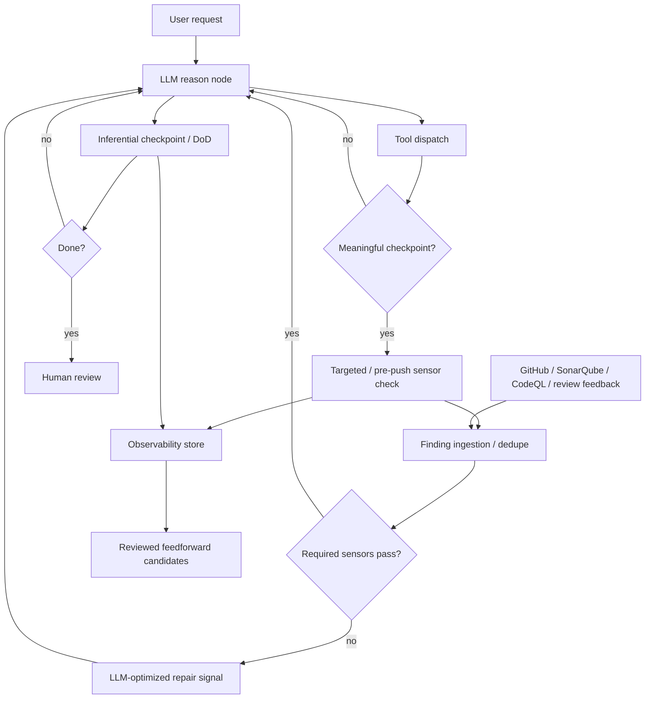

# Epic: Feedback sensors harness

**Beads id:** `agent-platform-feedback-sensors`  
**Planning source:** Birgitta Böckeler, "Harness engineering for coding agent users" (02 April 2026), plus Thoughtworks Technology Radar "Feedback sensors for coding agents" (April 2026)

## Objective

Add first-class feedback sensors to the coding harness so deterministic and inferential checks can observe agent actions, ingest local/IDE/remote findings, produce LLM-optimized repair signals, and drive bounded self-correction loops before final human review.

## Capability Map

```json
{
  "capabilities": [
    "sensor_contracts",
    "capability_discovery",
    "finding_ingestion",
    "computational_sensor_runner",
    "react_sensor_check_node",
    "pre_push_validation",
    "post_push_feedback_import",
    "inferential_sensor_checkpoints",
    "sensor_observability",
    "feedback_flywheel_candidates",
    "api_ui_sensor_visibility"
  ],
  "sensor_types": {
    "computational": [
      "typecheck",
      "lint",
      "test",
      "format",
      "docs",
      "build",
      "sonarqube",
      "codeql",
      "github_checks",
      "ide_problems",
      "agent_code_comments"
    ],
    "inferential": ["critic", "definition_of_done", "diff_intent_review", "architecture_fit_review"]
  },
  "feedback_sources": [
    "local_command",
    "ide_problems",
    "sonarqube_local",
    "sonarqube_remote",
    "codeql_local",
    "codeql_remote",
    "github_check_run",
    "github_pr_review",
    "github_pr_annotation",
    "agent_code_comment",
    "user_feedback"
  ],
  "policy": {
    "fast_sensors": "run_targeted_checks_only_when_useful",
    "slow_sensors": "run_at_pre_push_or_explicit_checkpoints",
    "remote_sensors": "import_after_push_or_when_requested",
    "repeated_failures": "propose_feedforward_improvements_for_human_review",
    "autonomous_instruction_changes": "disallowed"
  }
}
```

## Execution Cadence

Sensors should improve the coding flow without turning every edit into a full CI run.

- **During work:** run only cheap, targeted checks when they are likely to produce useful feedback, such as a package-level test after a focused source change or a path/security check after a risky action.
- **Before commit/push:** run the required local completion gate. This is the primary computational checkpoint and should approximate the repository's CI expectations before code reaches GitHub Actions.
- **After push:** import remote feedback instead of rerunning everything locally. This includes GitHub check runs, CodeQL/code scanning alerts, SonarQube quality gates, PR annotations, and review comments.
- **Manual:** allow the user or agent to request sensor discovery, local validation, remote feedback import, or a specific provider check.
- **Scheduled:** later orchestration can poll long-running remote checks and repeated failure patterns.

Capability discovery comes before user confirmation. The platform should inspect local scripts, repository instructions, SonarQube/CodeQL configuration, IDE/problem surfaces, GitHub remotes, branch protection, and check runs where authenticated access is available. Missing auth should be represented as an `auth_required` or `unavailable` sensor result with a clear repair action, not as absence of a gate.

## Proposed Task Chain

| Task                                | Purpose                                                                                      |
| ----------------------------------- | -------------------------------------------------------------------------------------------- |
| `agent-platform-feedback-sensors.1` | Define sensor contracts, finding/result shapes, provider availability, policy, and tracing   |
| `agent-platform-feedback-sensors.2` | Implement deterministic sensor runner and local/IDE/provider-backed finding collection       |
| `agent-platform-feedback-sensors.3` | Wire sensor checks into ReAct at targeted, pre-push, post-push, manual, and scheduled points |
| `agent-platform-feedback-sensors.4` | Add bounded inferential sensor checkpoints for semantic review                               |
| `agent-platform-feedback-sensors.5` | Record sensor outcomes and create reviewed feedforward improvement candidates                |
| `agent-platform-feedback-sensors.6` | Expose sensor controls/results and validate the self-correction workflow end to end          |

## Architecture



## Key Design Decisions

- Start with sensor metadata and structured results in contracts, not ad hoc tool output parsing in graph nodes.
- Treat existing `sys_run_quality_gate` as the first computational sensor execution backend.
- Treat IDE problems, SonarQube issues, CodeQL alerts, GitHub checks, PR annotations, agent code comments, and user feedback as normalized findings with source metadata.
- Prefer pre-push local validation and post-push remote feedback import over frequent full checks after every edit.
- Missing provider auth is a structured availability state with repair actions such as connect, authenticate, skip optional sensor, or retry.
- Feed the model repair-shaped messages, not raw logs. Raw stdout/stderr remain evidence artifacts.
- Reuse the existing critic and DoD loop model for inferential sensors instead of creating a second semantic-review system.
- Keep automatic harness improvement review-gated. Repeated failures may propose Beads tasks, memories, skills, or instruction changes, but must not apply them directly.

## Definition Of Done

- Sensors have typed definitions, trigger policies, bounded result envelopes, and trace events.
- Fast deterministic sensors can run selectively during work, with required local validation before commit/push.
- Remote feedback from GitHub Actions, CodeQL, SonarQube, PR annotations, and code review comments can be imported after push or on request.
- IDE/problem diagnostics and agent-generated code comments can be ingested before push and deduplicated with local/remote findings.
- Inferential sensors can run at task checkpoints with cost/iteration limits.
- Sensor outcomes are observable and queryable.
- Repeated sensor failures can become reviewed improvement candidates.
- API/UI surfaces expose sensor configuration/results sufficiently for users to trust the loop.
- Unit, integration, and E2E coverage prove failure-to-correction and pass-to-completion behavior.
