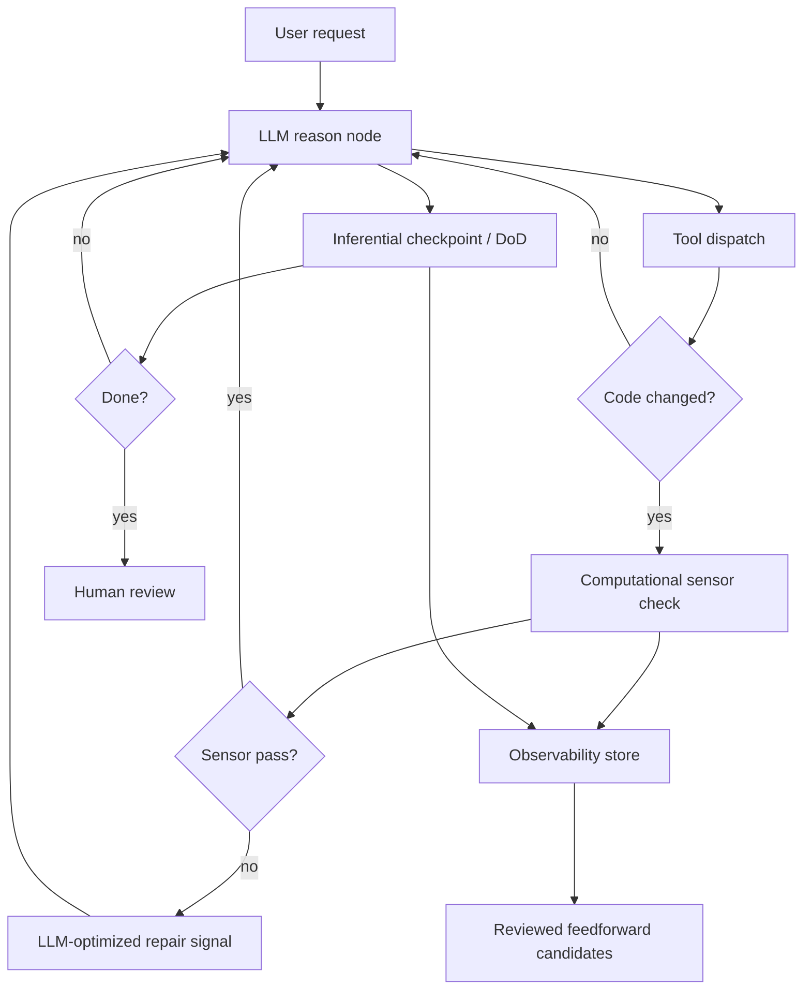

# Epic: Feedback sensors harness

**Beads id:** `agent-platform-feedback-sensors`  
**Planning source:** Birgitta Böckeler, "Harness engineering for coding agent users" (02 April 2026), plus Thoughtworks Technology Radar "Feedback sensors for coding agents" (April 2026)

## Objective

Add first-class feedback sensors to the coding harness so deterministic and inferential checks can observe agent actions, produce LLM-optimized repair signals, and drive bounded self-correction loops before human review.

## Capability Map

```json
{
  "capabilities": [
    "sensor_contracts",
    "computational_sensor_runner",
    "react_sensor_check_node",
    "inferential_sensor_checkpoints",
    "sensor_observability",
    "feedback_flywheel_candidates",
    "api_ui_sensor_visibility"
  ],
  "sensor_types": {
    "computational": ["typecheck", "lint", "test", "format", "docs", "build", "sonarqube"],
    "inferential": ["critic", "definition_of_done", "diff_intent_review", "architecture_fit_review"]
  },
  "policy": {
    "fast_sensors": "run_during_agent_session",
    "slow_sensors": "run_at_checkpoints",
    "repeated_failures": "propose_feedforward_improvements_for_human_review",
    "autonomous_instruction_changes": "disallowed"
  }
}
```

## Proposed Task Chain

| Task                                | Purpose                                                                             |
| ----------------------------------- | ----------------------------------------------------------------------------------- |
| `agent-platform-feedback-sensors.1` | Define sensor contracts, result shape, repair instructions, policy, and tracing     |
| `agent-platform-feedback-sensors.2` | Implement deterministic sensor runner over approved quality gates                   |
| `agent-platform-feedback-sensors.3` | Wire sensor checks into the ReAct graph after relevant tool dispatches              |
| `agent-platform-feedback-sensors.4` | Add bounded inferential sensor checkpoints for semantic review                      |
| `agent-platform-feedback-sensors.5` | Record sensor outcomes and create reviewed feedforward improvement candidates       |
| `agent-platform-feedback-sensors.6` | Expose sensor controls/results and validate the self-correction workflow end to end |

## Architecture



## Key Design Decisions

- Start with sensor metadata and structured results in contracts, not ad hoc tool output parsing in graph nodes.
- Treat existing `sys_run_quality_gate` as the first computational sensor execution backend.
- Feed the model repair-shaped messages, not raw logs. Raw stdout/stderr remain evidence artifacts.
- Reuse the existing critic and DoD loop model for inferential sensors instead of creating a second semantic-review system.
- Keep automatic harness improvement review-gated. Repeated failures may propose Beads tasks, memories, skills, or instruction changes, but must not apply them directly.

## Definition Of Done

- Sensors have typed definitions, trigger policies, bounded result envelopes, and trace events.
- Fast deterministic sensors can run after code-changing actions and feed repair instructions back into the ReAct loop.
- Inferential sensors can run at task checkpoints with cost/iteration limits.
- Sensor outcomes are observable and queryable.
- Repeated sensor failures can become reviewed improvement candidates.
- API/UI surfaces expose sensor configuration/results sufficiently for users to trust the loop.
- Unit, integration, and E2E coverage prove failure-to-correction and pass-to-completion behavior.
