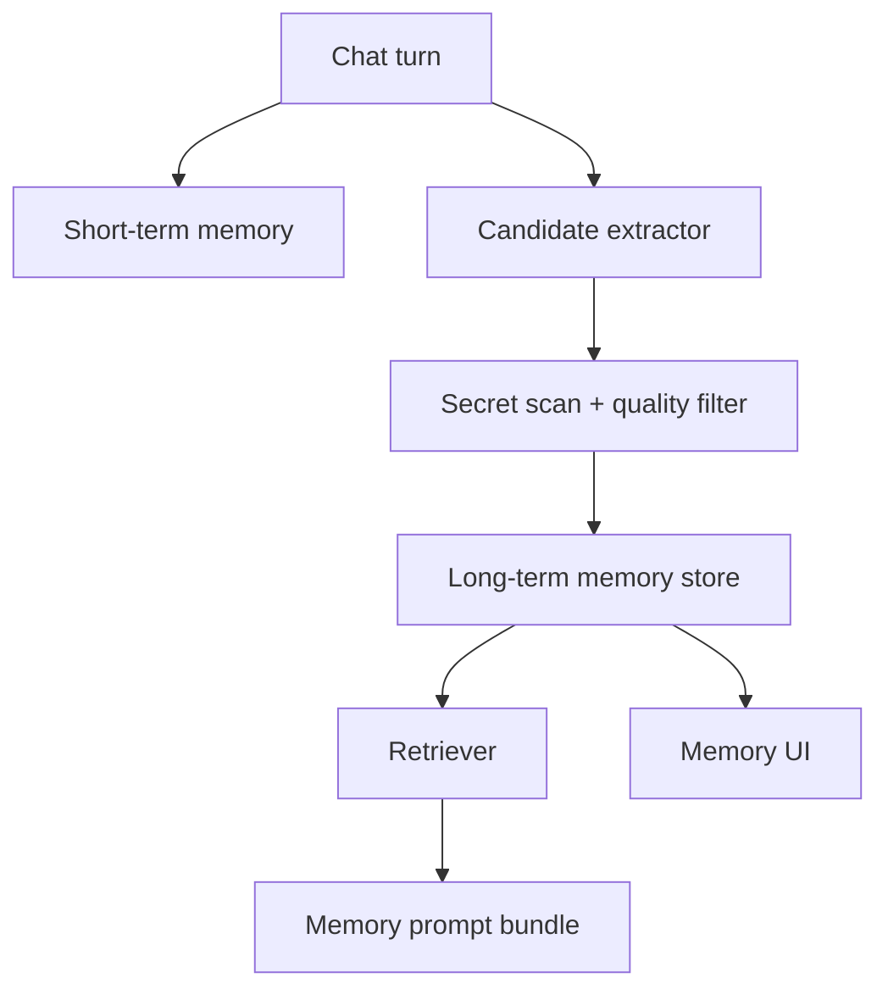

# Epic: Memory management and self-learning

**Beads id:** `agent-platform-memory`  
**Planning source:** [Memory Management Architecture](../planning/memory-management.md)

## Objective

Add short-term working memory and long-term scoped memory so agents can use prior context, learn from mistakes, retain useful project knowledge, and expose memory for user review.

## Capability Map

```json
{
  "short_term": ["working_notes", "evidence_bundle", "pending_decisions", "scratch_state"],
  "long_term": ["fact", "preference", "decision", "procedure", "failure_learning", "correction"],
  "operations": ["store", "search", "retrieve", "update", "delete", "export", "clear_scope"],
  "safety": ["source_metadata", "confidence", "expiry", "secret_scan", "user_review"]
}
```

## Proposed Task Chain

| Task                      | Purpose                                                                      |
| ------------------------- | ---------------------------------------------------------------------------- |
| `agent-platform-memory.1` | Add memory contracts, schema, repository, and policy model                   |
| `agent-platform-memory.2` | Add short-term working memory artifacts for runs/tasks                       |
| `agent-platform-memory.3` | Add memory candidate extraction from corrections, failures, and remediations |
| `agent-platform-memory.4` | Add retrieval and prompt memory bundles with source metadata                 |
| `agent-platform-memory.5` | Add memory tools and Memory UI for inspect/edit/delete/export                |
| `agent-platform-memory.6` | Add self-learning workflow with review controls and tests                    |
| `agent-platform-memory.7` | Add retention, expiry, cleanup, and cross-scope safety tests                 |

## Architecture



## Definition Of Done

- Memory is scoped by global/project/agent/session.
- Learned memories include source, confidence, status, and timestamps.
- User can inspect, edit, delete, export, and clear memory.
- Retrieval is conservative and source-linked.
- Secret scanning and stale-memory controls are enforced.
