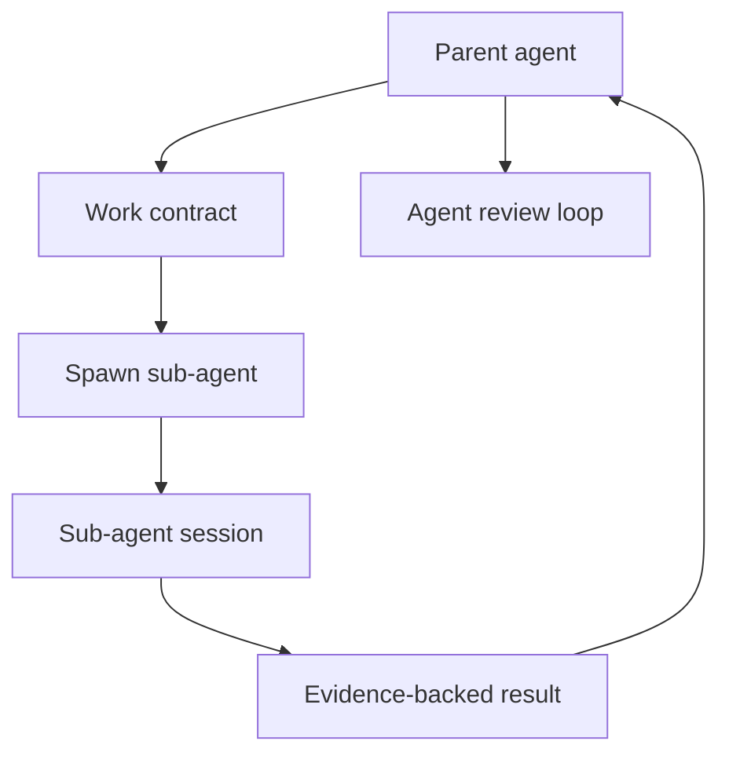

# Epic: Multi-agent orchestration

**Beads id:** `agent-platform-multi-agent`  
**Planning source:** [Harness Gap Analysis](../planning/harness-gap-analysis-2026-04-29.md)

## Objective

Add bounded sub-agent execution for parallel tasks, agent-to-agent review, and result collection. The model should be able to delegate work through explicit contracts without bypassing workspace, tool, or approval policy.

## Capability Map

```json
{
  "sub_agent_contract": {
    "inputs": ["goal", "scope", "allowed_paths", "allowed_tools", "timeout_ms"],
    "outputs": ["summary", "changed_files", "evidence", "open_risks"],
    "controls": ["spawn", "status", "cancel", "collect_result"]
  }
}
```

## Proposed Task Chain

| Task                           | Purpose                                                    |
| ------------------------------ | ---------------------------------------------------------- |
| `agent-platform-multi-agent.1` | Define sub-agent contracts, state, and policy boundaries   |
| `agent-platform-multi-agent.2` | Implement sub-agent session creation and result collection |
| `agent-platform-multi-agent.3` | Add cancellation, timeouts, and bounded parallel execution |
| `agent-platform-multi-agent.4` | Add agent review loop and evidence handoff                 |
| `agent-platform-multi-agent.5` | Add UI/API observability and E2E tests                     |

## Architecture



## Definition Of Done

- Sub-agent work is explicitly scoped and policy-bound.
- Parent agents can monitor, cancel, and collect results.
- Sub-agent evidence is auditable and visible.
- Parallel execution respects configured limits.
- Tests cover success, failure, cancellation, and policy denial.
