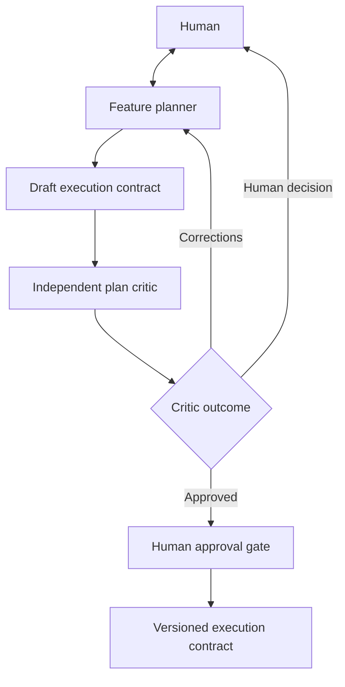
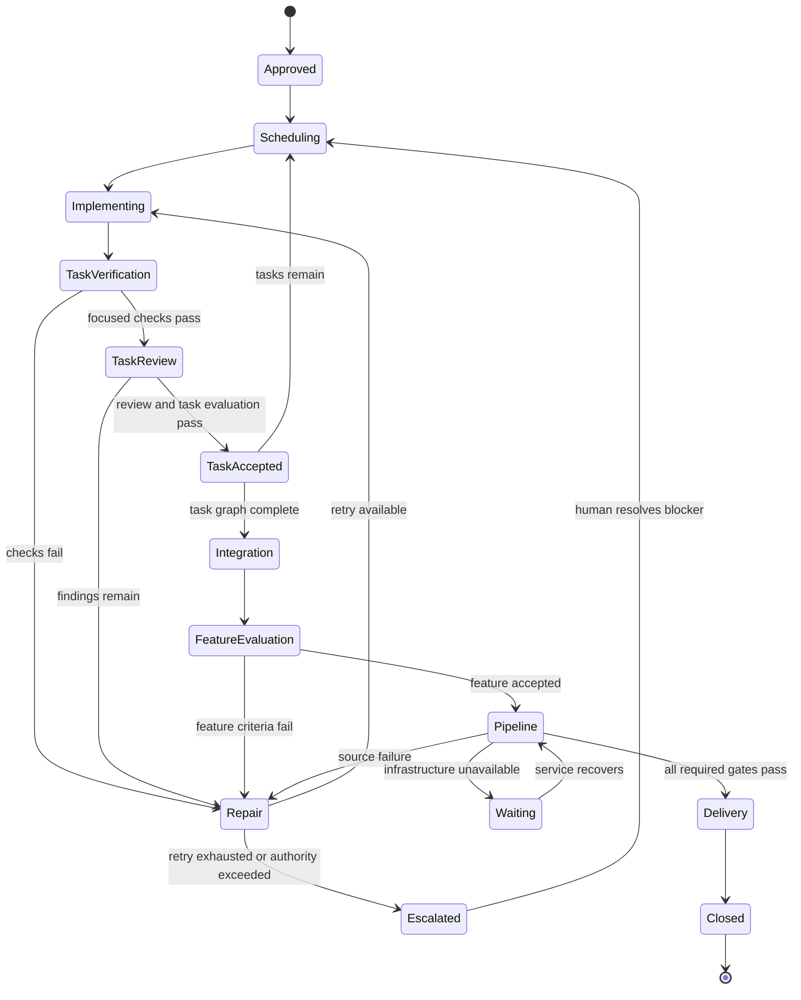

# Epic: Autonomous Multi-Agent Feature Delivery

**Beads id:** `agent-platform-multi-agent`

**Status:** Policy approved; ready for independent plan criticism and implementation task breakdown.

**Primary configuration:** `.codex/agents/*.toml`

**Workflow skills:** `.agents/skills/*/SKILL.md`

**Planning source:** [Harness Gap Analysis](../planning/harness-gap-analysis-2026-04-29.md)

## Objective

Create a feature-level delivery workflow in which a human collaborates with a primary planning agent,
an independent critic evaluates the plan, and the human approves a versioned execution contract.
After approval, an orchestrator executes the complete Beads task graph with specialist agents,
feedback and repair loops, quality gates, durable pipeline waiting, delivery, and final evidence
reporting.

The target operating model is:

> Planning is collaborative; execution is delegated; progress is observable; interruption is
> exceptional.

The human owns intent, policy, and exceptional decisions. The orchestrator owns progress after the
planning gate.

## Desired Outcome

A human should be able to:

1. Describe and refine a feature with a primary planning agent.
2. Review an independent critique of the proposed plan.
3. Resolve open questions and approve the corrected execution contract.
4. Move on to planning another feature while the orchestrator delivers the approved feature.
5. Return to a completed feature with traceable code, reviews, tests, pipelines, Beads state, and
   remaining risks.

Normal test failures, review findings, evaluator rejections, and source-code pipeline failures must
enter automated repair loops. They must not require the human to restart the workflow manually.

## Non-Goals

- Removing human approval from initial feature planning.
- Allowing agents to expand scope, permissions, or delivery authority after approval.
- Running every task through the most expensive possible agent sequence.
- Parallelizing write-heavy tasks that overlap in files, contracts, or integration state.
- Treating chat history as the durable workflow store.
- Replacing Beads with a second task tracker.
- Granting production deployment authority by default.
- Building a full visual workflow editor in the first increment.

## Core Principles

### Feature-Level Orchestration

The feature or epic is the unit of orchestration. Beads child tasks remain the units of implementation,
dependency management, recovery, and closure.

Planning, cumulative review, feature evaluation, and delivery happen at feature level. Individual
tasks receive proportionate review and verification based on their risk and role in the dependency
graph.

### Maker-Checker Planning

The primary planning agent creates the plan. An independent plan critic applies a maker-checker, or
four-eyes, review before the human approves it. The critic reports findings; it does not silently
rewrite the plan.

### Human-In-The-Loop, Then Human-On-The-Loop

The human participates directly during discovery, refinement, critique resolution, and final plan
approval. After approval, the human observes progress and is interrupted only when work exceeds the
approved authority or cannot recover within its retry policy.

### Single-Writer Control

The orchestrator is the only agent allowed to mutate workflow state or Beads task state. Specialist
agents return structured recommendations and evidence. They do not claim, reopen, close, reprioritize,
or create tasks directly.

### Evidence Before Transition

No task or feature advances because an agent says it is done. State transitions require the evidence
defined by the execution contract: changed files, test results, review outcome, acceptance-criteria
coverage, and known risks.

### Bounded Context

Each specialist receives a compact work packet rather than the complete feature transcript. Durable
decisions, findings, and evidence are persisted as structured workflow records so execution can resume
without reconstructing state from chat.

## Repository Configuration

Project-scoped Codex agent definitions live in `.codex/agents/`. Repository workflow skills live in
`.agents/skills/`, which is the supported project-skill discovery location.

```text
.codex/
├── config.toml
├── README.md
└── agents/
    ├── feature-planner.toml
    ├── plan-critic.toml
    ├── workflow-orchestrator.toml
    ├── repo-explorer.toml
    ├── implementation-worker.toml
    ├── code-reviewer.toml
    ├── test-runner.toml
    ├── qa-evaluator.toml
    └── feature-evaluator.toml

.agents/skills/
├── feature-planning/
│   ├── SKILL.md
│   └── references/
│       ├── execution-contract.md
│       └── plan-review-rubric.md
├── autonomous-feature-delivery/
│   ├── SKILL.md
│   ├── references/
│   │   ├── workflow-state-machine.md
│   │   ├── agent-result-contract.md
│   │   ├── task-scheduling.md
│   │   └── feedback-loops.md
│   └── scripts/
│       └── validate-execution-contract.*
└── delivery-closeout/
    ├── SKILL.md
    └── references/
        ├── quality-gates.md
        └── closeout-protocol.md
```

Codex does not currently document a native project workflow TOML schema. Agent TOMLs define roles and
configuration; skills define reusable procedures; a durable workflow-control service persists and
enforces execution state.

## Agent Roster

| Agent                   | Sandbox         | Responsibility                                                         | May change application code |
| ----------------------- | --------------- | ---------------------------------------------------------------------- | --------------------------- |
| `feature_planner`       | Read-only       | Conduct the planning interview and produce the execution contract      | No                          |
| `plan_critic`           | Read-only       | Independently evaluate requirements, risks, tasks, tests, and delivery | No                          |
| `workflow_orchestrator` | Workspace-write | Execute the approved contract and own state transitions                | No                          |
| `repo_explorer`         | Read-only       | Map relevant code paths, dependencies, and tests                       | No                          |
| `implementation_worker` | Workspace-write | Implement one bounded task and focused tests                           | Yes                         |
| `code_reviewer`         | Read-only       | Review correctness, security, regressions, architecture, and test gaps | No                          |
| `test_runner`           | Workspace-write | Run deterministic verification and capture evidence                    | No                          |
| `qa_evaluator`          | Workspace-write | Exercise user-visible behavior and capture artifacts                   | No                          |
| `feature_evaluator`     | Read-only       | Evaluate the integrated feature against the approved contract          | No                          |

Every custom agent TOML must define `name`, `description`, and `developer_instructions`. Models and
reasoning effort initially inherit from the parent session. Explicit model overrides should be added
only after measuring quality, latency, and token use for each role.

The existing explorer, implementation worker, code reviewer, and test runner definitions should be
refined rather than duplicated.

## Agent Authority Boundaries

| State or resource               | Authoritative writer                  | Other agents                      |
| ------------------------------- | ------------------------------------- | --------------------------------- |
| Feature requirements and policy | Human through approved contract       | May propose changes               |
| Workflow state                  | Orchestrator                          | Return transition recommendations |
| Beads task state                | Orchestrator through workflow control | Read-only                         |
| Application code                | Assigned implementation worker        | Review or test only               |
| Review findings                 | Assigned reviewer or evaluator        | May respond with evidence         |
| Test evidence                   | Test runner or QA evaluator           | May consume evidence              |
| GitHub merge                    | Orchestrator through delivery skill   | Read-only                         |
| Production promotion            | Human unless separately approved      | No default authority              |

Agent instructions are behavioral boundaries, not the sole security mechanism. MCP services must
enforce scoped credentials and server-side authorization. A more restricted agent must not gain power
by delegating to a more privileged profile without policy approval.

## Phase 1: Collaborative Planning


```mermaid
flowchart TD
    H[Human] <--> P[Feature planner]
    P --> D[Draft execution contract]
    D --> C[Independent plan critic]
    C --> F{Critic outcome}
    F -->|Corrections| P
    F -->|Human decision| H
    F -->|Approved| A[Human approval gate]
    A --> X[Versioned execution contract]
```

### Planning Interview

The feature planner must establish:

- desired outcome and user value;
- functional requirements and non-goals;
- observable acceptance criteria;
- architecture and security constraints;
- data, credential, network, and sandbox boundaries;
- Beads tasks and dependency order;
- tasks that may run concurrently;
- required tools, MCP services, and skills;
- quality gates and evidence expectations;
- delivery destination and merge authority;
- retry budgets and human-escalation conditions.

The planner asks focused questions until material ambiguity is resolved. It must distinguish genuine
requirements from implementation suggestions and record assumptions explicitly.

### Plan Critic

The critic receives the original brief, relevant repository evidence, and draft contract. It checks:

- complete requirements and non-goal coverage;
- ambiguity, assumptions, edge cases, and failure modes;
- architectural, security, data, and permission risks;
- task boundaries, dependencies, and integration points;
- whether proposed parallel tasks are truly independent;
- testability of acceptance criteria;
- adequacy of review, QA, pipeline, and delivery gates;
- whether the authority envelope is both sufficient and appropriately bounded;
- whether token, runner, and time costs are proportionate.

The critic returns one outcome:

- `approved`;
- `approved_with_corrections`;
- `requires_replanning`;
- `requires_human_decision`.

The planner responds to every finding. Unresolved disagreements are shown to the human before
approval.

## Feature Execution Contract

Human approval freezes a versioned contract containing at least:

```yaml
feature_id: agent-platform-example
objective: Observable feature outcome
requirements: []
non_goals: []
acceptance_criteria: []
constraints:
  architecture: []
  security: []
  allowed_paths: []
authority:
  delivery_target: staging
  allowed_actions: []
tasks:
  - id: agent-platform-example.1
    depends_on: []
    parallel_group: foundation
    risk: standard
    assigned_role: implementation_worker
quality_gates: []
retry_policy: {}
escalation_policy: []
```

The concrete schema should be versioned and machine-validated. Any material change to objective,
requirements, permissions, delivery target, or production impact invalidates the approval and returns
the workflow to a human decision state.

## Phase 2: Autonomous Execution


```mermaid
stateDiagram-v2
    [*] --> Approved
    Approved --> Scheduling
    Scheduling --> Implementing
    Implementing --> TaskVerification
    TaskVerification --> TaskReview: focused checks pass
    TaskVerification --> Repair: checks fail
    TaskReview --> TaskAccepted: review and task evaluation pass
    TaskReview --> Repair: findings remain
    Repair --> Implementing: retry available
    Repair --> Escalated: retry exhausted or authority exceeded
    TaskAccepted --> Scheduling: tasks remain
    TaskAccepted --> Integration: task graph complete
    Integration --> FeatureEvaluation
    FeatureEvaluation --> Repair: feature criteria fail
    FeatureEvaluation --> Pipeline: feature accepted
    Pipeline --> Repair: source failure
    Pipeline --> Waiting: infrastructure unavailable
    Waiting --> Pipeline: service recovers
    Pipeline --> Delivery: all required gates pass
    Delivery --> Closed
    Escalated --> Scheduling: human resolves blocker
    Closed --> [*]
```

### Task Work Packet

The orchestrator gives each specialist only the context needed for its role:

- approved feature objective and relevant constraints;
- task specification and acceptance criteria;
- dependency evidence and stable interfaces;
- allowed paths, tools, skills, and MCP services;
- relevant repository map and prior decisions;
- required output contract and retry budget.

### Agent Result Contract

Every specialist returns a structured result:

```yaml
status: passed | needs_repair | blocked
summary: Concise outcome
changed_files: []
acceptance_criteria:
  passed: []
  failed: []
evidence:
  commands: []
  tests: []
  artifacts: []
findings: []
remaining_risks: []
recommended_transition: continue | repair | escalate | integrate
```

Raw logs remain available as artifacts but are not copied into every downstream prompt.

## Scheduling And Parallelism

The approved task graph determines concurrency. A task is ready only when its Beads dependencies are
closed and its required inputs are available.

Tasks may run concurrently only when they have:

- no dependency relationship;
- separate or explicitly coordinated file and component ownership;
- stable shared contracts;
- isolated worktrees or branches;
- independent test resources;
- a defined integration order and cumulative verification step.

Read-heavy exploration, review, test analysis, and documentation research are preferred early
parallel workloads. Write-heavy tasks remain sequential unless the plan proves their independence.

The initial project limit remains four concurrent subagent threads. The orchestrator queues excess
work and measures token use, elapsed time, conflicts, and repair frequency before concurrency is
raised.

## Feedback And Repair Loops

| Failure source                      | Feedback recipient                   | Required response                                      |
| ----------------------------------- | ------------------------------------ | ------------------------------------------------------ |
| Compile, lint, or typecheck failure | Implementation worker                | Repair and rerun the focused gate                      |
| Unit or integration test failure    | Implementation worker                | Diagnose, repair, rerun failure and regression set     |
| Code-review finding                 | Implementation worker                | Repair or return an evidence-based rebuttal            |
| Security or Sonar finding           | Implementation worker, then reviewer | Repair by severity and rerun analysis                  |
| QA behavior mismatch                | Implementation worker                | Reproduce from evidence, repair, rerun scenario        |
| Task evaluator rejection            | Implementation worker or planner     | Repair implementation; escalate ambiguous requirements |
| Feature evaluator rejection         | Orchestrator                         | Reopen affected task or create bounded repair work     |
| CI source failure                   | Implementation worker                | Classify, repair, push, and rerun                      |
| CI infrastructure failure           | Orchestrator                         | Retry or wait without changing source code             |
| Plan critic rejection               | Feature planner                      | Revise and resubmit the plan                           |

Suggested initial budgets:

| Loop                   |                      Attempts before escalation |
| ---------------------- | ----------------------------------------------: |
| Implementation repair  |                                               3 |
| Review repair          |                                               2 |
| Test repair            |                                               3 |
| Pipeline source repair |                                               2 |
| Infrastructure retry   | 3 with backoff, then durable wait or escalation |

Retries must be evidence-driven. An agent may not repeat the same failed action without a changed
hypothesis, implementation, environment, or test condition.

## Human Escalation Policy

Normal implementation and verification failures remain inside the workflow. Human input is required
only when:

- requirements conflict or material scope must expand;
- the approved permissions or delivery target are insufficient;
- a destructive or irreversible action was not authorized;
- new credentials or external access are required;
- security or policy prevents safe continuation;
- an architectural choice has materially different product outcomes;
- repair budgets are exhausted;
- external infrastructure remains unavailable beyond its agreed threshold;
- production promotion requires approval.

An escalation includes the blocked state, evidence gathered, attempts made, risks, and a focused
decision request. It does not ask the human to rediscover the problem from raw logs.

## Tools And MCP Services

| Service or tool                    | Agents                             | Required access                                       |
| ---------------------------------- | ---------------------------------- | ----------------------------------------------------- |
| Codex subagent controls            | Orchestrator                       | Spawn, steer, wait, cancel, and collect results       |
| Built-in shell and patch tools     | Implementation worker, test runner | Repository-scoped execution and edits                 |
| GitHub MCP                         | Orchestrator, reviewer, evaluator  | Orchestrator writes PR/merge state; others read       |
| Official Beads MCP                 | Planner, orchestrator              | Planner reads; orchestrator alone mutates issue state |
| Workflow-control service           | Orchestrator                       | Checkpoint, resume, waits, findings, and artifacts    |
| SonarQube MCP                      | Reviewer, worker, evaluator        | Read findings and gates; worker repairs code          |
| Browser or Playwright MCP          | Test runner, QA evaluator          | Execute journeys and capture artifacts                |
| OpenAI Developer Docs MCP          | Planner, critic, reviewer          | Read-only API and configuration evidence              |
| Artifact and observability service | All agents                         | Record scoped evidence; orchestrator reads run state  |
| Runner-health service, optional    | Orchestrator                       | Read-only runner and dependency health                |

File and shell operations do not require an MCP server when Codex built-ins provide them safely.
External systems should use narrow MCP interfaces instead of general-purpose remote shell access.

### Workflow-Control MCP

The installed official Beads MCP provides structured issue reads and mutations, but it does not
provide Dolt synchronization, role enforcement, or durable execution across process restarts and
long pipeline waits. A separate workflow-control service should compose official Beads operations
with durable run state and expose:

- `feature_load`;
- `feature_approve`;
- `workflow_checkpoint`;
- `workflow_resume`;
- `task_ready`;
- `task_claim`;
- `task_complete`;
- `task_reopen`;
- `finding_record`;
- `artifact_record`;
- `pipeline_wait`;
- `workflow_finalize`.

Beads remains authoritative for feature and task lifecycle. The workflow store records execution
checkpoints, attempts, agent results, artifacts, and pending waits; it must not become a competing
issue tracker.

### Current MCP Access Gap Analysis

This inventory was verified on 2026-08-30 against the MCP servers configured on the local Codex host,
the tools exposed to the active Codex session, and read-only capability smoke tests. CLI availability
is recorded separately because a working CLI does not provide the role-scoped, structured MCP contract
required by the target workflow.

| Capability                           | Current access                                                                     | Operational status                                                     | Gap and required action                                                                                     |
| ------------------------------------ | ---------------------------------------------------------------------------------- | ---------------------------------------------------------------------- | ----------------------------------------------------------------------------------------------------------- |
| Codex subagent control               | Built-in Codex collaboration tools                                                 | Available; not an MCP server                                           | Define orchestrator instructions, result contracts, and durable state                                       |
| GitHub repository and pull requests  | Official GitHub MCP through the Docker `codex` profile                             | Read and write smoke tests pass                                        | Add role-specific tool allowlists; restrict merge and mutation tools to the orchestrator                    |
| GitHub Actions                       | Authenticated `gh` CLI with `repo` and `workflow` scopes                           | Recent workflow and job queries pass; no Actions tools in GitHub MCP   | Use bounded orchestrator-owned CLI access for the pilot and add durable pipeline waiting                    |
| Beads issue state                    | Official `beads-mcp` plus local `bd` CLI                                           | Fifteen tools load; explicit-root reads and writes pass                | Restrict writes to the orchestrator; avoid `context init` when embedded-Dolt detection reports a false miss |
| Beads Dolt synchronization           | Local `bd dolt push`/`pull` CLI                                                    | Available outside MCP; embedded mode limits some diagnostics           | Keep deterministic CLI closeout or add a narrowly scoped synchronization operation                          |
| SonarQube quality gates              | SonarQube MCP through the Docker `codex` profile                                   | Authentication works; PR 251 gate passes                               | Clear one historical project-baseline hotspot and enforce role-appropriate mutation access                  |
| Browser and Playwright QA            | Playwright MCP through the Docker `codex` profile                                  | Browser navigation and snapshots pass; prior `ENOSPC` failure resolved | Define artifact retention and restrict unsafe browser execution                                             |
| Developer documentation              | Context7 MCP, OpenAI Docs skill, and web access                                    | Operational; dedicated OpenAI Developer Docs MCP not configured        | Optional improvement; existing official-docs path is sufficient for the pilot                               |
| Workflow checkpoints and resume      | None                                                                               | Missing                                                                | Implement durable workflow run state, checkpoint, resume, retry, and wait tools                             |
| Artifacts and orchestration evidence | Repository observability packages exist; no agent-facing workflow evidence service | Missing                                                                | Add artifact and evidence operations to workflow control or a dedicated observability service               |
| Tool authorization                   | Global Codex MCP configuration and an unrestricted Docker `codex` profile          | Tools are visible across agent roles; no profile tool allowlists       | Enforce least privilege outside prompt instructions                                                         |
| Pipeline and runner health           | `gh` CLI can inspect Actions runs                                                  | Repository CI visible; no narrow remote-runner health service          | Add a read-only runner/dependency health endpoint only if Actions data is insufficient                      |
| Notebook research                    | `notebooklm-mcp`                                                                   | Operational, but not required for core delivery                        | Keep optional and do not grant by default                                                                   |
| JavaScript scratch execution         | `node_repl` MCP                                                                    | Operational, but not required for core delivery                        | Keep optional and role-scoped                                                                               |
| Computer use                         | `computer-use` and `cua_repl` are configured but disabled                          | Unavailable by policy                                                  | Keep disabled unless an approved QA scenario proves it is necessary                                         |

The Docker MCP catalog currently offers GitHub, official GitHub, Playwright, SonarQube, Temporal,
task-orchestrator, Testkube, Sentry, and other candidate servers. Catalog availability does not mean a
server is enabled, authenticated, least-privilege, or suitable as the platform's source of truth.

#### MCP Readiness Priorities

Before the end-to-end pilot can run autonomously:

1. Enforce role-specific MCP access, especially Beads mutations, GitHub writes, and unsafe browser tools.
2. Implement durable workflow checkpoints, resume, retry state, and external waits around the official
   Beads MCP rather than rebuilding its issue CRUD adapter.
3. Implement bounded orchestrator-owned GitHub Actions CLI access with durable pipeline waiting; add
   a typed wrapper later only if the CLI contract proves insufficient.
4. Store workflow artifacts and evidence in workflow control initially behind a separable storage
   boundary.
5. Clear the historical SonarQube hotspot so both PR and project-baseline quality gates pass.
6. Add narrow runner-health access only if GitHub Actions job data cannot classify the remote runner.

OpenAI Docs MCP is recommended for planning and review quality but is not a delivery blocker because
the existing official-docs skill and web path provide a bounded fallback. NotebookLM, Node REPL,
computer use, and the broader Docker catalog remain optional capabilities rather than default agent
access.

## Observability And Evidence

Every feature run records:

- contract version and approval;
- workflow and task transitions;
- agent identity and assigned role;
- tool and skill use;
- commits, branches, and changed files;
- findings and repair attempts;
- test, QA, security, and pipeline evidence;
- policy decisions and escalations;
- token, latency, and cost metadata when available;
- final acceptance-criteria traceability;
- retained artifacts and redaction state.

Observability explains what happened. Artifacts preserve evidence. Raw secrets, credentials, and
unbounded prompt or tool payloads must not be persisted.

## Git And Delivery Workflow

The orchestrator follows the repository's locked branch policy:

1. Create or use `feature/<feature-name>` from current `staging` as the integration branch.
2. Create the first `task/<task-name>` branch from the feature branch.
3. Create each sequential task branch from the previous accepted task branch.
4. Use isolated branches or worktrees for approved parallel tasks.
5. Integrate parallel results in the planned order and run cumulative verification.
6. Open the final task-tip PR into the feature branch.
7. Run feature-branch integration gates.
8. Promote the feature only to the destination authorized by the execution contract.

The approved initial delivery policy preserves the locked task-to-feature chain. After all approved
feature gates pass, the orchestrator may automatically merge the completed `feature/*` integration
branch into protected `staging`. Promotion from `staging` to `main`, or any production promotion,
requires explicit human approval.

Pipeline completion uses durable waiting or event-driven updates. The orchestrator must not require a
human to poll GitHub. Infrastructure failures are distinguished from source failures so unavailable
runners do not cause speculative code changes.

Closeout is primarily a deterministic skill owned by the orchestrator rather than another autonomous
agent. The sequence is idempotent:

1. Verify required hosted and self-hosted gates.
2. Merge into the approved destination.
3. Close accepted Beads tasks and the epic through supported commands.
4. Push Dolt state and verify the authoritative closure.
5. Record only durable handoff information.
6. Present the final evidence report without creating a recursive closeout PR solely for runtime logs.

## Proposed Implementation Task Graph

Child tasks are created only after this epic design and its policy decisions are approved.

| Proposed task                               | Purpose                                                                        | Depends on | May run in parallel                 |
| ------------------------------------------- | ------------------------------------------------------------------------------ | ---------- | ----------------------------------- |
| `.1` Execution contract and state machine   | Define schemas, transitions, result envelopes, retries, and policy boundaries  | None       | No                                  |
| `.2` Planning and critic agents             | Add TOMLs, planning skill, critic rubric, and human approval gate              | `.1`       | With `.3`                           |
| `.3` Workflow-control service               | Compose Beads MCP with checkpoints, findings, artifacts, waits, and resume     | `.1`       | With `.2`                           |
| `.4` Orchestrator and scheduler             | Execute the task DAG, isolate work, enforce ownership, and collect results     | `.2`, `.3` | No                                  |
| `.5` Implementation, review, and test loops | Refine existing agents and implement structured repair routing                 | `.4`       | With `.6` after contracts stabilize |
| `.6` GitHub CI and delivery control         | Add durable pipeline waiting, classification, repair routing, and merge policy | `.3`, `.4` | With `.5`                           |
| `.7` QA and feature evaluation              | Add behavioral evidence and cumulative contract evaluation                     | `.5`       | No                                  |
| `.8` Integration and evidence reporting     | Produce traceability, final report, Beads closeout, and resumable status       | `.6`, `.7` | No                                  |
| `.9` End-to-end pilot                       | Deliver a real feature through planning, repair, CI, merge, and closeout       | `.8`       | No                                  |

Each child spec must define summary, requirements, non-goals, implementation plan, dependency order,
tests, evidence, and Definition of Done. Beads dependency edges and the table above must remain
aligned.

## Verification Strategy

### Contract And State Tests

- Validate complete and incomplete execution contracts.
- Reject invalid state transitions.
- Reject authority expansion after approval.
- Prove checkpoints resume without duplicate actions.
- Prove idempotent task completion and feature closeout.

### Scheduling Tests

- Run independent tasks concurrently in isolated worktrees.
- Force overlapping tasks to execute sequentially.
- Respect concurrency limits and task dependencies.
- Cancel or time out bounded work without losing accepted results.

### Repair-Loop Tests

- Route a unit-test failure back to the implementation worker and subsequently pass.
- Route a reviewer finding through repair and re-review.
- Reject an incomplete plan through the critic.
- Reopen incomplete work after task or feature evaluation.
- Stop repeated identical retries.
- Escalate once, with evidence, after the configured budget is exhausted.

### Pipeline And Delivery Tests

- Distinguish a source failure from runner infrastructure failure.
- Repair and push a genuine CI failure.
- Retry or durably wait for a transient runner outage.
- Resume pipeline waiting after process restart.
- Prevent merge while any required gate is missing or failing.
- Merge only to the destination authorized by the contract.
- Close and sync Beads without relying on a generated interaction log as task authority.

### End-To-End Acceptance

A pilot feature must demonstrate:

1. Human and planner refine requirements.
2. Critic identifies at least one seeded plan omission.
3. Human approves the corrected contract.
4. The orchestrator runs sequential and parallel tasks appropriately.
5. At least one implementation or verification failure enters a successful repair loop.
6. Independent review, testing, QA, and feature evaluation pass.
7. Hosted and required self-hosted pipelines pass.
8. The feature reaches its authorized delivery target.
9. Beads and workflow state close correctly.
10. The human receives a concise evidence-backed final report.

## Definition Of Done

- Project-scoped specialist agents have reviewed TOML definitions and bounded responsibilities.
- A human and primary planner can produce a machine-valid execution contract.
- An independent critic evaluates the plan before approval.
- The approved contract drives the complete Beads task graph without routine human restarts.
- The orchestrator schedules safe parallel work and sequential dependencies correctly.
- Review, test, QA, evaluator, and pipeline failures enter bounded repair loops.
- Durable workflow state survives restarts and external waits.
- Tool and MCP access is least-privilege and enforced outside prompt instructions.
- Feature delivery follows the approved Git and merge policy.
- Beads remains authoritative and is closed and synced through supported operations.
- Final reporting maps every acceptance criterion to implementation and evidence.
- Tests cover success, failure, repair, cancellation, resume, policy denial, and escalation.
- A real pilot feature completes end to end.

## Approved Policy Decisions

| Decision             | Approved policy                                                                  | Status              |
| -------------------- | -------------------------------------------------------------------------------- | ------------------- |
| Configuration root   | Agents in `.codex`; workflow skills in `.agents/skills`                          | Approved 2026-08-30 |
| Planning model       | Human plus primary planner, then independent critic                              | Approved 2026-08-30 |
| Execution model      | Feature-level orchestration over Beads child tasks                               | Approved 2026-08-30 |
| Human involvement    | Required for planning approval and exceptions, not routine delivery              | Approved 2026-08-30 |
| Beads authority      | Orchestrator is the only workflow agent allowed to mutate Beads                  | Approved 2026-08-30 |
| Beads integration    | Official Beads MCP for issue CRUD; CLI for Dolt sync and unsupported operations  | Approved 2026-08-30 |
| Delivery automation  | Auto-merge the completed feature branch into protected `staging` after gates     | Approved 2026-08-30 |
| Production authority | Human approval is required for `staging` to `main` or production promotion       | Approved 2026-08-30 |
| Closeout owner       | Deterministic orchestrator skill rather than a separate delivery agent           | Approved 2026-08-30 |
| Initial concurrency  | Four spawned-agent threads per primary session                                   | Approved 2026-08-30 |
| Durable control      | Compose official Beads MCP with checkpoints, evidence, waits, and resume         | Approved 2026-08-30 |
| Retry budgets        | Use the initial budgets in this spec and tune from evidence                      | Approved 2026-08-30 |
| Parallel writes      | Require isolation, non-overlapping ownership, and planned integration            | Approved 2026-08-30 |
| Model selection      | Inherit parent model initially; benchmark before role-specific overrides         | Approved 2026-08-30 |
| Workflow visibility  | Provide structured status and evidence without requiring human steering          | Approved 2026-08-30 |
| Evidence storage     | Store evidence in workflow control initially behind a separable storage boundary | Approved 2026-08-30 |
| Tool authorization   | Enforce per-role allowlists outside prompts; reserve mutations for owners        | Approved 2026-08-30 |
| Pipeline access      | Use bounded orchestrator-owned `gh` access for the pilot; add wrappers as needed | Approved 2026-08-30 |

The refinement policy gate is complete. Run an independent plan-critic pass before creating the
approved implementation child-task graph.
