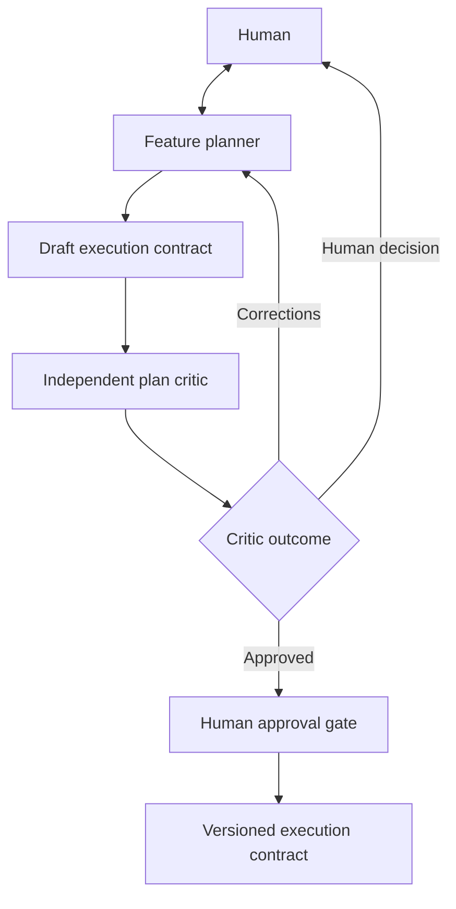
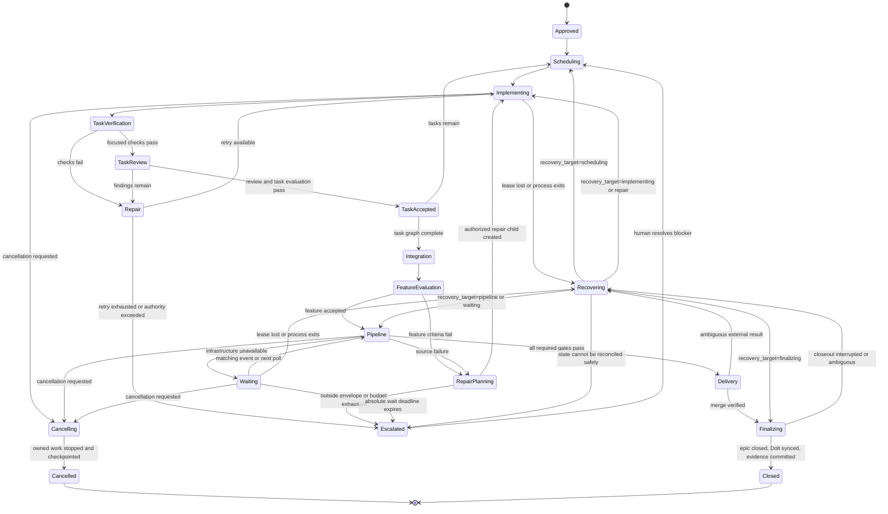

# Epic: Autonomous Multi-Agent Feature Delivery

**Beads id:** `agent-platform-multi-agent`

**Status:** Independent review approved with amendments; implementation chain created and task `.1` claimed.

**Primary configuration:** `.codex/agents/*.toml`

**Workflow skills:** `.agents/skills/*/SKILL.md`

**Planning source:** [Harness Gap Analysis](../planning/harness-gap-analysis-2026-04-29.md)

## Objective

Create a feature-level delivery workflow in which a human collaborates with a primary planning agent,
an independent critic evaluates the plan, and the human approves a versioned execution contract.
After approval, an orchestrator executes the complete Beads task graph with specialist agents,
feedback and repair loops, quality gates, durable pipeline waiting, delivery, and final evidence
reporting.

The target operating model is:

> Planning is collaborative; execution is delegated; progress is observable; interruption is
> exceptional.

The human owns intent, policy, and exceptional decisions. The orchestrator owns progress after the
planning gate.

This epic delivers **repository-local Codex development automation** for work in this repository. It
does not add an end-user multi-agent feature to the Agent Platform product. The runtime and trust
boundary are locked in
[ADR-0004](../adr/0004-codex-development-orchestration-control-plane.md); any future product-facing
orchestration requires a separate ADR and security review.

## Desired Outcome

A human should be able to:

1. Describe and refine a feature with a primary planning agent.
2. Review an independent critique of the proposed plan.
3. Resolve open questions and approve the corrected execution contract.
4. Move on to planning another feature while the orchestrator delivers the approved feature.
5. Return to a completed feature with traceable code, reviews, tests, pipelines, Beads state, and
   remaining risks.

Normal test failures, review findings, evaluator rejections, and source-code pipeline failures must
enter automated repair loops. They must not require the human to restart the workflow manually.

## Non-Goals

- Removing human approval from initial feature planning.
- Allowing agents to expand scope, permissions, or delivery authority after approval.
- Running every task through the most expensive possible agent sequence.
- Parallelizing write-heavy tasks that overlap in files, contracts, or integration state.
- Treating chat history as the durable workflow store.
- Replacing Beads with a second task tracker.
- Granting production deployment authority by default.
- Building a full visual workflow editor in the first increment.
- Exposing this development control plane through `apps/api` or shipping it as an Agent Platform
  product feature.

## Core Principles

### Feature-Level Orchestration

The feature or epic is the unit of orchestration. Beads child tasks remain the units of implementation,
dependency management, recovery, and closure.

Planning, cumulative review, feature evaluation, and delivery happen at feature level. Individual
tasks receive proportionate review and verification based on their risk and role in the dependency
graph.

### Maker-Checker Planning

The primary planning agent creates the plan. An independent plan critic applies a maker-checker, or
four-eyes, review before the human approves it. The critic reports findings; it does not silently
rewrite the plan.

### Human-In-The-Loop, Then Human-On-The-Loop

The human participates directly during discovery, refinement, critique resolution, and final plan
approval. After approval, the human observes progress and is interrupted only when work exceeds the
approved authority or cannot recover within its retry policy.

### Single-Writer Control

The orchestrator is the only agent allowed to mutate workflow state or Beads task state. Specialist
agents return structured recommendations and evidence. They do not claim, reopen, close, reprioritize,
or create tasks directly.

### Evidence Before Transition

No task or feature advances because an agent says it is done. State transitions require the evidence
defined by the execution contract: changed files, test results, review outcome, acceptance-criteria
coverage, and known risks.

### Bounded Context

Each specialist receives a compact work packet rather than the complete feature transcript. Durable
decisions, findings, and evidence are persisted as structured workflow records so execution can resume
without reconstructing state from chat.

## Repository Configuration

Project-scoped Codex agent definitions live in `.codex/agents/`. Repository workflow skills live in
`.agents/skills/`, which is the supported project-skill discovery location.

```text
.codex/
├── config.toml
├── README.md
└── agents/
    ├── feature-planner.toml
    ├── plan-critic.toml
    ├── workflow-orchestrator.toml
    ├── repo-explorer.toml
    ├── implementation-worker.toml
    ├── code-reviewer.toml
    ├── test-runner.toml
    ├── qa-evaluator.toml
    └── feature-evaluator.toml

.agents/skills/
├── feature-planning/
│   ├── SKILL.md
│   └── references/
│       ├── execution-contract.md
│       └── plan-review-rubric.md
├── autonomous-feature-delivery/
│   ├── SKILL.md
│   ├── references/
│   │   ├── workflow-state-machine.md
│   │   ├── agent-result-contract.md
│   │   ├── task-scheduling.md
│   │   └── feedback-loops.md
│   └── scripts/
│       └── validate-execution-contract.*
└── delivery-closeout/
    ├── SKILL.md
    └── references/
        ├── quality-gates.md
        └── closeout-protocol.md
```

Codex does not currently document a native project workflow TOML schema. Agent TOMLs define roles and
sandbox defaults; skills define reusable procedures. Neither is the security boundary. A local
`packages/workflow-control/` stdio MCP/CLI process persists execution state and enforces privileged
operation contracts as defined by ADR-0004.

## Agent Roster

| Agent                   | Sandbox           | Responsibility                                                         | May change application code |
| ----------------------- | ----------------- | ---------------------------------------------------------------------- | --------------------------- |
| `feature_planner`       | Read-only         | Conduct the planning interview and produce the execution contract      | No                          |
| `plan_critic`           | Read-only         | Independently evaluate requirements, risks, tasks, tests, and delivery | No                          |
| `workflow_orchestrator` | Workspace-write   | Execute the approved contract and own state transitions                | No                          |
| `repo_explorer`         | Read-only         | Map relevant code paths, dependencies, and tests                       | No                          |
| `implementation_worker` | Workspace-write   | Implement one bounded task and focused tests                           | Yes                         |
| `code_reviewer`         | Read-only         | Review correctness, security, regressions, architecture, and test gaps | No                          |
| `test_runner`           | Workspace-write\* | Run deterministic verification and capture evidence                    | No                          |
| `qa_evaluator`          | Workspace-write\* | Exercise user-visible behavior and capture artifacts                   | No                          |
| `feature_evaluator`     | Read-only         | Evaluate the integrated feature against the approved contract          | No                          |

Every custom agent TOML must define `name`, `description`, and `developer_instructions`. Models and
reasoning effort initially inherit from the parent session. Explicit model overrides should be added
only after measuring quality, latency, and token use for each role.

The existing explorer, implementation worker, code reviewer, and test runner definitions should be
refined rather than duplicated.

`Workspace-write*` roles run in a generated execution profile that mounts only the declared artifact,
temporary, and test-output paths as writable and provides no mutation credentials. The TOML sandbox
label alone is not considered sufficient enforcement.

## Agent Authority Boundaries

| State or resource               | Authoritative writer                  | Other agents                      |
| ------------------------------- | ------------------------------------- | --------------------------------- |
| Feature requirements and policy | Human through approved contract       | May propose changes               |
| Workflow state                  | Orchestrator                          | Return transition recommendations |
| Beads task state                | Orchestrator through workflow control | Read-only                         |
| Application code                | Assigned implementation worker        | Review or test only               |
| Review findings                 | Assigned reviewer or evaluator        | May respond with evidence         |
| Test evidence                   | Test runner or QA evaluator           | May consume evidence              |
| Git commits and task refs       | Orchestrator through Git/ref broker   | Workers change files only         |
| GitHub merge                    | Orchestrator through delivery skill   | Read-only                         |
| Production promotion            | Human unless separately approved      | No default authority              |

Agent instructions and sandboxes are defense-in-depth, not the authorization authority. Specialist
execution environments must not receive write credentials or direct mutation-capable Beads, GitHub,
shell, browser, or filesystem adapters. Narrow brokers validate the caller role, contract and policy
version, operation, normalized arguments, workspace, and destination before every mutation. A more
restricted agent must not gain power by delegation, tool discovery, shell escape, resume approval, or
direct access to a globally credentialed MCP server.

### Enforced Operation-Level Capability Matrix

The initial pilot denies every operation not listed below. Server-level access never implies access
to every tool on that server.

| Role                  | Repository files                          | Beads                                          | GitHub                                         | Shell / browser                                   |
| --------------------- | ----------------------------------------- | ---------------------------------------------- | ---------------------------------------------- | ------------------------------------------------- |
| Planner / critic      | Read approved workspace paths             | Read issue/spec/dependency state               | Read PR/check metadata                         | No shell; read-only documentation/browser         |
| Explorer / reviewer   | Read approved workspace paths             | Read assigned issue state                      | Read diff, review, check, and quality metadata | No shell mutation; no browser side effects        |
| Implementation worker | Write assigned paths in isolated worktree | No direct access; return recommendations       | No credential or mutation access               | Repository-scoped commands; no credential access  |
| Test runner / QA      | Write only declared artifacts/temp paths  | No direct access                               | Read checks through broker                     | Allowlisted tests/journeys; destructive UI denied |
| Orchestrator          | Workflow metadata, integration operations | Narrow CRUD broker; sole workflow-state writer | Narrow PR/check/merge broker; no arbitrary API | Deterministic allowlisted closeout commands       |
| Human                 | Explicitly authorized actions             | May override through audited orchestrator flow | `staging` to `main` and production approval    | Explicit exceptional authority                    |

Enforcement requirements:

- Built-in Codex collaboration subagents are allowed only before a privileged broker capability is
  established, or after it is revoked, and only when the primary session exposes no global mutation
  tools. Once broker authority is active, every specialist role runs as a separate `codex exec` child
  process inside the external container/VM boundary from ADR-0004, with a generated minimal
  `CODEX_HOME`, isolated worktree, empty-by-default environment, and no primary home, `.git`, `.beads`,
  Docker socket, broker channel, or external mutation credentials mounted.
- Read and write MCP entry points use distinct credentials and process profiles. A single journaled
  Beads broker owns the official Beads MCP write connection; the primary orchestrator and specialists
  have no bypass connection. Git/ref and GitHub credentials are likewise broker-only.
- Broker identity comes from a launcher-created process session and short-lived capability delivered
  through a private inherited descriptor/owner-only socket. The broker never trusts caller-supplied
  `actor_role`.
- Built-in `sys_*` and `coding_*` operations are role-deniable; an empty allowlist means deny, not
  implicit access.
- Resumed approvals are bound to agent id, role, tool id, normalized arguments, workspace, contract
  version, policy digest, and expiry. Current policy is re-evaluated before execution.
- Negative integration tests attempt every prohibited Beads, GitHub, shell, browser, filesystem, and
  approval-resume mutation for every role and must observe a denial audit event.
- A malicious-specialist feasibility test must prove it cannot reach the primary `CODEX_HOME`, Beads
  database/write server, `.git`, Git/GitHub credentials, broker channel, Docker socket, or impersonate
  the orchestrator. Failure blocks the autonomous pilot.

## Phase 1: Collaborative Planning


```mermaid
flowchart TD
    H[Human] <--> P[Feature planner]
    P --> D[Draft execution contract]
    D --> C[Independent plan critic]
    C --> F{Critic outcome}
    F -->|Corrections| P
    F -->|Human decision| H
    F -->|Approved| A[Human approval gate]
    A --> X[Versioned execution contract]
```

### Planning Interview

The feature planner must establish:

- desired outcome and user value;
- functional requirements and non-goals;
- observable acceptance criteria;
- architecture and security constraints;
- data, credential, network, and sandbox boundaries;
- Beads tasks and dependency order;
- tasks that may run concurrently;
- required tools, MCP services, and skills;
- quality gates and evidence expectations;
- delivery destination and merge authority;
- retry budgets and human-escalation conditions.

The planner asks focused questions until material ambiguity is resolved. It must distinguish genuine
requirements from implementation suggestions and record assumptions explicitly.

### Plan Critic

The critic receives the original brief, relevant repository evidence, and draft contract. It checks:

- complete requirements and non-goal coverage;
- ambiguity, assumptions, edge cases, and failure modes;
- architectural, security, data, and permission risks;
- task boundaries, dependencies, and integration points;
- whether proposed parallel tasks are truly independent;
- testability of acceptance criteria;
- adequacy of review, QA, pipeline, and delivery gates;
- whether the authority envelope is both sufficient and appropriately bounded;
- whether token, runner, and time costs are proportionate.

The critic returns one outcome:

- `approved`;
- `approved_with_corrections`;
- `requires_replanning`;
- `requires_human_decision`.

The planner responds to every finding. Unresolved disagreements are shown to the human before
approval.

## Feature Execution Contract

Human approval freezes a versioned contract containing at least:

```yaml
feature_id: agent-platform-example
contract_version: 1
policy_digest: sha256:...
workspace_id: sha256:...
objective: Observable feature outcome
requirements: []
non_goals: []
acceptance_criteria: []
constraints:
  architecture: []
  security: []
  allowed_paths: []
authority:
  delivery_target: staging
  allowed_actions: []
  github:
    repository: owner/repository
    base: staging
    merge_method: squash
    required_checks: []
tasks:
  - id: agent-platform-example.1
    depends_on: []
    risk: standard
    assigned_role: implementation_worker
    branch_parent: feature/agent-platform-example
    allowed_paths: []
    allowed_operations: []
quality_gates: []
retry_policy:
  implementation_attempts: 3
  finding_attempts: 2
  infrastructure_attempts: 3
  wait_deadline_seconds: 86400
repair_task_policy:
  id_pattern: agent-platform-example.repair.<sequence>
  max_children: 2
  allowed_roles: [implementation_worker]
  allowed_paths: []
  authority_may_expand: false
escalation_policy: []
```

The concrete schema should be versioned and machine-validated. Any material change to objective,
requirements, permissions, delivery target, or production impact invalidates the approval and returns
the workflow to a human decision state.

## Phase 2: Autonomous Execution


```mermaid
stateDiagram-v2
    [*] --> Approved
    Approved --> Scheduling
    Scheduling --> Implementing
    Implementing --> Cancelling: cancellation requested
    Implementing --> Recovering: lease lost or process exits
    Implementing --> TaskVerification
    TaskVerification --> TaskReview: focused checks pass
    TaskVerification --> Repair: checks fail
    TaskReview --> TaskAccepted: review and task evaluation pass
    TaskReview --> Repair: findings remain
    Repair --> Implementing: retry available
    Repair --> Escalated: retry exhausted or authority exceeded
    TaskAccepted --> Scheduling: tasks remain
    TaskAccepted --> Integration: task graph complete
    Integration --> FeatureEvaluation
    FeatureEvaluation --> RepairPlanning: feature criteria fail
    FeatureEvaluation --> Pipeline: feature accepted
    Pipeline --> RepairPlanning: source failure
    RepairPlanning --> Implementing: authorized repair child created
    RepairPlanning --> Escalated: outside envelope or budget exhausted
    Pipeline --> Waiting: infrastructure unavailable
    Pipeline --> Cancelling: cancellation requested
    Waiting --> Pipeline: matching event or next poll
    Waiting --> Escalated: absolute wait deadline expires
    Waiting --> Cancelling: cancellation requested
    Waiting --> Recovering: lease lost or process exits
    Pipeline --> Delivery: all required gates pass
    Delivery --> Finalizing: merge verified
    Delivery --> Recovering: ambiguous external result
    Finalizing --> Closed: epic closed, Dolt synced, evidence committed
    Finalizing --> Recovering: closeout interrupted or ambiguous
    Cancelling --> Cancelled: owned work stopped and checkpointed
    Recovering --> Scheduling: recovery_target=scheduling
    Recovering --> Implementing: recovery_target=implementing or repair
    Recovering --> Pipeline: recovery_target=pipeline or waiting
    Recovering --> Finalizing: recovery_target=finalizing
    Recovering --> Escalated: state cannot be reconciled safely
    Escalated --> Scheduling: human resolves blocker
    Cancelled --> [*]
    Closed --> [*]
```

The diagram is illustrative; the transition table is normative.

| From                   | Trigger / precondition                                       | Required durable side effects                                                                    | Result                        |
| ---------------------- | ------------------------------------------------------------ | ------------------------------------------------------------------------------------------------ | ----------------------------- |
| `approved`             | Valid signed contract and current policy digest              | Create run, transition id, lease epoch, and immutable contract record                            | `scheduling`                  |
| `scheduling`           | Ready Beads task, closed dependencies, free concurrency slot | Acquire fenced task lease; record assigned role, branch parent, paths, and attempt `1`           | `implementing`                |
| `implementing`         | Worker result received before deadline                       | Persist result and evidence hashes; release worker lease                                         | `task_verification`           |
| `task_verification`    | Required focused gates pass                                  | Persist commands, exit status, environment fingerprint, and acceptance mapping                   | `task_review`                 |
| `task_verification`    | Gate fails and task budget remains                           | Record changed hypothesis and increment task repair count                                        | `repair`                      |
| `task_review`          | Reviewer/evaluator accepts evidence                          | Commit transition intent and mark workflow task `accepted_pending_integration`                   | `task_accepted`               |
| `task_review`          | Finding remains and finding budget remains                   | Persist finding, owner, evidence, and changed repair hypothesis                                  | `repair`                      |
| `repair`               | Lease acquired and current contract still authorizes repair  | Increment the relevant task/finding attempt; attempts include the initial try                    | `implementing`                |
| `task_accepted`        | Segment integration gate and Beads close preconditions pass  | Journal Beads close intent, close idempotently through official MCP, reconcile, release lease    | `scheduling` or `integration` |
| `integration`          | Every child is closed and cumulative gate passes             | Record integrated head SHA and immutable cumulative evidence                                     | `feature_evaluation`          |
| `feature_evaluation`   | Contract criteria pass                                       | Persist signed evaluation against exact contract/head                                            | `pipeline`                    |
| `feature_evaluation`   | Contract criterion fails                                     | Persist finding against exact head and validate the approved repair envelope                     | `repair_planning`             |
| `pipeline`             | Required check set succeeds for expected head SHA            | Persist check identities, conclusions, URLs, and observed head                                   | `delivery`                    |
| `pipeline`             | Source-owned check fails                                     | Persist check/failure evidence against exact head and validate the approved repair envelope      | `repair_planning`             |
| `repair_planning`      | Finding fits scope, paths, role, and remaining repair budget | Create append-only repair child/ref with derived id and dependency through journaled brokers     | `implementing`                |
| `repair_planning`      | Finding exceeds any approved bound                           | Persist requested scope/authority delta; do not mutate the graph                                 | `escalated`                   |
| `pipeline` / `waiting` | Infrastructure unavailable                                   | Store event identity, `next_poll_at`, `absolute_wait_deadline`, backoff count, and lease release | `waiting`                     |
| `waiting`              | Matching event or `next_poll_at` reached                     | Acquire new fenced lease and revalidate head, contract, policy, checks, and retry budget         | `pipeline`                    |
| `waiting`              | `absolute_wait_deadline` reached                             | Persist one deadline event with attempts/evidence; do not poll or retry again                    | `escalated`                   |
| Any non-terminal state | Cancellation requested                                       | Persist request, stop spawning, interrupt owned work, retain accepted evidence                   | `cancelling`                  |
| `cancelling`           | All owned work stopped or deadline reached                   | Reconcile leases/external effects and record incomplete cleanup                                  | `cancelled` or `escalated`    |
| Any mutating state     | Process death, lease loss, or ambiguous external result      | Persist interrupted state as `recovery_target`; new owner acquires higher fence and reconciles   | `recovering`                  |
| `recovering`           | Reconciliation proves interrupted transition safe            | Persist authoritative result and revalidate contract, policy, lease, and recorded target         | `recovery_target`             |
| `recovering`           | State differs from every safe expected result                | Fence all work and persist contradiction evidence                                                | `escalated`                   |
| `delivery`             | Narrow broker validates repository, base, head, and gates    | Journal merge intent, merge idempotently, verify resulting SHA, then journal completion          | `finalizing`                  |
| `finalizing`           | Merge verified and closeout lease current                    | Reconcile Git/GitHub; close epic through Beads broker; sync/verify Dolt; persist final evidence  | `closed`                      |

Invariants:

- Only the holder of the current workspace and task fencing tokens may commit a transition.
- A transition has one stable idempotency key derived from run id, transition id, operation, and
  expected version. Replays return the recorded result.
- Retry budgets are per task and per finding; pipeline infrastructure retry is per run/check. The
  initial attempt counts as attempt `1`. Backoff is exponential with bounded jitter and an approved
  maximum wait deadline.
- No two orchestrators may own the same run. A later lease epoch fences every earlier writer.
- Cancellation never discards accepted evidence and never implies rollback of an already verified
  external side effect.
- `closed` is legal only after the merge result, Beads epic closure, Dolt remote synchronization,
  and final evidence postconditions are all verified. Interrupted finalization resumes through the
  prepared/committed saga; an existing epic close or Dolt push is verified rather than duplicated.
- `recovery_target` is the exact interrupted normative state, never a caller-selected destination.
  Once a merge is verified, recovery may return only to `finalizing` or `escalated`; task scheduling
  and implementation transitions are permanently denied for that run.

### Task Work Packet

The orchestrator gives each specialist only the context needed for its role:

- approved feature objective and relevant constraints;
- task specification and acceptance criteria;
- dependency evidence and stable interfaces;
- allowed paths, tools, skills, and MCP services;
- relevant repository map and prior decisions;
- required output contract and retry budget.

### Agent Result Contract

Every specialist returns a structured result:

```yaml
status: passed | needs_repair | blocked
summary: Concise outcome
changed_files: []
acceptance_criteria:
  passed: []
  failed: []
evidence:
  commands: []
  tests: []
  artifacts: []
findings: []
remaining_risks: []
recommended_transition: continue | repair | escalate | integrate
```

Raw logs remain available as artifacts but are not copied into every downstream prompt.

## Scheduling And Parallelism

The approved task graph determines concurrency. A task is ready only when its Beads dependencies are
closed and its required inputs are available.

Tasks may run concurrently only when they have:

- no dependency relationship;
- separate or explicitly coordinated file and component ownership;
- stable shared contracts;
- isolated worktrees or branches;
- independent test resources;
- a defined integration order and cumulative verification step.

Read-heavy exploration, review, test analysis, and documentation research are preferred early
parallel workloads. The initial pilot serializes all write tasks to comply with the locked linear task
branch policy. It permits concurrent read-only agents and verification processes only. Parallel write
segments require a future explicit amendment to the locked Git policy, named sibling branch parents,
an integration owner/order, and a cumulative conflict and test gate before they can be approved.

The initial project limit remains four concurrent subagent threads. The orchestrator queues excess
work and measures token use, elapsed time, conflicts, and repair frequency before concurrency is
raised.

### Beads Task Lifecycle

Beads readiness remains the scheduler. Each downstream task therefore depends on the upstream issue
being closed; workflow acceptance alone does not make a task ready.

1. A worker completes a task on its chained task branch and returns acceptance evidence.
2. Focused verification and review run against the exact task head.
3. For an intermediate task, the orchestrator records workflow state
   `accepted_pending_integration`, integrates it in the declared segment order, and runs the segment
   gate required by its spec.
4. Once that task's acceptance criteria and required segment integration gate pass, the orchestrator
   journals a Beads-close intent and closes the task idempotently through official Beads MCP.
5. Only after Beads confirms closure may a dependent task become ready and branch from the accepted
   predecessor tip.
6. Final closeout verifies all children are already closed; it closes only the epic, synchronizes
   Dolt, and records the final report. It does not defer every task closure until feature delivery.

If a task cannot be integrated safely, it remains open and downstream tasks remain blocked. Workflow
control may show intermediate diagnostic states, but it may not substitute them for `bd ready`.

### Feature And Pipeline Repair Children

Task-local failures before acceptance remain repair attempts on the same open task. After integration,
original children remain immutable and closed; feature-evaluation or CI source failures use an
append-only repair child only when the frozen contract pre-authorizes all of the following:

- stable derived id `<feature-id>.repair.<sequence>` and a maximum repair-child count;
- parent epic, dependency on the current accepted chain tip, and branch parent at that exact head;
- finding/acceptance criterion, allowed paths, assigned role, operation capabilities, and repair
  attempt budget;
- no change to objective, non-goals, delivery target, production authority, security boundary, or
  required checks.

The orchestrator journals graph-change intent, creates the child through the Beads broker, adds the
dependency, creates its task ref through the Git/ref broker, and resumes the normal implementation,
verification, review, close, integration, feature-evaluation, and pipeline sequence against the new
exact head. Every previous check result is stale for the new head.

An original Beads task may be reopened only before any dependent has started or closed and only when
its own acceptance evidence was invalid. Once a dependent exists in accepted history, corrections use
an append-only repair child. Any repair outside the approved id/count/scope/path/role/authority budget
invalidates the execution contract and returns to human approval without mutating Beads or Git.

## Feedback And Repair Loops

| Failure source                      | Feedback recipient                   | Required response                                      |
| ----------------------------------- | ------------------------------------ | ------------------------------------------------------ |
| Compile, lint, or typecheck failure | Implementation worker                | Repair and rerun the focused gate                      |
| Unit or integration test failure    | Implementation worker                | Diagnose, repair, rerun failure and regression set     |
| Code-review finding                 | Implementation worker                | Repair or return an evidence-based rebuttal            |
| Security or Sonar finding           | Implementation worker, then reviewer | Repair by severity and rerun analysis                  |
| QA behavior mismatch                | Implementation worker                | Reproduce from evidence, repair, rerun scenario        |
| Task evaluator rejection            | Implementation worker or planner     | Repair implementation; escalate ambiguous requirements |
| Feature evaluator rejection         | Orchestrator                         | Create an append-only contract-authorized repair child |
| CI source failure                   | Orchestrator, then assigned worker   | Create bounded repair child, repair, push, and rerun   |
| CI infrastructure failure           | Orchestrator                         | Retry or wait without changing source code             |
| Plan critic rejection               | Feature planner                      | Revise and resubmit the plan                           |

Suggested initial budgets:

| Loop                   |                      Attempts before escalation |
| ---------------------- | ----------------------------------------------: |
| Implementation repair  |                                               3 |
| Review repair          |                                               2 |
| Test repair            |                                               3 |
| Pipeline source repair |                                               2 |
| Infrastructure retry   | 3 with backoff, then durable wait or escalation |

Retries must be evidence-driven. An agent may not repeat the same failed action without a changed
hypothesis, implementation, environment, or test condition.

## Human Escalation Policy

Normal implementation and verification failures remain inside the workflow. Human input is required
only when:

- requirements conflict or material scope must expand;
- the approved permissions or delivery target are insufficient;
- a destructive or irreversible action was not authorized;
- new credentials or external access are required;
- security or policy prevents safe continuation;
- an architectural choice has materially different product outcomes;
- repair budgets are exhausted;
- external infrastructure remains unavailable beyond its agreed threshold;
- production promotion requires approval.

An escalation includes the blocked state, evidence gathered, attempts made, risks, and a focused
decision request. It does not ask the human to rediscover the problem from raw logs.

## Tools And MCP Services

| Service or tool                    | Agents                               | Required access                                                     |
| ---------------------------------- | ------------------------------------ | ------------------------------------------------------------------- |
| External specialist launcher       | Orchestrator                         | Launch, steer, wait, cancel, and collect isolated `codex exec` runs |
| Built-in shell and patch tools     | Implementation worker, test runner   | Isolated repository-scoped execution; no external credentials       |
| Git/ref broker                     | Orchestrator requests                | Broker alone creates refs, exact-tree commits, and CAS pushes       |
| Read-only GitHub adapter           | Planner, critic, reviewer, evaluator | Read approved PR, diff, review, and check metadata                  |
| GitHub delivery broker             | Orchestrator requests                | Broker alone owns write credential and PR/check/merge mutations     |
| Read-only Beads adapter            | Planner, critic, reviewer            | Read approved issue, spec, dependency, and readiness state          |
| Journaled Beads/Dolt broker        | Orchestrator requests                | Broker alone owns official MCP writes and bounded CLI sync          |
| Workflow-control service           | Orchestrator                         | Checkpoint, resume, waits, findings, and artifacts                  |
| SonarQube MCP                      | Reviewer, worker, evaluator          | Read findings and gates; worker repairs code                        |
| Browser or Playwright MCP          | Test runner, QA evaluator            | Execute allowlisted journeys and capture artifacts                  |
| OpenAI Developer Docs MCP          | Planner, critic, reviewer            | Read-only API and configuration evidence                            |
| Artifact and observability service | All agents                           | Record scoped evidence; orchestrator reads run state                |
| Runner-health service, optional    | Orchestrator                         | Read-only runner and dependency health                              |

File and shell operations do not require an MCP server when Codex built-ins provide them safely.
External systems should use narrow MCP interfaces instead of general-purpose remote shell access.

### Workflow-Control MCP

The installed official Beads MCP provides structured issue reads and mutations, but it does not
provide Dolt synchronization, role enforcement, or durable execution across process restarts and
long pipeline waits. Per ADR-0004, `packages/workflow-control/` supplies a local TypeScript library,
CLI, and stdio MCP server launched by the primary Codex session for one canonical workspace. Its
SQLite store and content-addressed artifact directory live beneath
`${CODEX_HOME}/workflow-control/<workspace-id>/`; `apps/api` does not start, mount, or expose them.

The journaled Beads broker composes workflow-control transitions with official Beads MCP operations
and exposes the Beads-affecting subset below. The orchestrator requests these operations through the
broker and never holds a second write-capable Beads connection:

- `feature_load`;
- `feature_approve`;
- `workflow_checkpoint`;
- `workflow_resume`;
- `task_ready`;
- `task_claim`;
- `task_complete`;
- `task_reopen`;
- `finding_record`;
- `artifact_record`;
- `pipeline_wait`;
- `workflow_finalize`.

Beads remains authoritative for feature and task lifecycle. The workflow store records execution
checkpoints, attempts, agent results, artifacts, and pending waits; it must not become a competing
issue tracker.

#### Crash consistency and reconciliation

SQLite and Beads/GitHub cannot participate in one atomic transaction, so every external mutation uses
a persisted saga:

1. In one SQLite transaction, compare-and-swap the current run version and write a `prepared`
   transition with a stable idempotency key, expected external version/head, actor, contract version,
   policy digest, and monotonically increasing fencing token.
2. Invoke the narrow external operation with that idempotency key and exact preconditions.
3. In a second SQLite transaction, persist the observed external result and mark the transition
   `committed`; duplicate responses are matched to the original result.
4. If the process stops at any point, the next fenced owner reconciles `prepared` transitions by
   reading the authoritative external state before deciding to replay, commit, compensate, or
   escalate. It never assumes failure from a missing local completion record.

Reconciliation rules are explicit for both orderings:

- Beads/GitHub changed but the local commit is absent: verify the exact external result and mark the
  prepared transition committed without repeating the side effect.
- Local intent exists but the external state is unchanged: replay once with the same idempotency key
  after policy and precondition revalidation.
- External state changed differently: fence the run and escalate with evidence; do not overwrite.
- Workflow state claims a task is complete but Beads is open: Beads wins lifecycle authority and the
  task returns to reconciliation rather than scheduling dependents.
- Beads is closed but workflow acceptance evidence is absent: block dependents until the close is
  matched to a valid transition or a human-authorized repair record.

Fault-injection tests stop the process before and after every SQLite, Beads, GitHub, artifact, and Git
write boundary and prove deterministic recovery without duplicate agents, closes, pushes, or merges.

### Current MCP Access Gap Analysis

This inventory was verified on 2026-08-30 against the MCP servers configured on the local Codex host,
the tools exposed to the active Codex session, and read-only capability smoke tests. CLI availability
is recorded separately because a working CLI does not provide the role-scoped, structured MCP contract
required by the target workflow.

| Capability                           | Current access                                                                     | Operational status                                                     | Gap and required action                                                                                     |
| ------------------------------------ | ---------------------------------------------------------------------------------- | ---------------------------------------------------------------------- | ----------------------------------------------------------------------------------------------------------- |
| Codex subagent control               | Built-in Codex collaboration tools                                                 | Available; not an MCP server                                           | Define orchestrator instructions, result contracts, and durable state                                       |
| GitHub repository and pull requests  | Official GitHub MCP through the Docker `codex` profile                             | Read and write smoke tests pass                                        | Add role-specific tool allowlists; restrict merge and mutation tools to the orchestrator                    |
| GitHub Actions                       | Authenticated `gh` CLI with `repo` and `workflow` scopes                           | Recent workflow and job queries pass; raw credential is too broad      | Put the credential behind the required narrow delivery broker and durable pipeline waiting                  |
| Beads issue state                    | Official `beads-mcp` plus local `bd` CLI                                           | Fifteen tools load; explicit-root reads and writes pass                | Restrict writes to the orchestrator; avoid `context init` when embedded-Dolt detection reports a false miss |
| Beads Dolt synchronization           | Local `bd dolt push`/`pull` CLI                                                    | Available outside MCP; embedded mode limits some diagnostics           | Keep deterministic CLI closeout or add a narrowly scoped synchronization operation                          |
| SonarQube quality gates              | SonarQube MCP through the Docker `codex` profile                                   | Authentication works; PR 251 gate passes; zero hotspots need review    | Enforce role-appropriate mutation access                                                                    |
| Browser and Playwright QA            | Playwright MCP through the Docker `codex` profile                                  | Browser navigation and snapshots pass; prior `ENOSPC` failure resolved | Define artifact retention and restrict unsafe browser execution                                             |
| Developer documentation              | Context7 MCP, OpenAI Docs skill, and web access                                    | Operational; dedicated OpenAI Developer Docs MCP not configured        | Optional improvement; existing official-docs path is sufficient for the pilot                               |
| Workflow checkpoints and resume      | None                                                                               | Missing                                                                | Implement durable workflow run state, checkpoint, resume, retry, and wait tools                             |
| Artifacts and orchestration evidence | Repository observability packages exist; no agent-facing workflow evidence service | Missing                                                                | Add artifact and evidence operations to workflow control or a dedicated observability service               |
| Tool authorization                   | Global Codex MCP configuration and an unrestricted Docker `codex` profile          | Tools are visible across agent roles; no profile tool allowlists       | Enforce least privilege outside prompt instructions                                                         |
| Pipeline and runner health           | `gh` CLI can inspect Actions runs                                                  | Repository CI visible; no narrow remote-runner health service          | Add a read-only runner/dependency health endpoint only if Actions data is insufficient                      |
| Notebook research                    | `notebooklm-mcp`                                                                   | Operational, but not required for core delivery                        | Keep optional and do not grant by default                                                                   |
| Computer use                         | `computer-use` and `cua_repl` are configured but disabled                          | Unavailable by policy                                                  | Keep disabled unless an approved QA scenario proves it is necessary                                         |

The Docker MCP catalog currently offers GitHub, official GitHub, Playwright, SonarQube, Temporal,
task-orchestrator, Testkube, Sentry, and other candidate servers. Catalog availability does not mean a
server is enabled, authenticated, least-privilege, or suitable as the platform's source of truth.

#### MCP Readiness Priorities

Before the end-to-end pilot can run autonomously:

1. Enforce role-specific MCP access, especially Beads mutations, GitHub writes, and unsafe browser tools.
2. Implement durable workflow checkpoints, resume, retry state, and external waits around the official
   Beads MCP rather than rebuilding its issue CRUD adapter.
3. Implement the narrow GitHub delivery broker with durable pipeline waiting before the pilot; raw
   orchestrator shell access to `gh api`, merge, workflow mutation, or admin bypass is prohibited.
4. Store workflow artifacts and evidence in workflow control initially behind a separable storage
   boundary.
5. Add narrow runner-health access only if GitHub Actions job data cannot classify the remote runner.

#### Narrow GitHub delivery broker

The broker is a pilot prerequisite, not a later optimization. It owns the write credential and exposes
typed operations for PR creation/update, required-check observation, and merge. Each request must
match the approved repository, base `staging`, expected feature head SHA, allowed merge method,
required check names, review state, contract version, and policy digest. Immediately before mutation
it re-reads the PR and rejects stale heads, changed destinations, missing/obsolete checks, missing
approvals, branch-protection changes, and any admin-bypass requirement.

The broker does not expose arbitrary `gh api`, workflow-file mutation, workflow dispatch/rerun,
branch-protection changes, secret access, release creation, or production promotion. Every decision
record includes normalized input, observed head/base, check set, policy version, actor, timestamp,
result, and GitHub identifiers. Negative tests cover wrong repositories/destinations, stale heads,
changed checks, missing reviews, protection changes, rerun attempts, and admin bypass.

#### Narrow Git/ref broker

Specialists receive writable source files but no writable `.git` directory, Git hooks, SSH agent, or
remote credential. The Git/ref broker is the sole writer of task branches, commits, and remote refs.
It exposes only:

- create the approved `task/*` ref from the contract's exact parent SHA;
- snapshot the assigned worktree after verifying allowed paths and compute the exact tree/diff hash;
- create a non-signing commit with the contract-approved identity and message format; and
- compare-and-swap push the one approved task ref when its remote old SHA matches the contract.

Every operation is bound to workspace, repository, run, task, contract version, policy digest,
allowed parent SHA, expected old ref, exact tree/diff hash, allowed paths, commit identity, and fencing
token. The broker denies force pushes, arbitrary/protected refs, tags, hooks, filters, submodule
credential access, URL rewrites, alternate object databases, signing-program execution, and any
unexpected tree content. It clears credential-bearing Git environment variables before local Git
operations and supplies the remote credential only to the fixed compare-and-swap push operation.

Branch creation, commit, ref update, and push use the same prepared/committed saga protocol as other
external writes. Reconciliation compares the local commit tree and remote ref to the expected hashes
before replay. Tests cover stale refs, unexpected trees/paths, malicious hooks/config, credential
exfiltration, protected destinations, and crashes immediately before and after commit/ref/push.

OpenAI Docs MCP is recommended for planning and review quality but is not a delivery blocker because
the existing official-docs skill and web path provide a bounded fallback. NotebookLM, Node REPL,
computer use, and the broader Docker catalog remain optional capabilities rather than default agent
access.

## Observability And Evidence

Every feature run records:

- contract version and approval;
- workflow and task transitions;
- agent identity and assigned role;
- tool and skill use;
- commits, branches, and changed files;
- findings and repair attempts;
- test, QA, security, and pipeline evidence;
- policy decisions and escalations;
- token, latency, and cost metadata when available;
- final acceptance-criteria traceability;
- retained artifacts and redaction state.

Observability explains what happened. Artifacts preserve evidence. Raw secrets, credentials, and
unbounded prompt or tool payloads must not be persisted.

Each evidence record contains:

- immutable evidence id, SHA-256 content hash, media type, byte size, and creation timestamp;
- workspace, run, task, transition, producer agent/role, contract version, policy digest, and exact
  commit/head identifiers;
- an opaque content-addressed object key or normalized repository-relative source path—never an
  absolute caller-supplied destination;
- command/tool identity, normalized non-secret arguments, exit/conclusion status, and environment
  fingerprint when applicable;
- redaction and secret-scan status recorded only after redaction-before-persist succeeds;
- retention class, deletion deadline, and read-role classification.

The store rejects path traversal, symlink escape, unsupported media, per-artifact and per-run size
limits, hash mismatches, post-acceptance mutation, unauthorized reads, and content that fails secret
scanning. Accepted records are append-only; corrections create a new record linked to the superseded
one. Default pilot retention is 30 days for raw logs/artifacts and indefinite for compact transition,
decision, hash, and acceptance summaries. Human-requested deletion removes eligible blobs while
retaining a non-secret tombstone and audit reference.

## Git And Delivery Workflow

The orchestrator follows the repository's locked branch policy:

1. Create or use `feature/<feature-name>` from current `staging` as the integration branch.
2. Create the first `task/<task-name>` branch from the feature branch.
3. Create each sequential task branch from the previous accepted task branch.
4. Do not create sibling write branches during the initial pilot; concurrency is read-only.
5. Run the task/segment integration gate before closing each child and scheduling its dependent.
6. Open the final task-tip PR into the feature branch.
7. Run feature-branch integration gates.
8. Promote the feature only to the destination authorized by the execution contract.

The approved initial delivery policy preserves the locked task-to-feature chain. After all approved
feature gates pass, the orchestrator may automatically merge the completed `feature/*` integration
branch into protected `staging`. Promotion from `staging` to `main`, or any production promotion,
requires explicit human approval.

Pipeline completion uses durable waiting or event-driven updates. The orchestrator must not require a
human to poll GitHub. Infrastructure failures are distinguished from source failures so unavailable
runners do not cause speculative code changes.

Closeout is primarily a deterministic skill owned by the orchestrator rather than another autonomous
agent. The sequence is idempotent:

1. Verify every implementation child was already closed after its task/segment acceptance gate.
2. Verify required cumulative hosted and self-hosted feature gates against the expected head SHA.
3. Merge into the approved destination through the narrow delivery broker.
4. Enter non-terminal `finalizing` and reconcile the resulting GitHub/Git state.
5. Close the epic through the journaled Beads broker, push Dolt state through its bounded sync
   operation, and verify the remote authoritative closure.
6. Record only durable handoff information.
7. Present the final evidence report without creating a recursive closeout PR solely for runtime logs.

A restart before or after Beads epic close or Dolt push re-enters `recovering`, reads local and remote
state, and resumes `finalizing` with the original idempotency keys. The run does not become `closed`
until the broker verifies all finalization postconditions.

## Proposed Implementation Task Graph

Child tasks are created only after this epic design and its policy decisions are approved.

| Proposed task                                       | Purpose                                                                                                         | Depends on | Parallel policy       |
| --------------------------------------------------- | --------------------------------------------------------------------------------------------------------------- | ---------- | --------------------- |
| `.1` Execution contract and normative state machine | Define versioned schemas, transitions, invariants, retries, cancellation, and wait                              | None       | Sequential write task |
| `.2` Operation authorization and agent isolation    | Prove external specialist isolation; enforce process identity, minimal profiles, capabilities, and resume rules | `.1`       | Sequential write task |
| `.3` Workflow-control persistence and recovery      | Add SQLite journal, leases, fencing, journaled Beads broker, reconciliation, artifacts, and waits               | `.2`       | Sequential write task |
| `.4` Planning and critic approval gate              | Add TOMLs, planning skill, critic rubric, contract validation, and approval                                     | `.3`       | Sequential write task |
| `.5` Orchestrator and Beads scheduler               | Schedule only Beads-ready tasks, enforce ownership, lifecycle, and close semantics                              | `.4`       | Sequential write task |
| `.6` Implementation, review, and test loops         | Refine worker roles and implement bounded evidence-driven repair routing                                        | `.5`       | Sequential write task |
| `.7` Git/ref and GitHub delivery brokers            | Enforce typed branch/commit/CAS-push and PR/check/merge operations with durable waits                           | `.6`       | Sequential write task |
| `.8` QA, feature evaluation, and secure evidence    | Add behavioral evaluation, artifact policy, redaction, retention, and traceability                              | `.7`       | Sequential write task |
| `.9` Integration, closeout, and recovery tests      | Prove fault recovery, cumulative gates, Beads/Dolt closeout, and final reporting                                | `.8`       | Sequential write task |
| `.10` End-to-end pilot                              | Deliver a real feature through planning, repair, CI, merge, recovery, and closeout                              | `.9`       | Sequential write task |

The first pilot has one linear write chain: the first task branches from the feature branch and each
later task branches from the prior accepted task tip. Up to four read-only review, exploration, or
verification agents may run concurrently without creating sibling write branches. Parallel writes
remain out of scope until the locked Git policy is separately amended.

Each child spec must define summary, requirements, non-goals, implementation plan, dependency order,
tests, evidence, and Definition of Done. Beads dependency edges and the table above must remain
aligned.

## Verification Strategy

### Contract And State Tests

- Validate complete and incomplete execution contracts.
- Reject invalid state transitions.
- Reject authority expansion after approval.
- Deny built-in and MCP operations omitted from a role's operation allowlist.
- Deny resumed approvals after agent, arguments, contract, policy, workspace, or expiry changes.
- Launch a malicious specialist and prove it cannot read primary Codex, Beads, Git, GitHub, broker,
  Docker, SSH, or host credential surfaces or forge its role/session capability.
- Prove checkpoints resume without duplicate actions.
- Prove idempotent task completion and feature closeout.
- Inject crashes before and after every local/external write and prove deterministic reconciliation.
- Fence stale orchestrators and leases.

### Scheduling Tests

- Run read-only agents concurrently while serializing the pilot's write task chain.
- Force overlapping tasks to execute sequentially.
- Respect concurrency limits and task dependencies.
- Cancel or time out bounded work without losing accepted results.
- Prove a downstream task is not ready until its upstream Beads issue is closed.

### Repair-Loop Tests

- Route a unit-test failure back to the implementation worker and subsequently pass.
- Route a reviewer finding through repair and re-review.
- Reject an incomplete plan through the critic.
- Reopen incomplete work after task or feature evaluation.
- Stop repeated identical retries.
- Escalate once, with evidence, after the configured budget is exhausted.
- Create an in-envelope append-only repair child and reject graph/scope/authority expansion outside
  the frozen repair policy.

### Pipeline And Delivery Tests

- Distinguish a source failure from runner infrastructure failure.
- Repair and push a genuine CI failure.
- Retry or durably wait for a transient runner outage.
- Resume pipeline waiting after process restart.
- Prevent merge while any required gate is missing or failing.
- Merge only to the destination authorized by the contract.
- Reject wrong repository/base, stale head, changed protection, workflow mutation, rerun, and admin
  bypass requests at the delivery broker.
- Reject stale refs, unexpected trees/paths, hooks/config injection, protected refs, force pushes, and
  credential exfiltration at the Git/ref broker.
- Resume `finalizing` before/after epic close and Dolt push; reach `closed` only after remote sync is
  verified.
- Prove recovery after a verified merge can return only to `finalizing` or `escalated`, never task
  scheduling or implementation.
- Distinguish `next_poll_at` from `absolute_wait_deadline`; poll wakes recheck the pipeline and an
  absolute expiry escalates exactly once.
- Close and sync Beads without relying on a generated interaction log as task authority.

### Evidence Security Tests

- Reject path traversal, symlink escape, hash mismatch, oversized artifacts, and unsupported media.
- Redact and secret-scan before persistence; prove raw secrets never reach the artifact store.
- Deny role-inappropriate reads and mutation of accepted evidence.
- Apply retention/deletion rules while preserving non-secret audit tombstones.

### End-To-End Acceptance

A pilot feature must demonstrate:

1. Human and planner refine requirements.
2. Critic identifies at least one seeded plan omission.
3. Human approves the corrected contract.
4. The orchestrator serializes write tasks and runs approved read-only work concurrently.
5. At least one implementation or verification failure enters a successful repair loop.
6. Independent review, testing, QA, and feature evaluation pass.
7. Hosted and required self-hosted pipelines pass.
8. The feature reaches its authorized delivery target.
9. Beads and workflow state close correctly.
10. The human receives a concise evidence-backed final report.

## Definition Of Done

- Project-scoped specialist agents have reviewed TOML definitions and bounded responsibilities.
- A human and primary planner can produce a machine-valid execution contract.
- An independent critic evaluates the plan before approval.
- The approved contract drives the complete Beads task graph without routine human restarts.
- The orchestrator schedules safe parallel work and sequential dependencies correctly.
- Review, test, QA, evaluator, and pipeline failures enter bounded repair loops.
- Durable workflow state survives restarts and external waits.
- Tool and MCP access is least-privilege and enforced outside prompt instructions.
- Feature delivery follows the approved Git and merge policy.
- Beads remains authoritative and is closed and synced through supported operations.
- Final reporting maps every acceptance criterion to implementation and evidence.
- Tests cover success, failure, repair, cancellation, resume, policy denial, and escalation.
- A real pilot feature completes end to end.

## Approved Policy Decisions

| Decision             | Approved policy                                                                                 | Status              |
| -------------------- | ----------------------------------------------------------------------------------------------- | ------------------- |
| Runtime boundary     | Repository-local Codex control plane per ADR-0004; not an end-user product API                  | Approved 2026-08-31 |
| Configuration root   | Agents in `.codex`; workflow skills in `.agents/skills`                                         | Approved 2026-08-30 |
| Planning model       | Human plus primary planner, then independent critic                                             | Approved 2026-08-30 |
| Execution model      | Feature-level orchestration over Beads child tasks                                              | Approved 2026-08-30 |
| Human involvement    | Required for planning approval and exceptions, not routine delivery                             | Approved 2026-08-30 |
| Beads authority      | Orchestrator requests mutations; journaled broker is the sole writer                            | Amended 2026-08-31  |
| Beads integration    | Active runs broker official MCP writes and bounded CLI sync; manual work may call them directly | Amended 2026-08-31  |
| Delivery automation  | Auto-merge the completed feature branch into protected `staging` after gates                    | Approved 2026-08-30 |
| Production authority | Human approval is required for `staging` to `main` or production promotion                      | Approved 2026-08-30 |
| Closeout owner       | Deterministic orchestrator skill rather than a separate delivery agent                          | Approved 2026-08-30 |
| Initial concurrency  | Four externally isolated specialist processes per active run                                    | Amended 2026-08-31  |
| Durable control      | Compose official Beads MCP with checkpoints, evidence, waits, and resume                        | Approved 2026-08-30 |
| Retry budgets        | Use the initial budgets in this spec and tune from evidence                                     | Approved 2026-08-30 |
| Parallel writes      | Serialize pilot write tasks; allow concurrent read-only work only                               | Amended 2026-08-31  |
| Model selection      | Inherit parent model initially; benchmark before role-specific overrides                        | Approved 2026-08-30 |
| Workflow visibility  | Provide structured status and evidence without requiring human steering                         | Approved 2026-08-30 |
| Evidence storage     | Content-addressed, hashed, redacted, role-scoped storage with bounded retention                 | Amended 2026-08-31  |
| Tool authorization   | Operation-level brokers, minimal profiles, and policy revalidation                              | Amended 2026-08-31  |
| Pipeline access      | Narrow typed GitHub broker is mandatory before the pilot                                        | Amended 2026-08-31  |
| Task closure         | Close each child after its acceptance/integration gate so Beads schedules dependents            | Approved 2026-08-31 |
| Recovery             | Fenced leases and persisted sagas reconcile every cross-store mutation                          | Approved 2026-08-31 |

The independent critic returned `BLOCKED` across three refinement passes, then `APPROVED WITH
AMENDMENTS` on 2026-08-31. Every required amendment, including the final tool-authority table
correction, is applied. The review task is closed, the sequential implementation graph exists in
Beads, and task `.1` is the only claimed implementation task.
