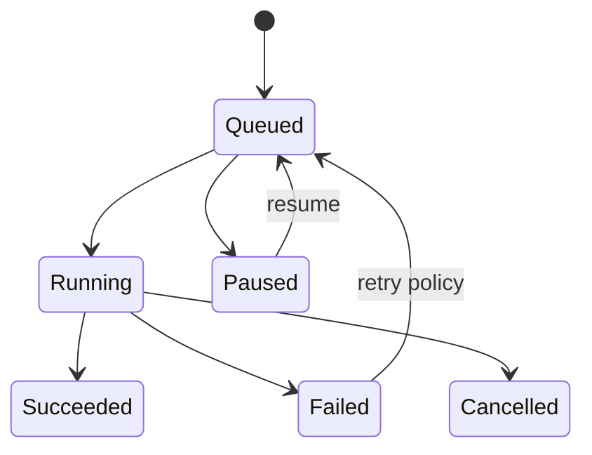
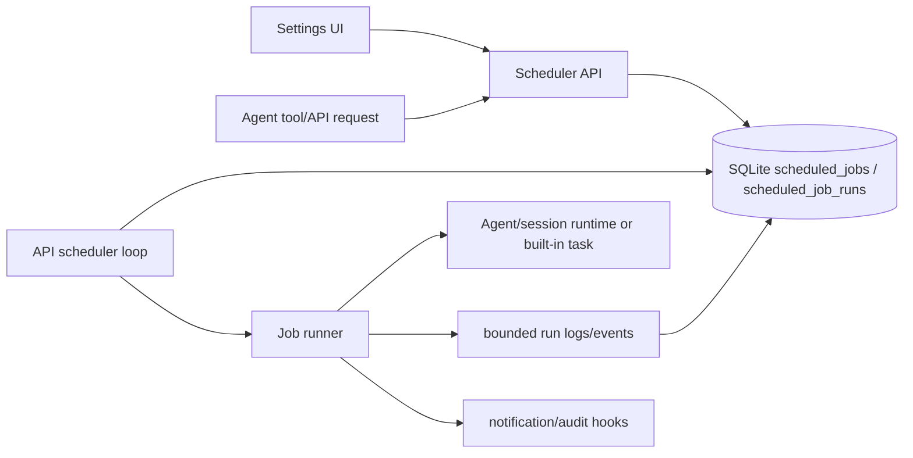

# Epic: Scheduler and background work

**Beads id:** `agent-platform-scheduler`  
**Planning source:** [Harness Gap Analysis](../planning/harness-gap-analysis-2026-04-29.md)

## Objective

Add durable scheduled tasks and background process tracking so agents can run recurring automation, long-running coding checks, and delayed follow-up work outside a single active chat request.

This epic is the platform foundation for later automation such as nightly memory/self-learning review, runtime configuration backups, expired memory cleanup, delayed follow-ups, and long-running quality gates. The first implementation should be single-node and Docker-local; it must not introduce external queues or OS-level cron.

## Capability Map

```json
{
  "jobs": ["one_off", "recurring", "manual_run", "retry"],
  "runtime": ["queued", "running", "succeeded", "failed", "paused", "cancelled"],
  "controls": ["create", "pause", "resume", "cancel", "inspect_logs"],
  "safety": ["owner_scope", "tool_policy", "HITL_for_high_risk", "audit_log"]
}
```

## Scope

- Durable job definitions and run history in SQLite.
- One-off, delayed, and recurring schedules.
- A single API-owned scheduler loop with leasing so duplicate API processes do not double-run the same job.
- Bounded run output/log capture and inspectable run status.
- Retry, timeout, cancellation, pause/resume, and manual-run controls.
- API and Settings UI surfaces for managing jobs and viewing runs.
- Safety policy integration for agent/tool execution, including HITL for high-risk work.
- Notification hooks for completion/failure events, starting with in-app/audit surfaces.

## Non-Goals

- Distributed queue infrastructure such as Redis, Postgres advisory locks, or cloud task queues.
- User-auth or multi-tenant ownership beyond the current single-user/scoped-data model.
- Silent autonomous code/policy/prompt changes from scheduled jobs.
- Full email/Slack/push notification delivery. This epic should create the hook/event shape and at most local/in-app notification behavior.

## Proposed Task Chain

| Task                         | Purpose                                                     |
| ---------------------------- | ----------------------------------------------------------- |
| `agent-platform-scheduler.1` | Define scheduled job contracts, schema, and state machine   |
| `agent-platform-scheduler.2` | Implement job runner, queue, retry, and cancellation basics |
| `agent-platform-scheduler.3` | Add background process tracking and log capture             |
| `agent-platform-scheduler.4` | Add UI/API controls for schedule and background work        |
| `agent-platform-scheduler.5` | Add notification hooks and end-to-end tests                 |

## Child Task Boundaries

1. `agent-platform-scheduler.1` defines the data model, contracts, migrations, and state machine only.
2. `agent-platform-scheduler.2` implements a minimal runner/dispatcher that can execute persisted jobs safely.
3. `agent-platform-scheduler.3` adds durable background run output and bounded log/event capture.
4. `agent-platform-scheduler.4` exposes management API/UI controls.
5. `agent-platform-scheduler.5` completes observability/notification hooks, E2E coverage, docs, and epic polish.

## Architecture





## Data Model Direction

- `scheduled_jobs`: job definition, schedule type, cron/interval/run-at expression, target kind, target payload JSON, status, retry policy, timeout, created/updated timestamps.
- `scheduled_job_runs`: immutable-ish run attempts with status, lease metadata, started/completed timestamps, result summary, error code/message, retry attempt, and cancellation request state.
- `scheduled_job_run_logs`: bounded append-only output/events for a run, with truncation controls.

The schema should stay SQLite/Postgres-compatible and use JSON columns only for target payloads, retry policy, and compact metadata.

## Safety Model

- Jobs start paused or enabled explicitly depending on creation path; destructive defaults should be conservative.
- High-risk tool work must still route through existing policy/HITL behavior.
- A scheduled job should execute as a normal agent turn or a named built-in maintenance task, with trace/audit records linking the job id and run id.
- Cancellation must be best-effort and leave an inspectable terminal state.

## Definition Of Done

- Jobs have durable state and audit trails.
- User can pause, resume, cancel, and inspect work.
- High-risk scheduled actions remain policy/HITL controlled.
- Background process logs are captured and bounded.
- Tests cover retries, cancellation, failures, and persistence.
- Parent and child Beads issues are closed only after docs, tests, and manual UI verification are complete.
