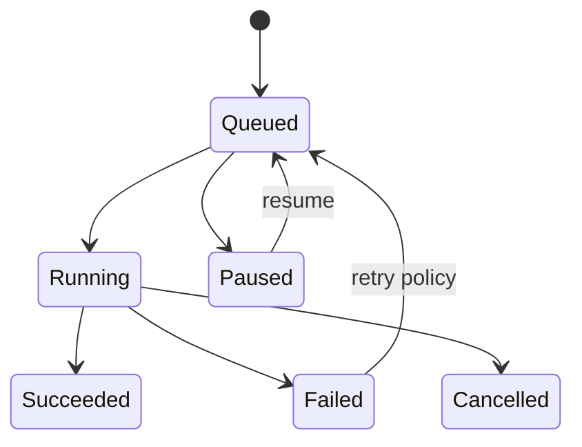

# Epic: Scheduler and background work

**Beads id:** `agent-platform-scheduler`  
**Planning source:** [Harness Gap Analysis](../planning/harness-gap-analysis-2026-04-29.md)

## Objective

Add durable scheduled tasks and background process tracking so agents can run recurring automation, long-running coding checks, and delayed follow-up work outside a single active chat request.

## Capability Map

```json
{
  "jobs": ["one_off", "recurring", "manual_run", "retry"],
  "runtime": ["queued", "running", "succeeded", "failed", "paused", "cancelled"],
  "controls": ["create", "pause", "resume", "cancel", "inspect_logs"],
  "safety": ["owner_scope", "tool_policy", "HITL_for_high_risk", "audit_log"]
}
```

## Proposed Task Chain

| Task                         | Purpose                                                     |
| ---------------------------- | ----------------------------------------------------------- |
| `agent-platform-scheduler.1` | Define scheduled job contracts, schema, and state machine   |
| `agent-platform-scheduler.2` | Implement job runner, queue, retry, and cancellation basics |
| `agent-platform-scheduler.3` | Add background process tracking and log capture             |
| `agent-platform-scheduler.4` | Add UI/API controls for schedule and background work        |
| `agent-platform-scheduler.5` | Add notification hooks and end-to-end tests                 |

## Architecture



## Definition Of Done

- Jobs have durable state and audit trails.
- User can pause, resume, cancel, and inspect work.
- High-risk scheduled actions remain policy/HITL controlled.
- Background process logs are captured and bounded.
- Tests cover retries, cancellation, failures, and persistence.
