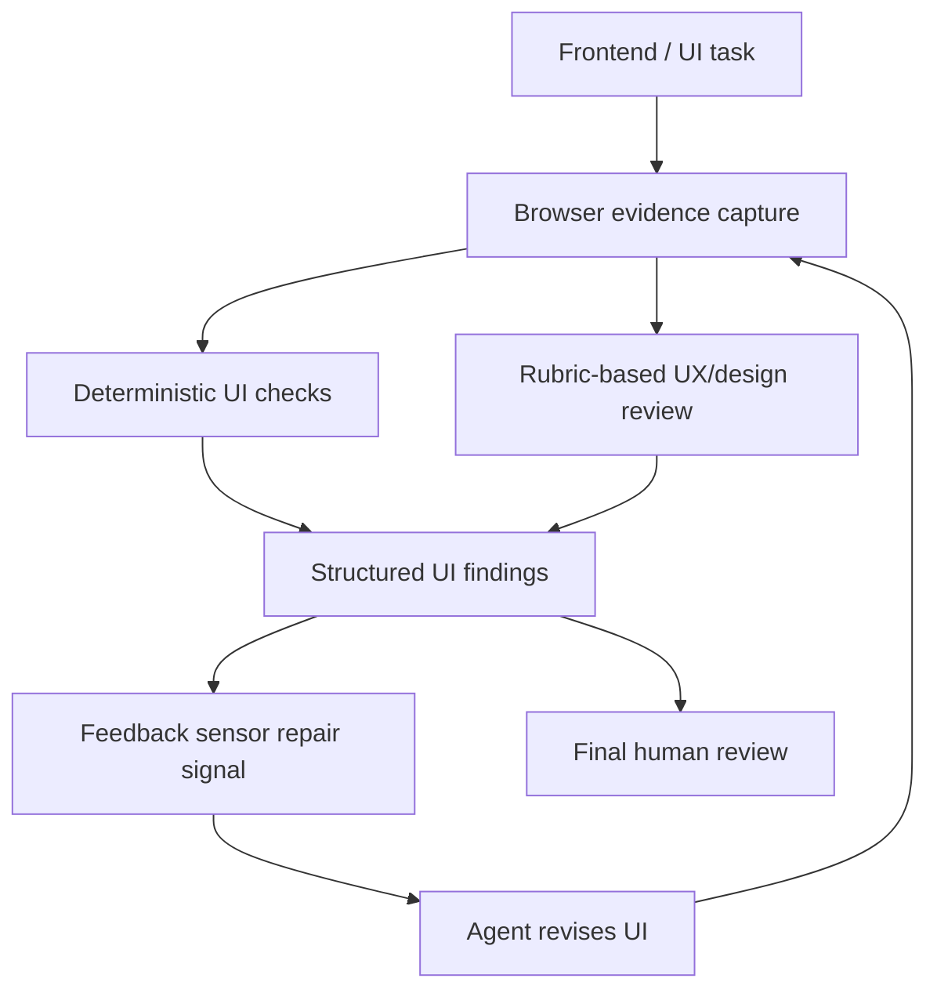

# Epic: UI quality and visual UX sensors

**Beads id:** `agent-platform-ui-quality-sensors`  
**Planning source:** Owner refinement during feedback-sensors planning

## Objective

Add UI quality sensors that help frontend/coding agents assess whether implemented UI is not only functional, but also usable, visually coherent, responsive, accessible, and aligned with the product's design intent.

This epic should consume the feedback-sensors architecture and browser automation evidence rather than creating a competing validation loop.

## Capability Map

```json
{
  "capabilities": [
    "browser_evidence_capture",
    "deterministic_ui_checks",
    "visual_ux_rubric_review",
    "responsive_viewport_review",
    "accessibility_snapshot_review",
    "theme_and_design_system_review",
    "structured_ui_repair_feedback"
  ],
  "evidence": [
    "screenshot",
    "accessibility_tree",
    "dom_summary",
    "console_errors",
    "viewport_metadata",
    "interaction_trace"
  ],
  "checks": {
    "deterministic": [
      "page_loads",
      "no_blank_primary_regions",
      "no_obvious_overlap",
      "text_not_clipped",
      "responsive_fit",
      "focus_keyboard_navigation",
      "visible_error_states",
      "contrast_basics"
    ],
    "inferential": [
      "visual_hierarchy",
      "workflow_efficiency",
      "styling_consistency",
      "theme_coherence",
      "domain_fit",
      "interaction_polish",
      "not_scaffold_like"
    ]
  },
  "agent_scope": ["coding", "custom"],
  "optional_providers": ["browser_tools", "design_review_provider", "external_design_generator"]
}
```

## Relationship To Other Epics

- **Depends on feedback sensors:** UI quality results should use the shared sensor/finding/repair model, agent profile policy, runtime limitation handling, and observability loop.
- **Depends on browser tools:** Browser automation should own navigation, screenshots, accessibility snapshots, viewport checks, and interaction traces.
- **May use capability registry later:** External design tools or review providers should be optional capabilities, not hardcoded requirements.

## Proposed Task Chain

| Task                                  | Purpose                                                                 |
| ------------------------------------- | ----------------------------------------------------------------------- |
| `agent-platform-ui-quality-sensors.1` | Define UI quality rubric, evidence schema, grading model, and profiles  |
| `agent-platform-ui-quality-sensors.2` | Implement deterministic UI evidence checks over browser snapshots       |
| `agent-platform-ui-quality-sensors.3` | Add inferential UX/design review over screenshots and task requirements |
| `agent-platform-ui-quality-sensors.4` | Wire UI findings into the feedback sensor repair loop                   |
| `agent-platform-ui-quality-sensors.5` | Expose UI quality results and validate frontend correction workflows    |

Child task specs are pending refinement. Per project memory, run owner refinement before moving this epic from planning to implementation-ready.

## Architecture



## Key Design Decisions

- UI quality sensors run only for frontend/coding tasks or explicit manual requests.
- External design/generation services can be optional providers, but the core grading loop must work from browser evidence and a local rubric.
- Deterministic checks catch objective problems first; inferential review critiques usability, styling, theming, hierarchy, and domain fit.
- Findings must be structured and actionable. Avoid vague "looks good" or "make it better" feedback.
- Rubrics should be domain-aware. A dashboard, form-heavy admin tool, landing page, game, and creative editor should not share one flat scoring standard.
- UI findings should include screenshot/viewport evidence, severity, category, and repair guidance.

## Definition Of Done

- UI quality is represented as feedback-sensor-compatible findings and repair instructions.
- Browser evidence capture supports screenshots, accessibility snapshots, DOM summaries, console errors, and viewport metadata.
- Deterministic checks cover objective UI failures such as blank regions, overlap, clipping, responsive fit, focus/navigation, error states, and contrast basics.
- Inferential review grades visual hierarchy, workflow efficiency, styling consistency, theme coherence, domain fit, and interaction polish.
- Frontend/coding agents can receive UI repair feedback and re-check before human review.
- API/UI surfaces expose UI quality grades, findings, evidence, and rerun state.
